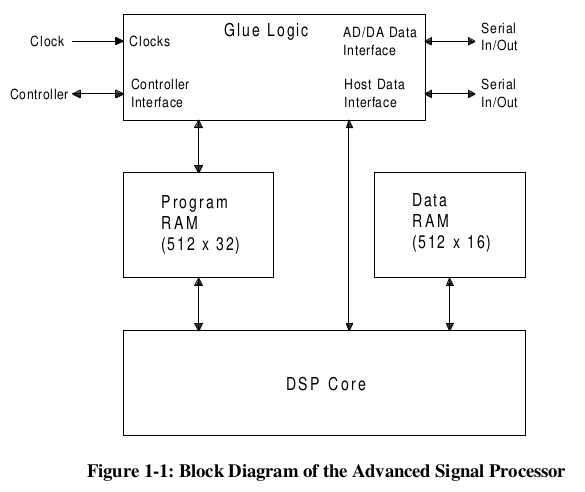
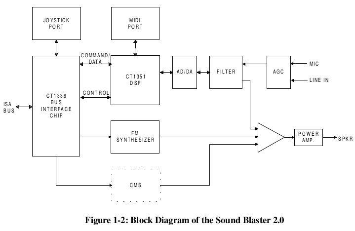
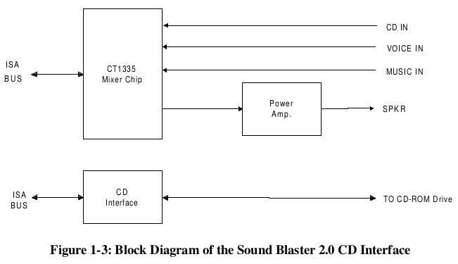
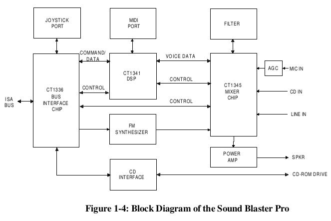
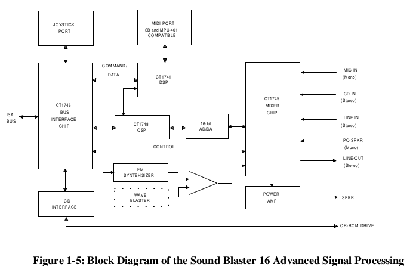
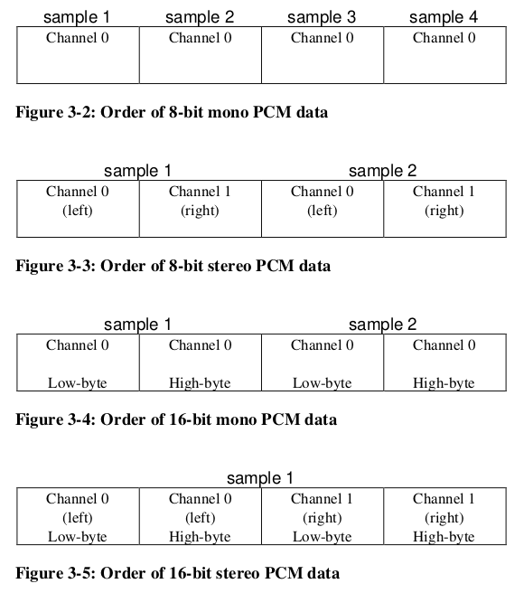
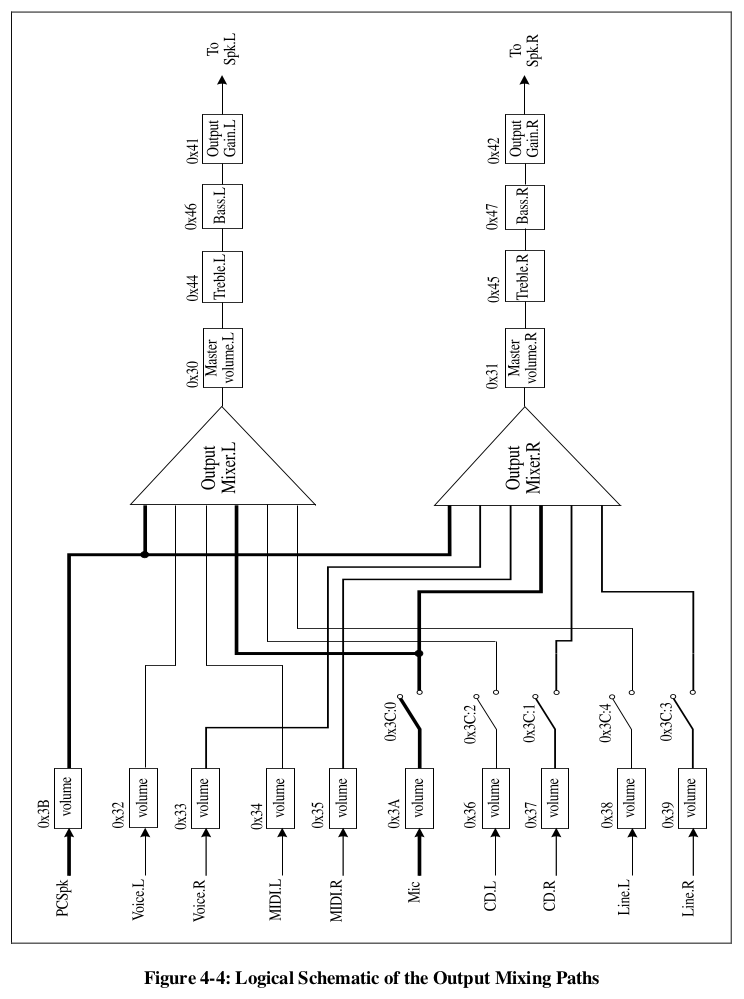
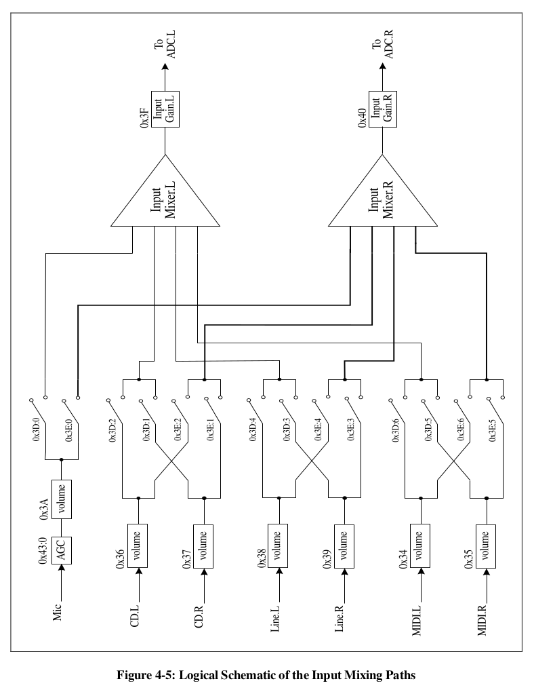

# Developer Kit for Sound Blaster Series
Second Edition

## Hardware Programming Reference

- Hardware Overview
- Digital Sound Processor
- Mixer
- MIDI Port

## License Agreement/Limitation And Disclaimer Of Warranties

**PLEASE NOTE : BY DOWNLOADING AND/OR USING THE SOFTWARE AND/OR MANUAL ACCOMPANYING THIS LICENSE AGREEMENT, YOU ARE HEREBY AGREEING TO THE FOLLOWING TERMS AND CONDITIONS:**

The software and related written materials, including any instructions for use, are provided on an "AS IS"
basis, without warranty of any kind, express or implied. This disclaimer of warranty expressly includes,
but is not limited to, any implied warranties of merchantability and/or of fitness for a particular purpose.
No oral or written information given by Creative Technology Ltd., its suppliers, distributors, dealers,
employees, or agents, shall create or otherwise enlarge the scope of any warranty hereunder. Licensee
assumes the entire risk as to the quality and the performance of such software and licensee application.
Should the software, and/or Licensee application prove defective, you, as licensee (and not Creative
Technology Ltd., its suppliers, distributors, dealers or agents), assume the entire cost of all necessary
correction, servicing, or repair.

### RESTRICTIONS ON USE

Creative Technology Ltd. retains title and ownership of the manual and software as well as ownership of
the copyright in any subsequent copies of the manual and software, irrespective of the form of media on or
in which the manual and software are recorded or fixed. By downloading and/or using this manual and
software, Licensee agrees to be bound to the terms of this agreement and further agrees that :

1. CREATIVE'S BBS/FTP/COMPUSERVE ARE THE ONLY ONLINE SITES WHERE USERS MAY DOWNLOAD ELECTRONIC FILES CONTAINING THE MANUAL AND/OR SOFTWARE,
1. LICENSEE SHALL USE THE MANUAL AND/OR SOFTWARE ONLY FOR THE PURPOSE OF DEVELOPING LICENSEE APPLICATIONS COMPATIBLE WITH CREATIVE’S SOUND BLASTER SERIES OF PRODUCTS, UNLESS OTHERWISE AGREED TO BY FURTHER WRITTEN AGREEMENT FROM CREATIVE TECHNOLOGY LTD.; AND,
1. LICENSEE SHALL NOT DISTRIBUTE OR COPY THE MANUAL FOR ANY REASON OR BY ANY MEANS (INCLUDING IN ELECTRONIC FORM) OR DISTRIBUTE, COPY, MODIFY, ADAPT, REVERSE ENGINEER, TRANSLATE OR PREPARE ANY DERIVATIVE WORK BASED ON THE MANUAL OR SOFTWARE OR ANY ELEMENT THEREOF OTHER THAN FOR THE ABOVE SAID PURPOSE, WITHOUT THE EXPRESS WRITTEN CONSENT OF CREATIVE TECHNOLOGY LTD.. CREATIVE TECHNOLOGY LTD. RESERVES ALL RIGHTS NOT EXPRESSLY GRANTED TO LICENSEE IN THIS LICENSE AGREEMENT.

### LIMITATION OF LIABILITY

In no event will Creative Technology Ltd., or anyone else involved in the creation, production, and/or
delivery of this software product be liable to licensee or any other person or entity for any direct or other
damages, including, without limitation, any interruption of services, lost profits, lost savings, loss of data,
or any other consequential, incidental, special, or punitive damages, arising out of the purchase, use,
inability to use, or operation of the software, and/or licensee application, even if Creative Technology Ltd.
or any authorised Creative Technology Ltd. dealer has been advised of the possibility of such damages.
Licensee accepts said disclaimer as the basis upon which the software is offered at the current price and
acknowledges that the price of the software would be higher in lieu of said disclaimer. Some states do not
allow the limitation or exclusion of liability for incidental or consequential damages so the above
limitations and exclusions may not apply to you.

Information in this document is subject to change without notice. Creative Technology Ltd. shall have no
obligation to update or otherwise correct any errors in the manual and software even if Creative
Technology Ltd. is aware of such errors and Creative Technology Ltd. shall be under no obligation to
provide to Licensee any updates, corrections or bug-fixes which Creative Technology Ltd. may elect to
prepare.

Creative Technology Ltd. does not warrant that the functions contained in the manual and software will be
uninterrupted or error free and Licensee is encouraged to test the software for Licensee's intended use
prior to placing any reliance thereon.

Copyright 1993-1996 by Creative Technology Ltd. All rights reserved.

Sound Blaster, Sound Blaster Pro, Sound Blaster 16, and Wave Blaster are trademarks of Creative Technology Ltd.

IBM is a registered trademark of International Business Machines Corporation.

MS-DOS is a registered trademark and Windows is a trademark of Microsoft Corporation.

All other products are trademarks or registered trademarks of their respective owners.

## Contents

### [Introduction](#introduction-1)

- [What You Should Know](#what-you-should-know)
- [Scope and Manual Organization](#scope-and-manual-organization)
- [Document Conventions](#document-conventions)
- [Determining User's Sound Blaster Card](#determining-users-sound-blaster-card)
- [Determining User's Card Settings](#determining-users-card-settings)

### [Chapter 1 Hardware Overview](#chapter-1-hardware-overview)

1. [Anatomy of Sound Blaster Family of Audio Cards](#anatomy-of-sound-blaster-family-of-audio-cards)
   1. [Digital Sound Processor Chip](#digital-sound-processor-chip)
   1. [Mixer Chip](#mixer-chip)
   1. [FM Synthesizer Chip](#fm-synthesizer-chip)
   1. [Bus Interface Chip](#bus-interface-chip)
   1. [Advanced Signal Processor](#advanced-signal-processor-chip)
1. [Block Diagrams for Sound Blaster Family of Audio Cards](#block-diagrams-for-sound-blaster-family-of-audio-cards)

### [Chapter 2 Introduction to DSP Programming](#chapter-2-introduction-to-dsp-programming-1)

1. [DSP I/O Addresses](#dsp-io-addresses)
1. [Resetting DSP](#resetting-dsp)
1. [Reading from DSP](#reading-from-dsp)
1. [Writing to DSP](#writing-to-dsp)
1. [Handling Interrupts from DSP](#handling-interrupts-from-dsp)
   1. [Sharing of Interrupts](#sharing-of-interrupts)
1. [Configuring DMA and Interrupt Settings](#configuring-dma-and-interrupt-settings)

### [Chapter 3 Digitized Sound I/O Programming](#chapter-3-digitized-sound-io-programming-1)

1. [Digitized Sound Operation Modes](#digitized-sound-operation-modes)
   1. [Digitized Sound Data Format](#digitized-sound-data-format)
   1. [Digitized Sound I/O Transfer Rate](#digitized-sound-io-transfer-rate)
   1. [Direct-Mode](#direct-mode)
   1. [Single-cycle DMA Mode](#single-cycle-dma-mode)
   1. [Auto-initialize DMA Mode](#auto-initialize-dma-mode)
   1. [High-Speed DMA Mode](#high-speed-dma-mode)
   1. [ADPCM DMA mode](#adpcm-dma-mode)
   1. [DSP Digitized Sound I/O Capability](#dsp-digitized-sound-io-capability)
1. [Sample Procedures](#sample-procedures)
   1. [General Procedures for a DMA mode Transfer](#general-procedures-for-a-dma-mode-transfer)
   1. [Handling the DSP Digitized Sound I/O Interrupt](#handling-the-dsp-digitized-sound-io-interrupt)
   1. [8-bit Mono Single-cycle Transfer](#8-bit-mono-single-cycle-transfer)
   1. [8-bit Mono Auto-initialize Transfer](#8-bit-mono-auto-initialize-transfer)
   1. [8-bit Mono High-Speed Single-cycle Transfer](#8-bit-mono-high-speed-single-cycle-transfer)
   1. [8-bit Mono High-Speed Auto-initialize Transfer](#8-bit-mono-high-speed-auto-initialize-transfer)
   1. [8-bit Stereo High-speed Single-cycle Transfer](#8-bit-stereo-high-speed-single-cycle-transfer)
   1. [8-bit Stereo High-Speed Auto-initialize Transfer](#8-bit-stereo-high-speed-auto-initialize-transfer)
   1. [8-bit or 16-bit Single-cycle Transfer](#8-bit-or-16-bit-single-cycle-transfer)
   1. [8-bit or 16-bit Auto-initialize Transfer](#8-bit-or-16-bit-auto-initialize-transfer)

### [Chapter 4 Mixer Chip Programming](#chapter-4-mixer-chip-programming-1)

1. [Programming Sequence](#programming-sequence)
   1. [CT1335 Mixer](#ct1335-mixer)
      1. [Features](#features)
      1. [Register Functions](#register-functions)
   1. [CT1345 Mixer](#ct1345-mixer)
      1. [Features](#features-1)
      1. [Register Functions](#register-functions-1)
   1. [CT1745 Mixer](#ct1745-mixer)
      1. [Features](#features-2)
      1. [Register Functions](#register-functions-2)

### [Chapter 5 MIDI Port I/O Programming](#chapter-5-midi-port-io-programming-1)

1. [SB-MIDI Mode](#sb-midi-mode)
   1. [I/O Addresses](#io-addresses)
   1. [Sending MIDI Data](#sending-midi-data)
   1. [Reading MIDI Data](#reading-midi-data)
1. [MPU-401 UART Mode](#mpu-401-uart-mode)
   1. [I/O Addresses](#io-addresses-1)
   1. [Checking the Status](#checking-the-status)
   1. [Sending a Command](#sending-a-command)
   1. [Sending MIDI Data](#sending-midi-data-1)
   1. [Reading MIDI Data](#reading-midi-data-1)

### [Chapter 6 DSP Commands](#chapter-6-dsp-commands-1)

1. [Commands by Category](#commands-by-category)
1. [Command Descriptions](#command-descriptions)

### [Appendix A Sound Blaster I/O Address Maps](#appendix-a-sound-blaster-io-address-maps-1)

1. [SB1.5 I/O Address Map](#sb15-io-address-map)
1. [SBMCV I/O Address Map](s#sbmcv-io-address-map)
1. [SB2.0 I/O Address Map](#sb20-io-address-map)
1. [SB2CD I/O Address Map](#sb2cd-io-address-map)
1. [SBPRO I/O Address Map](#sbpro-io-address-map)
1. [SBPRO MCV I/O Address Map](#sbpro-mcv-io-address-map)
1. [SB16 I/O Address Map](#sb16-io-address-map)

### [Appendix B Relevant Information](#appendix-b-relevant-information)

1. [Digital Audio](#digital-audio)
1. [MIDI](#midi)
1. [PIC and DMA Controllers Programming](#pic-and-dma-controllers-programming)
1. [Joystick Port Programming](#joystick-port-programming)
1. [FM Synthesizer Chip](#fm-synthesizer-chip-1)

## Introduction

This manual covers the hardware programming information for the following Sound Blaster cards:

- Sound Blaster Version 1.5 or earlier (SB1.5) TM
- Sound Blaster for Micro Channel Version (SBMCV) TM
- Sound Blaster Version 2.0 (SB2.0) TM
- Sound Blaster 2.0 CD Interface (SB2CD) TM
- Sound Blaster Pro (SBPRO) TM
- Sound Blaster Pro for Micro Channel Version (SBPRO MCV) TM
- Sound Blaster 16 (SB16) TM
- Sound Blaster 16 with Advanced Signal Processing TM

This manual documents the programming interface to the main Creative-specific Sound Blaster hardware components; namely the Digital Sound Processor (DSP), Mixer chip, and MIDI Port.

The Digital Sound Processor handles digitized sound recording and playback. It supports 8- or 16-bit digitized sound. Digitized sound I/O can be carried out in mono or stereo, using Single-cycle or Auto-initialize DMA modes. The Digital Sound Processor also supports real-time decompression of ADPCM in three compressed formats: 8 to 4 bits, 8 to 3 bits, and 8 to 2 bits.

The Mixer chip provides volume control of various input and output sources. It also controls the selection of the recording source.

The MIDI Port on Sound Blaster cards conform to the International MIDI Association specifications. Through this port, MIDI messages can be transmitted to and received from external MIDI devices.

### What You Should Know

This manual assumes you are familiar with system level programming on the IBM PC. This includes programming knowledge of the Direct Memory Access (DMA) Controller, Programmable Interrupt Controller (PIC), and System Timer. Refer to "Relevant Information" in the appendix if you need more information on these subjects.

Familiarity in programming the X86-family of microprocessors is also required, since assembly code for that range of microprocessors is used in many of the discussions.

This manual also assumes you are familiar with changing the base I/O address, interrupt and DMA channels of Sound Blaster cards.

Some chapters in this manual assume additional knowledge on your part. The introductions to these chapters will list these assumptions.

### Scope and Manual Organization

This manual focuses on the Creative-specific hardware programming of the following:

- Digital Sound Processor
- Mixer Chip
- MIDI Port

Refer to Appendix B, "Relevant Information" if you are interested in programming the FM chips or the joystick.

This manual is divided into the following chapters:

Chapter 1, "Hardware Overview", gives an overview and functional block diagram of the Sound Blaster cards.

Chapter 2, "Introduction to DSP Programming", presents the basic knowledge needed to access the DSP. You may not be able to proceed until you have mastered the characteristics of the DSP. Read this chapter carefully.

Chapter 3, "Digitized Sound I/O Programming", describes the programming information for digitized sound I/O. This covers 8-bit and 16-bit, mono and stereo, high-speed and auto-initialize DMA programming.

Chapter 4, "Mixer Chip Programming", discusses the essentials for control of the mixer chip.

Chapter 5, "MIDI Port I/O Programming", discusses Sound Blaster MIDI Port and MPU-401 MIDI UART mode programming.

Chapter 6, "DSP Commands", describes the DSP commands in detail.

Appendix A, "Sound Blaster I/O Address Maps", lists the I/O addresses and their functionalities.

Appendix B, "Relevant Information", lists the sources of the other relevant materials.

### Document Conventions

In this manual, the word "you" refers to you the developer or sometimes your application. The word "user" does not refer to you, but to the person who uses your applications.

SB1.5, SB2.0 and SBMCV are referred to collectively as Sound Blaster, SBPRO and SBPRO MCV are referred to collectively as Sound Blaster Pro, SB16 and Sound Blaster 16 with Advanced Signal Processing are referred to collectively as Sound Blaster 16. The term "Sound Blaster cards" is used to refer to the whole series of Sound Blaster cards.

The terms "Single-cycle" and "Auto-initialize" are used to refer to DMA mode digitized sound I/O transfer. "Single-cycle" refers to the Single Transfer Mode, and "Auto-initialize" refers to the Auto-initialize Single Transfer Mode used in the Intel data sheets.

To help you to locate and identify information easily, this manual uses visual cues and standard text formats. The following typographic conventions are used throughout this manual:

<table>
  <tr>
    <th>Example</th>
    <th>Description</th>
  </tr>
  <tr>
    <td valign="top">Write-Buffer Status</td>
    <td valign="top">Bold letters are used for keywords or to emphasize certain words.</td>
  </tr>
  <tr>
    <td valign="top">CT-VOICE.DRV</td>
    <td valign="top">All capital letters indicate file names, directory names.</td>
  </tr>
  <tr>
    <td valign="top">*placeholders*</td>
    <td valign="top">Italic letters indicate placeholders. Italics may also be used to emphasize certain words.</td>
  </tr>
  <tr>
    <td valign="top"><code>program</code></td>
    <td valign="top">This font is used for example codes.</td>
  </tr>
  <tr>
    <td valign="top">
      program<br/>
      &nbsp;&nbsp;.<br/>
      &nbsp;&nbsp;.<br/>
      &nbsp;&nbsp;.<br/>
      fragment
    </td>
    <td valign="top">Vertical ellipsis in an example program indicates that part of the program has been intentionally omitted.</td>
  </tr>
  <tr>
    <td valign="top">[]</td>
    <td valign="top">Square brackets in a command line indicate that the enclosed item is optional. It should not be typed verbatim.</td>
  </tr>
  <tr>
    <td valign="top">&lt;&gt;</td>
    <td valign="top">Angle brackets in a command line indicate that you must provide the actual value of the enclosed item. It should not be typed verbatim.</td>
  </tr>
  <tr>
    <td valign="top">/</td>
    <td valign="top">Slash in a command line indicates an either/or choice. It should not be typed verbatim.</td>
  </tr>
  <tr>
    <td valign="top">Sound Blaster Pro<br/>(SBPRO)</td>
    <td valign="top">Acronyms are usually spelled out the first time they are used.</td>
  </tr>
</table>

The following DSP version notations will be used in the discussions:

<table>
  <tr>
    <th valign="top">Version Notation</th>
    <th valign="top">Description</th>
  </tr>
  <tr>
    <td valign="top">1.xx</td>
    <td valign="top">This means DSPs with major version number 1.</td>
  </tr>
  <tr>
    <td valign="top">2.00</td>
    <td valign="top">This means only the DSPs with version number 2.00.</td>
  </tr>
  <tr>
    <td valign="top">2.01+</td>
    <td valign="top">This means DSPs with major version number 2, version 2.00 is excluded.</td>
  </tr>
  <tr>
    <td valign="top">3.xx</td>
    <td valign="top">This means DSPs with major version number 3.</td>
  </tr>
  <tr>
    <td valign="top">4.xx</td>
    <td valign="top">This means DSPs with major version number 4.</td>
  </tr>
</table>

### Determining User's Sound Blaster Card

Sound Blaster cards can be distinguished by their DSP version numbers. The table below lists the Sound Blaster cards and their respective DSP version numbers:

<table>
  <tr>
    <th valign="top">Cards</th>
    <th valign="top">Version Number</th>
  </tr>
  <tr>
    <td valign="top">
      SB1.5, SBMCV
    </td>
    <td valign="top">
      1.xx to 2.00
    </td>
  </tr>
  <tr>
    <td valign="top">
      SB2.0
    </td>
    <td valign="top">
      2.01+
    </td>
  </tr>
  <tr>
    <td valign="top">
      SBPRO, SBPRO MCV
    </td>
    <td valign="top">
      3.xx
    </td>
  </tr>
  <tr>
    <td valign="top">
      SB16, Sound Blaster 16 with Advanced Signal Processing
    </td>
    <td valign="top">
      4.xx
    </td>
  </tr>
</table>

The DSP version can be retrieved by issuing DSP command **E1h**. This will be covered in the subsequent chapters.

There are two versions of SBPRO. The difference is in the FM chip used. The earlier version uses a two-operator FM chip, while the later version uses a four-operator FM chip. To distinguished them, you can read the value from I/O port **388h**, two-operator cards will return a value of **06h**, and four-operator cards will return a value of **00h**.

You should determine the actual card used by your user if your application is written only for a specific card.


### Determining User's Card Settings

Most of the Sound Blaster card settings are jumper selectable to avoid conflicts with other peripheral cards. 

To aid the application in determining the settings used by a Sound Blaster card, we have advocated the use of an environment variable called **BLASTER**. The user will set up this environment variable during card installation.

The BLASTER environment variable specifies the base I/O address, interrupt and DMA channel used by the Sound Blaster card.

The command for setting the BLASTER environment is as follows:

    SET BLASTER=A220 I5 D1 [H5 M220 P330]

where:
<dl>
    <dt>A</dt>
    <dd>specifies the Sound Blaster card's base I/O port</dd>
    <dt>I</dt>
    <dd>specifies the interrupt request line</dd>
    <dt>D</dt>
    <dd>specifies the 8-bit DMA channel</dd>
    <dt>H</dt>
    <dd>specifies the 16-bit DMA channel</dd>
    <dt>M</dt>
    <dd>specifies the mixer chip base I/O port</dd>
    <dt>P</dt>
    <dd>specifies the MPU-401 base I/O port</dd>
</dl>

Note that there is no space before and after the = (equal) sign, but there must be at least one space between each setting. Some of the cards may have fewer environment parameters. For instance, 8-bit sound cards do not have the "**H**h" parameter in the parameter string. If "**M**mmm" is not specified, the mixer chip base I/O port will be the same as the card's base I/O port.

On Sound Blaster 16, 16-bit sound data is usually transfer through 16-bit DMA channel (specifies on the "**H**h" parameter of BLASTER environment variable). However, the hardware also supports transfer 16-bit sound data via 8-bit DMA channel. To make this possible, the program **SBCONFIG.EXE** come with Sound Blaster 16 package must be run to configure the Sound Blaster 16 appropriately. When SBCONFIG is run, the BLASTER environment entries "**D**d" and "**H**h" must be set such that d and h are the same 8-bit DMA channel number.

We encourage developers to adopt, as standard programming practice, the method of retrieving the hardware configuration from the BLASTER environment, instead of scanning the hardware.

## Chapter 1 Hardware Overview

This chapter gives an overview of the hardware architecture of the Sound Blaster family of audio cards. It is meant for developers who intend to do hardware level programming. Major building blocks of the Sound Blaster family cards and their functionalities will be discussed.

This chapter also covers the anatomy and block diagrams of Sound Blaster family of audio cards.

### Anatomy of Sound Blaster Family of Audio Cards

This section describes the major building blocks of the Sound Blaster family of audio cards. The functionalities and features of the following components will be presented:

- Digital Sound Processor (DSP) chip
- Mixer chip
- FM Synthesizer chip
- Bus Interface chip
- Advanced Signal Processor

#### Digital Sound Processor Chip

The Digital Sound Processor chip is one of the most important components on the Sound Blaster card. It interprets the DSP commands and then carries out one of the following tasks:

- Performs 8/16 bit Mono/Stereo digitized sound recording and playback
- Performs 4:1, 3:1 and 2:1 ADPCM decompression in Sound Blaster mode
- Control the sampling rate
- Interprets Sound Blaster compatible MIDI and MPU-401 UART mode commands (Sound Blaster 16 only)
- Provides communication path between Host and the Advanced Signal Processor (Sound Blaster 16 Advanced Signal Processing only)
- Provides the Advanced Signal Processor's code downloading (Sound Blaster 16 Advanced Signal Processing only)
- Provides DAC speaker control
- Controls various modes of DMA transfer

Different DSP versions are used on various versions of Sound Blaster family cards. Over the years, the functionality of the DSP has been greatly enhanced. The later versions of DSP are designed to be downward compatible with its earlier counterparts with new features introduced. Generally, the DSP versions can be classified under five majors categories: 1.xx , 2.00 , 2.01+ , 3.xx and 4.xx. In the chapter on "Introduction to DSP Programming", the essential steps needed to program the DSP are discussed. In the later chapter on "DSP Commands", various DSP commands are discussed in details according to their function's category.

#### Mixer Chip

The main purpose of the mixer chip is to mix signals from different input sources and to provide software volume control capabilities. All cards in the Sound Blaster family, except SB2.0 and earlier version of Sound Blaster cards, has mixer chip. Currently, there are three versions of mixer chip: CT1335 , CT1345 and CT1745. Each version differs from the other by their ability to accept different number of sources and to provide volume control resolution. CT1745, the latest version of mixer chip, can provide a finer resolution of volume control. In the chapter on "Mixer Chip Programming", each of these mixer chips as well as the included register maps will be discussed in detail.

#### FM Synthesizer Chip

The FM synthesizer chip synthesizes the sounds of musical instruments. It tries to approximate real instrument sounds by applying the Frequency Modulation (FM) technique to sine waves.

There are two versions of FM synthesizer chips used on Sound Blaster cards; YAMAHA OPL2 and YAMAHA OPL3. The OPL2 chip is used in earlier versions of Sound Blaster Pro, SB2.0 and Sound Blaster. The later version of Sound Blaster Pro, and Sound Blaster 16 use the YAMAHA OPL3 chip.

Please contact the respective vendor for detailed documentation on the FM synthesizer chip if you are interested on the FM synthesizer chip programming.

#### Bus Interface Chip

The Bus Interface Chip (CT1336) is responsible for providing handshake signals and data transfer between the ISA bus and various components on the Sound Blaster card. On Sound Blaster 16, it provides MPU-401 UART mode compatible MIDI, FIFOs for digital audio playback and recording, and interrupt channel sharing by three different processes (8-bit digitized sound, 16-bit digitized sound and MIDI).

#### Advanced Signal Processor Chip

The Advanced Signal Processor, used on Sound Blaster 16 Advanced Signal Processing cards, is a technological breakthrough. It can perform high speed mathematical processing on digitized sound data. It also provides real-time signal processing like compression/decompression of sound. The flexibility of the chip is that it can accept the downloading of algorithms. Below is a simplified block diagram of this chip:



These are the main features of the Advanced Signal Processor:

- 16-bit DSP core
- 16-bit x 16-bit => 32-bit Multiplier
- 192 x 16-bit of X-RAM
- 128 x 16-bit of Y-RAM
- 512 x 32-bit program memory RAM
- 512 x 16-bit data memory
- Serial I/O for digital audio data
- Runs at 12 MIPs

The control of the Advanced Signal Processor, including downloading, is handled by a device-level driver called CSP.SYS. You can access this device driver via the Creative Multimedia System (CTMMSYS) driver. Refer to the chapters "Creative Multimedia System Driver" in the Programmer's Guide and Library Reference manuals for details.

#### Block Diagrams for Sound Blaster Family of Audio Cards

After presenting the introduction to the major building blocks of Sound Blaster cards, we will now present the block diagrams for SB2.0, SB2CD, SBPRO and SB16.



Note that the CMS chip is optional. The CMS uses Pulse Width Modulation (PWM) technique to synthesize music. The quality of the sound is not as good as that from a FM synthesizer, and therefore, has been gradually phased out. All Sound Blaster cards that is later than SB2.0 does not have the CMS upgrade socket.

Please note the SB2.0 does not contain a mixer chip on board.



The SB2CD is the CD-ROM upgrade for SB2.0. It provides a CD-ROM interface which the SB2.0 does not have. It also includes an audio mixer for software volume control and a power amplifier.



Sound Blaster Pro is a 8-bit stereo sampling card with stereo mixer chip and CD-ROM interface built in. The DSP has been gradually enhanced to cover wider sampling range.

There are two versions of Sound Blaster Pro. The different is in the FM synthesizer chip used. The earlier version uses a two-operator FM chip known as OPL2, while the later version uses a four-operator FM synthesizer chip known as OPL3. The version
with OPL3 is commonly known as Sound Blaster Pro 2.



Sound Blaster 16 Advanced Signal Processing is a 16-bit stereo sampling card. It also features an enhanced stereo mixer chip. MPU-401 UART mode MIDI interface has also been added. One of the key component is the Advanced Signal Processor which can perform high-speed mathematical processing on the data from/to the AD/DA.

Sound Blaster 16 is the same as Sound Blaster 16 Advanced Signal Processing except the Advanced Signal Processor chip is an optional upgrade.

Wave Blaster is an optional expansion daughter board for both Sound Blaster 16 Advanced Signal Processing and Sound Blaster 16.

## Chapter 2 Introduction to DSP Programming

This chapter discusses the essentials for programming the Creative Digital Sound Processor (DSP). The DSP chip handles digitized sound I/O and MIDI operations. You must read this chapter carefully to ensure you understand the characteristics of the DSP before you proceed to program digitized sound or MIDI operations.

This chapter covers the following topics:

- DSP I/O addresses
- Resetting the DSP
- Reading from the DSP
- Writing to the DSP
- Handling interrupt from the DSP

### DSP I/O Addresses

The DSP is programmed through four selectable I/O addresses on the Sound Blaster cards. The following lists the I/O addresses and their functionalities. x represents the jumper selectable base I/O addresses.

<table>
  <tr>
    <td>Reset</td>
    <td>2x6h (write only)</td>
    <td>Used to reset the DSP to its default state.</td>
  </tr>
  <tr>
    <td>Read Data</td>
    <td>2xAh (read only)</td>
    <td>Used to access in-bound DSP data.</td>
  </tr>
  <tr>
    <td>Write Command/Data</td>
    <td>2xCh (write)</td>
    <td>Used to send commands or data to the DSP.</td>
  </tr>
  <tr>
    <td>Write-Buffer Status</td>
    <td>2xCh (read)</td>
    <td>Also indicates whether the DSP is ready to accept commands or data.</td>
  </tr>
  <tr>
    <td>Read-Buffer Status</td>
    <td>2xEh (read only)</td>
    <td>Indicates whether there is any in-bound data available for reading.</td>
  </tr>
</table>

**Table 2-1: DSP I/O Ports**

### Resetting DSP

The DSP has to be reset before it is first programmed. The reset causes it to perform an initialization and returns it to its default state. The DSP reset is done through the **Reset** port.

After the initialization, the DSP returns a data byte **0AAh** at the **Read Data** port. The procedure to reset the DSP is as follows:

1. Write a "1" to the **Reset** port (2x6h) and wait for 3 microseconds.
2. Write a "0" to the **Reset** port.
3. Poll for a ready byte **0AAh** from the **Read Data** port. You must check the **Read-Buffer Status** port to ensure there is data before reading the **Read Data** port.

Typically, the DSP takes about 100 microseconds to initialize itself. After this period of time, if the return value is not 0AAh or there is no data at all, then the Sound Blaster card may not be installed or an incorrect I/O address is being used. You should exit the reset process and declare an error.

The following assembly code fragment shows the process of resetting the DSP:
```
        mov  dx,wSBCBaseAddx   ; SBC base I/O address 2x0h
        add  dl,6              ; Reset port, 2x6h

        mov  al,1              ; Write a 1 to the DSP reset port
        out  dx,al
        sub  al,al             ; Delay loop
Delay:
        dec  al
        jnz  Delay
        out  dx,al             ; Write a 0 to the DSP reset port

        sub  cx,cx             ; Maximum of 65536 tries
Empty:
        mov  dx,wSBCBaseAddx   ; SBC base I/O address 2x0h
        add  dl,0Eh            ; Read-Buffer Status port, 2xEh

        in   dx,al             ; Read Read-Buffer Status port
        or   al,al             ; Data available?
        jns  NextAttempt       ; Bit 7 clear, try again

        sub  dl,4              ; Read Data port, 2xAh
        in   al,dx             ; Read in-bound DSP data
        cmp  al,0AAh           ; Receive success code, 0AAh?
        je   ResetOK           ; SUCCESS!

NextAttempt:
        loop Empty             ; Try again
        ;***
        ;*** Failed to reset DSP: Sound Blaster not detected!
```

### Reading from DSP

When DSP data is available, it can be read in from the **Read Data** port.

Before the data is read in, bit-7 of the **Read-Buffer Status** port must be checked to ensure that there is data to read. If bit-7 is 1, then there is data to read. Otherwise, no data is available.

The following assembly code fragment shows the process of reading data from the DSP:
```
        mov  dx,wSBCBaseAddx   ; SBC base I/O address 2x0h
        add  dl,0Eh            ; Read-Buffer Status port, 2xEh
Busy:
        in   al,dx             ; Check for in-bound data
        or   al,al             ; Data available?
        jns  Busy              ; Bit 7 clear, try again

        sub  dl,4              ; Read Data port, 2xAh
        in   al,dx             ; Read in-bound DSP data
```

### Writing to DSP

DSP commands and data are sent through the **Write Command/Data** port.

Before data is written to the DSP, bit-7 of the **Write-Buffer Status** port must be checked to ensure that the DSP command/data buffer is empty. If bit-7 is 0, the DSP buffer is empty and is ready to receive commands or data. Otherwise, no commands or data should be written to the DSP.

The following assembly code fragment shows the process of writing a command or data byte to the DSP:
```
        mov  dx,wSBCBaseAddx   ; SBC base I/O address 2x0h
        add  dl,0Ch            ; Write-Buffer Status port, 2xCh
Busy:
        in   al,dx             ; Read Write-Buffer Status port
        or   al,al             ; Can write to DSP?
        js   Busy              ; Bit 7 set, try again

        mov  al,bData          ; Get DSP command or data
        out  dx,al             ; Send to DSP
```

### Handling Interrupts from DSP

The DSP generates a hardware interrupt for each of the following processes:

- DMA mode ADC
- DMA mode DAC
- Interrupt mode MIDI input

An interrupt service routine (ISR) has to be set up to handle the interrupts. Within the ISR, each DSP interrupt is acknowledged by reading the DSP **Read-Buffer Status** port once.

The acknowledgment of interrupts on DSP version 4.xx is different; see the following section for more information.

#### Sharing of Interrupts

With DSP version 4.xx, four interrupts use the same Interrupt Request (IRQ) line. These are the 8-bit and 16-bit DMA mode digitized sound I/O, Sound Blaster MIDI (SB-MIDI), and MPU-401 MIDI UART mode interrupts.

The **Interrupt Status** register, addressed as register **82h** on the Mixer register map, is used by the ISR to determine whether the interrupt is meant for it or for some other ISR, in which case it should chain to the previous routine.

Reading register **82h** is accomplished in the same manner as reading any of the other mixer registers (see the chapter on "Mixer Chip Programming"). The byte read in from register **82h** is interpreted as follows:

<table>
  <tr>
    <th>D7</th>
    <th>D6</th>
    <th>D5</th>
    <th>D4</th>
    <th>D3</th>
    <th>D2</th>
    <th>D1</th>
    <th>D0</th>
  </tr>
  <tr>
    <td></td>
    <td></td>
    <td></td>
    <td></td>
    <td></td>
    <td>MPU-401</td>
    <td>16-bit DMA-mode digitized sound I/O</td>
    <td>8-bit DMA-mode digitized sound I/O</td>
  </tr>
  <tr>
    <td colspan="7"></td>
    <td>SB-MIDI</td>
  </tr>
</table>

where the grayed areas denote reserved bits. A bit is set to 1 if the corresponding
interrupt is triggered.

To send an interrupt acknowledgment signal to the DSP, perform a read in from one
of three I/O ports with:
```
        in  al,dx
```
where register **DX** has been pre-loaded with

- **2xEh** for 8-bit DMA-mode digitized sound I/O or SB-MIDI
- **2xFh** for 16-bit DMA-mode digitized sound I/O
- **3x0h** for MPU-401

Note that it is not possible to distinguish between 8-bit DMA mode digitized sound I/O and SB-MIDI interrupts because these two processes share the same interrupt status bit. It is thus important to avoid running both processes at the same time.

To remain backward compatible, the interrupt acknowledgment of 8-bit DMA mode digitized sound I/O and SB-MIDI is done via the **Read-Buffer Status** port of the DSP.

The following assembly code fragment illustrates the interrupt handling portion within a 16-bit DMA mode digitized sound I/O ISR:
```
        mov  dx,wSB16BaseAddx   ; SB16 base I/O address 2x0h
        add  dl,4               ; Mixer register address port 2x4h
        mov  al,82h             ; Index for Interrupt Status register
        out  dx,al
        inc  dx                 ; Mixer data port
        in   al,dx              ; Get interrupt status
        test al,02h             ; 16-bit DMA-mode digitized sound I/O interrupt?
        jz   ChainPreviousISR   ; No, chain to previous ISR

        ;***
        ;*** 1). Perform your 16-bit DMA digitized sound I/O instructions
        ;*** 2). Acknowledge the DSP interrupt; in al,2xFh
        ;*** 3). Send EOI to the Programmable Interrupt Controller
        ;***
        jmp  ExitISR

ChainPreviousISR:
        ;***
        ;*** Chain to previous ISR

ExitISR:
```

### Configuring DMA and Interrupt Settings

With the DSP version 4.xx, the DMA channels Interrupt Request (IRQ) line are software configurable. The **Interrupt Setup** register, addressed as register **80h** on the Mixer register map, is used to configure or determine the Interrupt Request line. The **DMA Setup** register, addressed as register **81h** on the Mixer register map, is used to configure or determine the DMA channels.

Reading and writing the register **80h** and **81h** are accomplished in the same manner as reading and writing any of the other mixer registers (see the chapter "Mixer Chip Programming").

The byte from register **80h** is interpreted as follows:

<table>
  <tr>
    <th>D7</th>
    <th>D6</th>
    <th>D5</th>
    <th>D4</th>
    <th>D3</th>
    <th>D2</th>
    <th>D1</th>
    <th>D0</th>
  </tr>
  <tr>
    <td></td>
    <td></td>
    <td></td>
    <td></td>
    <td>IRQ10</td>
    <td>IRQ7</td>
    <td>IRQ5</td>
    <td>IRQ2</td>
  </tr>
</table>

where the grayed areas denote reserved bits.

To configure the IRQ setting, set the corresponding interrupt bit to '1' to select the IRQ. Note that only a bit can be set on at any one time.

The byte from register 81h is interpreted as follows:

<table>
  <tr>
    <th>D7</th>
    <th>D6</th>
    <th>D5</th>
    <th>D4</th>
    <th>D3</th>
    <th>D2</th>
    <th>D1</th>
    <th>D0</th>
  </tr>
  <tr>
    <td>DMA 7</td>
    <td>DMA 6</td>
    <td>DMA 5</td>
    <td></td>
    <td>DMA 3</td>
    <td></td>
    <td>DMA 1</td>
    <td>DMA 0</td>
  </tr>
</table>

where the grayed areas denote reserved bits.

To configure the DMA channel settings, set the corresponding interrupt bit to '1' to select the DMA channel. Note that only a bit on the 16-bit DMA channel (DMA5, DMA6 or DMA7) can be set on at any one time. This applies for the 8-bit DMA channel (DMA0, DMA1 or DMA3).

DSP version 4.xx also supports the transfer of 16-bit digitized sound data through 8-bit DMA channel. To make this possible, set all the 16-bit DMA channel bits to '0' leaving only an 8-bit DMA channel set.

Note that application should not write to these registers to change the DMA and interrupt settings as many other system configurations such as BLASTER environment and Windows SYSTEM.INI file need to be updated when changing these registers. These registers should only be changed by system software such as SBCONFIG.EXE that come with Sound Blaster 16 package.

NOTE : Registers 80h and 81h are Read Only for PnP boards.


## Chapter 3 Digitized Sound I/O Programming

This chapter discusses the techniques of programming the DSP for digitized sound I/O and introduces the operational methods and modes available. It assumes that you have some working knowledge on programming the DMA controller and the Programmable Interrupt Controller.

This chapter is divided into two sections. The first section describes the various digitized sound operation modes. The second section provides the step by step procedures needed to perform the various modes of digitized sound operation described in the first part. Simple C language I/O port instructions are also included in the second section to help you use the steps presented effectively.

### Digitized Sound Operation Modes

This section describes the digitized sound data format and various digitized sound operation modes available on the DSP. It covers the following topics:

- digitized sound data format
- digitized sound I/O transfer rate
- direct mode digitized sound I/O
- single-cycle DMA mode digitized sound I/O
- auto-initialize DMA mode digitized sound I/O
- high-speed DMA mode digitized sound I/O
- Adaptive Delta Pulse Code Modulation (ADPCM) DMA mode digitized sound I/O
- DSP digitized sound I/O capability

### Digitized Sound Data Format

The digitized sound data is in Pulse Code Modulation (PCM) format. For 8-bit PCM data, each sample is represented by an unsigned byte. For 16-bit PCM data, each sample is represented by a 16-bit signed value.

The maximum and minimum values for PCM samples of 8-bit and 16-bit sizes are as follows:

<table>
  <tr>
    <th>Format</th>
    <th>Maximum Value</th>
    <th>Minimum Value</th>
    <th>Midpoint Value</th>
  </tr>
  <tr>
    <td>8-bit PCM</td>
    <td>255 (0xFF)</td>
    <td>0</td>
    <td>128 (0x80)</td>
  </tr>
  <tr>
    <td>16-bit PCM</td>
    <td>32767 (0x7FFF)</td>
    <td>-32768 (-0x8000)</td>
    <td>0</td>
  </tr>
</table>

**Figure 3-1: PCM sample size**

The order of the data varies between 8-bit and 16-bit data, and mono and stereo formats. The following show the data order for the first four bytes of different PCM data formats:




### Digitized Sound I/O Transfer Rate

Other than direct mode, all the digitized sound I/O operation modes require the transfer rate to be set before any transfer is carried out. To set the transfer rate, you may either program the DSP with the respective transfer rate Time Constant (supported by all DSP versions), or program the DSP with the actual sampling rate (only available on DSP version 4.xx). In the former case, a simple conversion has to be done first.

Time Constant is the sampling rate representation used by the DSP. It is calculated as follows:

    Time Constant = 65536 - (256 000 000/(channels * sampling rate))

The *channels* parameter is 1 for mono and 2 for stereo.

Only the high byte of the result is used to program the DSP. Refer to the chapter on "DSP commands" for the commands to set the digitized sound I/O transfer rate.

### Direct Mode

Direct mode digitized sound I/O should be used when direct data input from or output to the DSP is required.

Under direct mode, only mono 8-bit unsigned PCM data transfer is supported. The data transfer rate of direct mode is controlled by the application program itself. Usually, the timer interrupt is used to facilitate this implementation. The frequency of the timer interrupt is reprogrammed so that it interrupts at the number of times needed for that particular transfer rate. A new timer interrupt service routine is used to read the in-bound data from or write the out-bound data to the DSP.

There is no minimum sampling rate in this case. The maximum depends on how fast the timer interrupt can be programmed, and on how fast the interrupt service routine can service the interrupt.

Refer to the chapter "DSP Commands" for details on using the direct mode digitized sound I/O commands.

### Single-cycle DMA Mode

In single-cycle DMA mode digitized sound I/O transfer, the DSP is programmed to make one transfer only. The DSP will generate an interrupt to signal the application at the end of the transfer.

Due to DMA constraints, the digitized sound data transfer cannot straddle a 64 KB physical page boundary. Thus, to transfer digitized sound data that reside across a 64 KB physical page boundary, it has to be divided into sub-blocks within a physical page boundary. Each sub-block must not straddle the physical page boundary and may be of different sizes (but not more than 64 KB each). The DMA controller and DSP are then programmed to transfer the data sub-block by sub-block. At the end of a sub-block transfer, the DSP will generate an interrupt to the application. On receiving the interrupt, the application reprograms the DMA controller and DSP with the size of the subsequent sub-block. All sub-blocks are transferred until the data is exhausted.

Under single-cycle DMA mode, 8-bit unsigned PCM, 16-bit signed PCM, and ADPCM compressed data transfers are supported.

### Auto-initialize DMA Mode

In auto-initialize DMA mode digitized sound I/O transfer, the DMA controller and DSP need only be programmed once with the block transfer size for the transfer to begin. When the DMA controller's transfer count "rolls over" from zero to FFFF hex, the DMA controller will automatically reload the transfer address and count. The DSP will generate interrupts to the application at constant intervals, according to the programmed block transfer size.

Usually, the double-buffering method is used for auto-initialize DMA mode transfer. The application allocates a stationary DMA buffer which must not straddle a 64 KB physical page boundary. The DSP block transfer size is then set to half of the DMA buffer size. After every DSP block size transfer, the DSP will generate an interrupt. On receiving the interrupt, the application can then transfer data to/from (depending on playback/recording) that half of the DMA buffer whose data has just been transferred.

There are two ways to terminate auto-initialize DMA mode transfer:

- 1.Program the DSP to switch to single-cycle DMA mode transfer. At the end of the current block transfer, the DSP will exit from auto-initialize DMA mode and continue to transfer using the specified single-cycle DMA mode.
- 2.Send the exit auto-initialize command; the DSP will exit auto-initialize DMA mode at the end of current block and terminate the transfer. Under auto-initialize DMA mode, 8-bit unsigned PCM, 16-bit signed PCM, and ADPCM compressed data transfers are supported.

Auto-initialize DMA mode is crucial when dealing with high data rates. To give you some idea of the numbers involved, CD-quality sound (16-bit stereo at 44.1 kHz) involves transferring data at a rate of 176.4 KB/s. Under these conditions, using single-cycle DMA mode would produce less than optimal sound quality because of the time needed to reprogram the DMA and DSP to start transferring a new block at the end of every block of data. The delay between the blocks (though it may be brief), is enough to distort the sound.

### High-Speed DMA Mode

For non high-speed DMA mode, the DSP operates in the command and data modes. That is, the DSP is able to accept and execute commands that are sent to the DSP Command/Data port. Using this mode, the DSP can only support data transfer up to a certain sampling rate. To go beyond that, the DSP has to be switched to high-speed DMA mode.

Under high-speed DMA mode, the DSP will only perform data transfer. It will not accept further commands that are sent to the Command/Data port.

Both single-cycle and auto-initialize DMA modes are available for the high-speed DMA mode. For high-speed single-cycle DMA mode, the DSP will exit high-speed DMA mode automatically at the end of transfer. For high-speed auto-initialize DMA mode, a DSP reset is needed to exit high-speed DMA mode.

The DSP reset command behaves differently while the DSP is in high-speed DMA mode. It terminates high-speed DMA mode and restores all the DSP parameters to their states prior to entering the high-speed DMA mode. High-speed DMA mode supports both mono and stereo 8-bit unsigned PCM data. ADPCM compressed data is not supported.

### ADPCM DMA mode

The compression technique used by the DSP is known as ADPCM (Adaptive Delta Pulse Code Modulation). This technique stores the difference between data values instead of the actual data. The DSP supports decompression in the output process only.

The first byte of the compressed data is always a reference byte. It is not ADPCM code but an actual data byte value. This byte is used by the DSP as a reference during the data decompression.

There are three ADPCM compression techniques supported by the DSP: 8-bit to 2-bit, 8-bit to 3-bit, and 8-bit to 4-bit.

There are two different sets of output commands used to operate on data blocks. The first block of data to be transferred, which contains a reference byte, uses one set of commands. The subsequent blocks, which do not contain reference bytes, use another set of commands. Refer to the chapter "DSP commands" for details on using these ADPCM output commands.

### DSP Digitized Sound I/O Capability

Because the DSP is periodically enhanced, the capabilities of the DSP particularly with regard to the sampling rates and DMA operation modes, have varied among the different versions.

The table below lists the DMA operation modes supported by different versions of the DSP:

<table>
  <tr>
    <th></th>
    <th colspan="5">DSP Version</th>
  </tr>
  <tr>
    <th>DMA Operation Mode</th>
    <th>1.xx</th>
    <th>2.00</th>
    <th>2.01+</th>
    <th>3.xx</th>
    <th>4.xx</th>
  </tr>
  <tr>
    <td>8-bit Mono PCM Single-cycle</td>
    <td>✓</td>
    <td>✓</td>
    <td>✓</td>
    <td>✓</td>
    <td>✓</td>
  </tr>
  <tr>
    <td>8-bit Mono PCM Auto-initialize</td>
    <td></td>
    <td>✓</td>
    <td>✓</td>
    <td>✓</td>
    <td>✓</td>
  </tr>
  <tr>
    <th colspan="6"></th>
  </tr>
  <tr>
    <td>8-bit Mono ADPCM Single-cycle</td>
    <td>✓</td>
    <td>✓</td>
    <td>✓</td>
    <td>✓</td>
    <td>✓</td>
  </tr>
  <tr>
    <td>8-bit Mono ADPCM Auto-initialize</td>
    <td></td>
    <td>✓</td>
    <td>✓</td>
    <td>✓</td>
    <td>✓</td>
  </tr>
  <tr>
    <th colspan="6"></th>
  </tr>
  <tr>
    <td>8-bit Mono PCM High-Speed Single-cycle</td>
    <td></td>
    <td></td>
    <td>✓</td>
    <td>✓</td>
    <td></td>
  </tr>
  <tr>
    <td>8-bit Mono PCM High-Speed Auto-initialize</td>
    <td></td>
    <td></td>
    <td>✓</td>
    <td>✓</td>
    <td></td>
  </tr>
  <tr>
    <th colspan="6"></th>
  </tr>
  <tr>
    <td>8-bit Stereo PCM High-Speed Single-cycle</td>
    <td></td>
    <td></td>
    <td></td>
    <td>✓</td>
    <td></td>
  </tr>
  <tr>
    <td>8-bit Stereo PCM High-Speed Auto-initialize</td>
    <td></td>
    <td></td>
    <td></td>
    <td>✓</td>
    <td></td>
  </tr>
  <tr>
    <th colspan="6"></th>
  </tr>
  <tr>
    <td>8-bit/16-bit Mono PCM Single-cycle</td>
    <td></td>
    <td></td>
    <td></td>
    <td></td>
    <td>✓</td>
  </tr>
  <tr>
    <td>8-bit/16-bit Mono PCM Auto-initialize</td>
    <td></td>
    <td></td>
    <td></td>
    <td></td>
    <td>✓</td>
  </tr>
  <tr>
    <td>8-bit/16-bit Stereo PCM Single-cycle</td>
    <td></td>
    <td></td>
    <td></td>
    <td></td>
    <td>✓</td>
  </tr>
  <tr>
    <td>8-bit/16-bit Stereo PCM Auto-initialize</td>
    <td></td>
    <td></td>
    <td></td>
    <td></td>
    <td>✓</td>
  </tr>
</table>

**Table 3-1: DMA Operation Modes Supported**

The tables below list the sampling ranges for the supported DMA modes among the various DSP versions. Normal on the "Transfer Mode" column refers to non high-speed DMA mode. You must take note of the information below when programming for the different versions of the DSP.

#### Digitized Sound Output Capability

<table>
  <tr>
    <th>DSP Version</th>
    <th>Transfer Mode</th>
    <th>Data Format</th>
    <th>Sampling Range</th>
  </tr>
  <tr>
    <td>4.xx</td>
    <td>Mono/Normal</td>
    <td>8-bit unsigned</td>
    <td>5000 to 44100 Hz</td>
  </tr>
  <tr>
    <td></td>
    <td>Mono/Normal</td>
    <td>16-bit signed</td>
    <td>5000 to 44100 Hz</td>
  </tr>
  <tr>
    <td></td>
    <td>Stereo/Normal</td>
    <td>8-bit unsigned</td>
    <td>5000 to 44100 Hz</td>
  </tr>
  <tr>
    <td></td>
    <td>Stereo/Normal</td>
    <td>16-bit signed</td>
    <td>5000 to 44100 Hz</td>
  </tr>
  <tr>
    <th colspan="4"></th>
  </tr>
  <tr>
    <td>3.xx</td>
    <td>Mono/Normal</td>
    <td>8-bit unsigned</td>
    <td>4000 to 23000 Hz</td>
  </tr>
  <tr>
    <td></td>
    <td>Mono/High-Speed</td>
    <td>8-bit unsigned</td>
    <td>23000 to 44100 Hz</td>
  </tr>
  <tr>
    <td></td>
    <td>Stereo/High-Speed</td>
    <td>8-bit unsigned</td>
    <td>11025 and 22050 Hz</td>
  </tr>
  <tr>
    <th colspan="4"></th>
  </tr>
  <tr>
    <td>2.01+</td>
    <td>Mono/Normal</td>
    <td>8-bit unsigned</td>
    <td>4000 to 23000 Hz</td>
  </tr>
  <tr>
    <td></td>
    <td>Mono/High-Speed</td>
    <td>8-bit unsigned</td>
    <td>23000 to 44100 Hz</td>
  </tr>
  <tr>
    <th colspan="4"></th>
  </tr>
  <tr>
    <td>2.00 and 1.xx</td>
    <td>Mono/Normal</td>
    <td>8-bit unsigned</td>
    <td>4000 to 23000 Hz</td>
  </tr>
  <tr>
    <th colspan="4"></th>
  </tr>
  <tr>
    <td>All</td>
    <td>Mono/Normal</td>
    <td>8 bit to 4 bit ADPCM</td>
    <td>4000 to 12000 Hz</td>
  </tr>
  <tr>
    <td></td>
    <td>Mono/Normal</td>
    <td>8 bit to 3 bit ADPCM</td>
    <td>4000 to 13000 Hz</td>
  </tr>
  <tr>
    <td></td>
    <td>Mono/Normal</td>
    <td>8 bit to 2 bit ADPCM</td>
    <td>4000 to 11000 Hz</td>
  </tr>
</table>

**Table 3-2: Digitized Sound Output Capabilities**

#### Digitized Sound Input Capability

<table>
  <tr>
    <th>DSP Version</th>
    <th>Transfer Mode</th>
    <th>Data Format</th>
    <th>Sampling Range</th>
  </tr>
  <tr>
    <td>4.xx</td>
    <td>Mono/Normal</td>
    <td>8-bit unsigned</td>
    <td>5000 to 44100 Hz</td>
  </tr>
  <tr>
    <td></td>
    <td>Mono/Normal</td>
    <td>16-bit signed</td>
    <td>5000 to 44100 Hz</td>
  </tr>
  <tr>
    <td></td>
    <td>Stereo/Normal</td>
    <td>8-bit unsigned</td>
    <td>5000 to 44100 Hz</td>
  </tr>
  <tr>
    <td></td>
    <td>Stereo/Normal</td>
    <td>16-bit signed</td>
    <td>5000 to 44100 Hz</td>
  </tr>
  <tr>
    <th colspan="4"></th>
  </tr>
  <tr>
    <td>3.xx</td>
    <td>Mono/Normal</td>
    <td>8-bit unsigned</td>
    <td>4000 to 23000 Hz</td>
  </tr>
  <tr>
    <td></td>
    <td>Mono/High-Speed</td>
    <td>8-bit unsigned</td>
    <td>23000 to 44100 Hz</td>
  </tr>
  <tr>
    <td></td>
    <td>Stereo/High-Speed</td>
    <td>8-bit unsigned</td>
    <td>11025 and 22050 Hz</td>
  </tr>
  <tr>
    <th colspan="4"></th>
  </tr>
  <tr>
    <td>2.01+</td>
    <td>Mono/Normal</td>
    <td>8-bit unsigned</td>
    <td>4000 to 13000 Hz</td>
  </tr>
  <tr>
    <td></td>
    <td>Mono/High-Speed</td>
    <td>8-bit unsigned</td>
    <td>13000 to 15000 Hz</td>
  </tr>
  <tr>
    <th colspan="4"></th>
  </tr>
  <tr>
    <td>2.00 and 1.xx</td>
    <td>Mono/Normal</td>
    <td>8-bit unsigned</td>
    <td>4000 to 13000 Hz</td>
  </tr>
</table>

**Table 3-3: Digitized Sound Input Capabilities**

## Sample Procedures

This section provides step by step procedures needed to perform the various DMA modes of digitized sound operations described in the first section. It covers the following sample procedures:

- General procedures for a DMA mode transfer
- Handling the DSP digitized sound I/O interrupt
- 8-bit mono PCM or ADPCM single-cycle DMA mode transfer
- 8-bit mono PCM or ADPCM auto-initialize DMA mode transfer
- 8-bit mono PCM high-speed single-cycle DMA mode transfer
- 8-bit mono PCM high-speed auto-initialize DMA mode transfer
- 8-bit stereo PCM high-speed single-cycle DMA mode transfer
- 8-bit stereo PCM high-speed auto-initialize DMA mode transfer
- 8-bit or 16-bit PCM single-cycle DMA mode transfer
- 8-bit or 16-bit PCM auto-initialize DMA mode transfer

To help you utilize the sample procedures more effectively, we have also included simple C language I/O port instructions along with the discussions. In order to focus on the key steps involved, the checking of the status ports before reading from and writing to the DSP has been deliberately omitted. In your actual program, you must check the status ports. Refer to the chapter "Introduction to DSP Programming" for the details on reading from and writing to the DSP.

Before you continue, you should have read earlier section and have yourself familiar with digitized sound data format and the transfer rate (time constant).

## General Procedures for a DMA mode Transfer

The general steps for programming the DSP for digitized sound data transfer in DMA mode is as follows:

1. Set up the interrupt service routine.
2. Program the DMA controller.
3. Program the DSP sampling rate.
4. Program the DSP with the DMA transfer mode and length to start I/O transfer.
5. Service DSP interrupts.
6. Restore the original interrupt service routine.

### Handling the DSP Digitized Sound I/O Interrupt

The DSP generates an interrupt at the end of each DSP block transfer. The following lists the general actions needed in the interrupt service routine to handle the interrupt:

1. Preserve machine status.
2. Goto (5) if no more data blocks to transfer.

Depending on the operation mode, perform 3a and 4a if you are using single-
cycle mode or 3b and 4b if you are using auto-initialize mode.

3.
   1. Program the DMA controller for the next block.
   2. Program the DSP for the next block.
4.
   1. Transfer data between the DMA buffer and storage buffer.
   2. If you wish to quit, send the exit command here.

5. Acknowledge the DSP interrupt.
6. Output the EOI command (End of Interrupt) to the interrupt controller.
7. Restore machine status.
8. Execute an IRET.

### 8-bit Mono Single-cycle Transfer

The following are the steps needed to perform 8-bit mono PCM and ADPCM single-cycle DMA mode transfer:

1. Set up the DSP interrupt service routine.
2. Enable the interrupt used.
3. Turn on the DAC speaker for digitized output. Otherwise, turn it off. 
   ```
   outp(wSBCBaseAddx+0xC, 0xD3)   to turn off the DAC speaker
   outp(wSBCBaseAddx+0xC, 0xD1)   to turn on the DAC speaker
   ```
4. Program the DMA controller for 8-bit single-cycle DMA mode transfer.
5. Set the DSP transfer Time Constant.
   ```
   outp(wSBCBaseAddx+0xC, 0x40)
   outp(wSBCBaseAddx+0xC, bTimeConstant)
   ```
6. Send an I/O command followed by data transfer count.
   ```
   outp(wSBCBaseAddx+0xC, bCommand)
   outp(wSBCBaseAddx+0xC, wLength.LowByte)
   outp(wSBCBaseAddx+0xC, wLength.HighByte)
   ```
   `bCommand` is one of the following:

   <table>
    <tr>
      <th>bCommand</th>
      <th>Description</th>
    </tr>
    <tr>
      <td>24h</td>
      <td>8-bit PCM input</td>
    </tr>
    <tr>
      <td>14h</td>
      <td>8-bit PCM output</td>
    </tr>
    <tr>
      <td>75h</td>
      <td>8-bit to 4-bit ADPCM output with reference byte</td>
    </tr>
    <tr>
      <td>77h</td>
      <td>8-bit to 3-bit ADPCM output with reference byte</td>
    </tr>
    <tr>
      <td>17h</td>
      <td>8-bit to 2-bit ADPCM output with reference byte</td>
    </tr>
   </table>

   `wLength` is one less than the actual number of bytes to be transferred. For example, to transfer 8KB of 8-bit PCM data,
   ```
   wLength = 2000h - 1 = 1FFFh
   ```
   Hence, `wLength.LowByte` = 0FFh and `wLength.HighByte` = 1Fh.

The transfer begins here. The DSP will generate an interrupt after transferring the programmed number of bytes.

When the DSP sends an interrupt, the following steps should be done in the interrupt service routine:

1. Program the DMA controller for the next block.
2. Program the DSP for the next block.
   ```
   outp(wSBCBaseAddx+0xC, bCommand)
   outp(wSBCBaseAddx+0xC, wLength.LowByte)
   outp(wSBCBaseAddx+0xC, wLength.HighByte)
   ```
   `bCommand` is one of the following:

   <table>
    <tr>
      <th>bCommand</th>
      <th>Description</th>
    </tr>
    <tr>
      <td>24h</td>
      <td>8-bit PCM input</td>
    </tr>
    <tr>
      <td>14h</td>
      <td>8-bit PCM output</td>
    </tr>
    <tr>
      <td>74h</td>
      <td>8 bit to 4 bit ADPCM output without reference byte</td>
    </tr>
    <tr>
      <td>76h</td>
      <td>8 bit to 3 bit ADPCM output without reference byte</td>
    </tr>
    <tr>
      <td>16h</td>
      <td>8 bit to 2 bit ADPCM output without reference byte</td>
    </tr>
   </table>

   *Please note that for ADPCM output, subsequent data block transfers must be programmed using different commands; specifically those that do not take a reference byte.*

At the end of data transfer:

1. Turn off the DAC speaker.
   ```
   outp(wSBCBaseAddx+0xC, 0xD3)
   ```
2. Disable the interrupt used.
3. Restore the original interrupt service routine.

### 8-bit Mono Auto-initialize Transfer

The following are the steps needed to perform 8-bit mono PCM and ADPCM auto-initialize DMA mode transfer:

1. Allocate a DMA buffer in contiguous memory without straddling a 64KB physical page boundary. Use an 8KB buffer as an example.
2. Set up the DSP interrupt service routine.
3. Enable the interrupt used.
4. Turn on the DAC speaker for digitized output. Otherwise, turn it off. 
   ```
   outp(wSBCBaseAddx+0xC, 0xD3)     to turn off the DAC speaker
   outp(wSBCBaseAddx+0xC, 0xD1)     to turn on the DAC speaker
   ```
5. Program the DMA controller for 8-bit auto-initialize DMA mode transfer.
6. Set the DSP transfer Time Constant.
   ```
   outp(wSBCBaseAddx+0xC, 0x40)
   outp(wSBCBaseAddx+0xC, bTimeConstant)
   ```
7. Set the DSP block transfer size.
   ```
   outp(wSBCBaseAddx+0xC, 0x48)
   outp(wSBCBaseAddx+0xC, wBlkSize.LowByte)
   outp(wSBCBaseAddx+0xC, wBlkSize.HighByte)
   ```
If an 8KB DMA buffer is used, the DSP block transfer size should be set to 4KB. At the end of every 4KB transfer, the DSP will generate an interrupt to the application until the exit auto-initialize DMA mode command is received. Again, `wBlkSize` is one less than the actual transfer size.

8. Send an I/O command to start auto-initialize DMA mode transfer.
   ```
   outp(wSBCBaseAddx+0xC, bCommand)
   ```
   `bCommand` is one of the following:
   <table>
    <tr>
      <th>bCommand</th>
      <th>Description</th>
    </tr>
    <tr>
      <td>2Ch</td>
      <td>8-bit PCM input</td>
    </tr>
    <tr>
      <td>1Ch</td>
      <td>8-bit PCM output</td>
    </tr>
    <tr>
      <td>7Dh</td>
      <td>8-bit to 4-bit ADPCM output with reference byte</td>
    </tr>
    <tr>
      <td>7Fh</td>
      <td>8-bit to 3-bit ADPCM output with reference byte</td>
    </tr>
    <tr>
      <td>1Fh</td>
      <td>8-bit to 2-bit ADPCM output with reference byte</td>
    </tr>
   </table>

When the DSP sends an interrupt, the following steps should be done in the interrupt service routine:

1. Transfer data between the DMA buffer and the storage buffer.

To stop auto-initialize DMA mode, you can either send the exit auto-initialize DMA mode command or program the DSP for single-cycle DMA mode transfer.

2. Send the exit auto-initialize DMA command.
   ```
   outp(wSBCBaseAddx+0xC, 0xDA)
   ```
   Upon receiving the exit auto-initialize DMA mode command, the DSP will exit auto-initialize DMA mode immediately at the end of the current block transfer.

2. Program the DSP for single-cycle DMA mode transfer.
   ```
   outp(wSBCBaseAddx+0xC, bCommand)
   outp(wSBCBaseAddx+0xC, wLength.LowByte)
   outp(wSBCBaseAddx+0xC, wLength.HighByte)
   ```

   `bCommand` is one of the following:

   <table>
    <tr>
      <th>bCommand</th>
      <th>Description</th>
    </tr>
    <tr>
      <td>24h</td>
      <td>8-bit PCM input</td>
    </tr>
    <tr>
      <td>14h</td>
      <td>8-bit PCM output</td>
    </tr>
    <tr>
      <td>74h</td>
      <td>8 bit to 4 bit ADPCM output without reference byte</td>
    </tr>
    <tr>
      <td>76h</td>
      <td>8 bit to 3 bit ADPCM output without reference byte</td>
    </tr>
    <tr>
      <td>16h</td>
      <td>8 bit to 2 bit ADPCM output without reference byte</td>
    </tr>
   </table>

At the end of data transfer:

1. Turn off the DAC speaker.
   ```
   outp(wSBCBaseAddx+0xC, 0xD3)
   ```
2. Disable the interrupt used.
3. Restore the original interrupt service routine.
4. Release the allocated DMA buffer.

### 8-bit Mono High-Speed Single-cycle Transfer

The following are the steps needed to perform 8-bit mono PCM high-speed single-cycle DMA mode transfer:

1. Set up the DSP interrupt service routine.
2. Enable the interrupt used.
3. Turn on the DAC speaker for digitized output. Otherwise, turn it off. 
   ```
   outp(wSBCBaseAddx+0xC, 0xD3)   to turn off the DAC speaker
   outp(wSBCBaseAddx+0xC, 0xD1)   to turn on the DAC speaker
   ```
4. Program the DMA controller for 8-bit single-cycle DMA mode transfer.
5. Set the DSP transfer Time Constant.
   ```
   outp(wSBCBaseAddx+0xC, 0x40)
   outp(wSBCBaseAddx+0xC, bTimeConstant)
   ```
6. Set the DSP transfer block size.
   ```
   outp(wSBCBaseAddx+0xC, 0x48)
   outp(wSBCBaseAddx+0xC, wBlkSize.LowByte)
   outp(wSBCBaseAddx+0xC, wBlkSize.HighByte)
   ```
   `wBlkSize` is one byte less than the actual data transfer size.

7. Send an I/O command to start high-speed single-cycle DMA mode transfer.
   ```
   outp(wSBCBaseAddx+0xC, bCommand)
   ```
   `bCommand` is one of the following:

   <table>
    <tr>
      <th>bCommand</th>
      <th>Description</th>
    </tr>
    <tr>
      <td>99h</td>
      <td>8-bit PCM high-speed input</td>
    </tr>
    <tr>
      <td>91h</td>
      <td>8-bit PCM high-speed output</td>
    </tr>
   </table>

When the DSP sends an interrupt, the following steps should be done in the interrupt service routine:

1. Program the DMA controller for the next block.
2. Set the DSP block size and program the DSP for the next block.

At the end of data transfer:

1. Turn off the DAC speaker.
   ```
   outp(wSBCBaseAddx+0xC, 0xD3)
   ```
2. Disable the interrupt used.
3. Restore the original interrupt service routine.

*During high-speed DMA mode data I/O, the DSP will not accept any commands. Hence, to stop data transfer before the end of a block, send the reset DSP command.*

### 8-bit Mono High-Speed Auto-initialize Transfer

The following are the steps needed to perform 8-bit mono PCM high-speed auto-initialize DMA mode transfer:

1. Allocate a DMA buffer in contiguous memory without straddling a 64KB physical page boundary. Use an 8KB buffer as an example.
2. Set up the DSP interrupt service routine.
3. Enable the interrupt used.
4. Turn on the DAC speaker for digitized output. Otherwise, turn it off.
   ```
   outp(wSBCBaseAddx+0xC, 0xD3)    to turn off the DAC speaker
   outp(wSBCBaseAddx+0xC, 0xD1)    to turn on the DAC speaker
   ```
5. Program the DMA controller for 8-bit auto-initialize DMA mode transfer.
6. Set the DSP transfer Time Constant.
   ```
   outp(wSBCBaseAddx+0xC, 0x40)
   outp(wSBCBaseAddx+0xC, bTimeConstant)
   ```
7. Set the DSP block transfer size.
   ```
   outp(wSBCBaseAddx+0xC, 0x48)
   outp(wSBCBaseAddx+0xC, wBlkSize.LowByte)
   outp(wSBCBaseAddx+0xC, wBlkSize.HighByte)
   ```
   If an 8KB DMA buffer is used, the DSP block transfer size should be set to 4KB. At the end of every 4KB transfer, the DSP will generate an interrupt to the application until the exit auto-initialize DMA mode command is received. Again, wBlkSize is one less than the actual transfer size.
8. Send an I/O command to start auto-initialize DMA mode transfer.
   ```
   outp(wSBCBaseAddx+0xC, bCommand)
   ```
   `bCommand` is one of the following:

   <table>
    <tr>
      <th>bCommand</th>
      <th>Description</th>
    </tr>
    <tr>
      <td>98h</td>
      <td>8-bit PCM High-speed input</td>
    </tr>
    <tr>
      <td>90h</td>
      <td>8-bit PCM High-speed output</td>
    </tr>
   </table>

When the DSP sends an DSP interrupt, the following step should be done in the interrupt service routine:

1. Transfer data between the DMA buffer and the storage buffer.

To stop high-speed auto-initialize DMA mode, send the reset DSP command.

At the end of data transfer:

1. Turn off the DAC speaker.
   ```
   outp(wSBCBaseAddx+0xC, 0xD3)
   ```
2. Disable the interrupt used.
3. Restore the original interrupt service routine.
4. Release the allocated DMA buffer.

### 8-bit Stereo High-speed Single-cycle Transfer

The following are the steps needed to perform 8-bit stereo PCM high-speed single-cycle DMA mode transfer:

1. Set up the DSP interrupt service routine.
2. Enable the interrupt used.
3. Turn on the DAC speaker for digitized output. Otherwise, turn it off.
   ```
   outp(wSBCBaseAddx+0xC, 0xD3)    to turn off the DAC speaker
   outp(wSBCBaseAddx+0xC, 0xD1)    to turn on the DAC speaker
   ```
4. Set the hardware to stereo mode.
   1. For stereo input:
      ```
      outp(wSBCBaseAddx+0xC, 0xA8)
      ```
   2. For stereo output:
      1. Set stereo mode.
         ```
         outp(wSBCBaseAddx+0x4, 0xE)
         bTmp = inp(wSBCBaseAddx+0x5)
         outp(wSBCBaseAddx+0x5, (bTmp | 0x2))
         ```
      2. Program the DMA controller for one byte single-cycle output.
      3. Program the DSP to output one silent byte (value 0x80).
         ```
         outp(wSBCBaseAddx+0xC, 0x14)
         outp(wSBCBaseAddx+0xC, 0)
         outp(wSBCBaseAddx+0xC, 0)
         ```
      4. Upon receiving a DSP interrupt, acknowledge the DSP then exit the ISR.
5. Program the DMA controller for 8-bit single-cycle DMA mode transfer.
6. Set the DSP transfer Time Constant.
   ```
   outp(wSBCBaseAddx+0xC, 0x40)
   outp(wSBCBaseAddx+0xC, bTimeConstant)
   ```
7. Preserve the current input and output filter status, then turn it off.
   1. For stereo input:
      ```
      outp(wSBCBaseAddx+0x4, 0xC)
      bInputFilter = inp(wSBCBaseAddx+0x5)
      outp(wSBCBaseAddx+0x5, (bInputFilter | 0x20))
      ```
   2. For stereo output:
      ```
      outp(wSBCBaseAddx+0x4, 0xE)
      bOutputFilter = inp(wSBCBaseAddx+0x5)
      outp(wSBCBaseAddx+0x5, (bOutputFilter | 0x20))
      ```
8. Set the DSP block transfer size.
   ```
   outp(wSBCBaseAddx+0xC, 0x48)
   outp(wSBCBaseAddx+0xC, wBlkSize.LowByte)
   outp(wSBCBaseAddx+0xC, wBlkSize.HighByte)
   wBlkSize is one less than the actual transfer size.
   ```
9. Send an I/O command to start high-speed single-cycle DMA mode transfer.
   ```
   outp(wSBCBaseAddx+0xC, bCommand)
   ```
   `bCommand` is one of the following:

   <table>
    <tr>
      <th>bCommand</th>
      <th>Description</th>
    </tr>
    <tr>
      <td>99h</td>
      <td>8-bit PCM high-speed input</td>
    </tr>
    <tr>
      <td>91h</td>
      <td>8-bit PCM high-speed output</td>
    </tr>
   </table>

Upon receiving an interrupt from the DSP, the following steps should be done in the interrupt service routine:

1. Program the DMA controller for subsequent block.
2. Set the DSP block size and program the DSP for the next block.

At the end of data transfer:

1. Restore the filter status.
   1. For stereo input:
      ```
      outp(wSBCBaseAddx+0x4, 0xC)
      outp(wSBCBaseAddx+0x5, bInputFilter)
      ```
   2. For stereo output:
      ```
      outp(wSBCBaseAddx+0x4, 0xE)
      outp(wSBCBaseAddx+0x5, bOutputFilter)
      ```
2. Set the hardware to mono mode.
   1. For stereo input:
      ```
      outp(wSBCBaseAddx+0xC, 0xA0)
      ```
   2. For stereo output:
      ```
      outp(wSBCBaseAddx+0x4, 0xE)
      bTmp = inp(wSBCBaseAddx+0x5)
      outp(wSBCBaseAddx+0x5, (bTmp & 0xFD))
      ```
3. Turn off the DAC speaker.
   ```
   outp(wSBCBaseAddx+0xC, 0xD3)
   ```
4. Disable the interrupt used.
5. Restore the original interrupt service routine.

*During high-speed DMA mode data I/O, the DSP will not accept any commands. Hence, to stop data transfer before the end of a block, send the reset DSP command.*

### 8-bit Stereo High-Speed Auto-initialize Transfer

The following are the steps needed to perform 8-bit stereo PCM high-speed auto-initialize DMA mode transfer:

1. Allocate a DMA buffer in contiguous memory without straddling a 64KB physical page boundary. Use an 8KB buffer as an example.
2. Set up the DSP interrupt service routine.
3. Enable the interrupt used.
4. Turn on the DAC speaker for digitized output. Otherwise, turn it off.
```
outp(wSBCBaseAddx+0xC, 0xD3)    to turn off the DAC speaker
outp(wSBCBaseAddx+0xC, 0xD1)    to turn on the DAC speaker
```
5. Set the hardware to stereo mode.
   1. For stereo input:
      ```
      outp(wSBCBaseAddx+0xC, 0xA8)
      ```
   2. For stereo output:
      1. Set stereo mode.
      ```
      outp(wSBCBaseAddx+0x4, 0xE)
      bTmp = inp(wSBCBaseAddx+0x5)
      outp(wSBCBaseAddx+0x5, (bTmp | 0x2))
      ```
      2. Program the DMA controller for one byte single-cycle output.
      3. Program the DSP to output one silent byte (value 0x80).
         ```
         outp(wSBCBaseAddx+0xC, 0x14)
         outp(wSBCBaseAddx+0xC, 0)
         outp(wSBCBaseAddx+0xC, 0)
         ```
      4. Upon receiving a DSP interrupt, acknowledge the DSP then exit the ISR.
6. Program the DMA controller for 8-bit auto-initialize DMA mode transfer.
7. Set the DSP transfer Time Constant.
   ```
   outp(wSBCBaseAddx+0xC, 0x40)
   outp(wSBCBaseAddx+0xC, bTimeConstant)
   ```
8. Preserve the current input and output filter status, then turn it off.
   1. For stereo input:
      ```
      outp(wSBCBaseAddx+0x4, 0xC)
      bInputFilter = inp(wSBCBaseAddx+0x5)
      outp(wSBCBaseAddx+0x5, (bInputFilter | 0x20))
      ```
   2. For stereo output:
      ```
      outp(wSBCBaseAddx+0x4, 0xE)
      bOutputFilter = inp(wSBCBaseAddx+0x5)
      outp(wSBCBaseAddx+0x5, (bOutputFilter | 0x20))
      ```
9. Set the DSP block transfer size.
   ```
   outp(wSBCBaseAddx+0xC, 0x48)
   outp(wSBCBaseAddx+0xC, wBlkSize.LowByte)
   outp(wSBCBaseAddx+0xC, wBlkSize.HighByte)
   ```
   `wBlkSize` is one less than the actual transfer size.
10. Send an I/O command to start high-speed auto-initialize DMA mode transfer.
    ```
    outp(wSBCBaseAddx+0xC, bCommand)
    ```
    `bCommand` is one of the following:

    <table>
      <tr>
        <th>bCommand</th>
        <th>Description</th>
      </tr>
      <tr>
        <td>98h</td>
        <td>8-bit PCM high-speed input</td>
      </tr>
      <tr>
        <td>90h</td>
        <td>8-bit PCM high-speed output</td>
      </tr>
    </table>

Upon receiving an interrupt from the DSP, the following step should be done in the interrupt service routine:

1. Transfer data between the DMA buffer and the storage buffer.

To stop high-speed auto-initialize DMA mode, send the reset DSP command.

At the end of data transfer:

1. Restore the filter status.
   1. For stereo input:
      ```
      outp(wSBCBaseAddx+0x4, 0xC)
      outp(wSBCBaseAddx+0x5, bInputFilter)
      ```
   2. For stereo output:
      ```
      outp(wSBCBaseAddx+0x4, 0xE)
      outp(wSBCBaseAddx+0x5, bOutputFilter)
      ```
2. Set the hardware to mono mode.
   1. For stereo input:
      ```
      outp(wSBCBaseAddx+0xC, 0xA0)
      ```
   2. For stereo output:
      ```
      outp(wSBCBaseAddx+0x4, 0xE)
      bTmp = inp(wSBCBaseAddx+0x5)
      outp(wSBCBaseAddx+0x5, (bTmp & 0xFD))
      ```
3. Turn off the DAC speaker.
   ```
   outp(wSBCBaseAddx+0xC, 0xD3)
   ```
4. Disable the interrupt used.
5. Restore the original interrupt service routine.
6. Release the allocated DMA buffer.

*During high-speed DMA mode data I/O, the DSP will not accept any further commands. Hence, to stop data transfer before the end of a block, send the reset DSP command.*

### 8-bit or 16-bit Single-cycle Transfer

The following are the steps needed to perform 8-bit or 16-bit and mono or stereo PCM single-cycle DMA mode transfer on DSP version 4.xx:

1. Set up the DSP interrupt service routine.
2. Enable the interrupt used.
3. Program the DMA controller for 8-bit or 16-bit single-cycle DMA mode transfer.
4. Set the DSP transfer sampling rate.
   ```
   outp(wSBCBaseAddx+0xC, bCommand)
   outp(wSBCBaseAddx+0xC, wSamplingRate.HighByte)
   outp(wSBCBaseAddx+0xC, wSamplingRate.LowByte)
   ```
   `bCommand` is one of the following:

   <table>
    <tr>
      <th>bCommand</th>
      <th>Description</th>
    </tr>
    <tr>
      <td>42h</td>
      <td>Input</td>
    </tr>
    <tr>
      <td>41h</td>
      <td>Output</td>
    </tr>
   </table>

   *Contrast the sampling rate with the DSP transfer Time Constant.* For example, at a 44100 Hz sampling rate, `wSamplingRate.HighByte` =
ACh, and `wSamplingRate.LowByte` = 44h.
5. Send an I/O command, followed by the transfer mode, and the data transfer count.
   ```
   outp(wSBCBaseAddx+0xC, bCommand)
   outp(wSBCBaseAddx+0xC, bMode)
   outp(wSBCBaseAddx+0xC, wLength.LowByte)
   outp(wSBCBaseAddx+0xC, wLength.HighByte)
   ```
   `bCommand` is one of the following:

   <table>
    <tr>
      <th>bCommand</th>
      <th>Description</th>
    </tr>
    <tr>
      <td>C8h</td>
      <td>8-bit input</td>
    </tr>
    <tr>
      <td>C0h</td>
      <td>8-bit output</td>
    </tr>
    <tr>
      <td>B8h</td>
      <td>16-bit input</td>
    </tr>
    <tr>
      <td>B0h</td>
      <td>16-bit output</td>
    </tr>
   </table>

   `bMode` is one of the following:

   <table>
    <tr>
      <th>bCommand</th>
      <th>Description</th>
    </tr>
    <tr>
      <td>00h</td>
      <td>8-bit mono unsigned PCM</td>
    </tr>
    <tr>
      <td>20h</td>
      <td>8-bit stereo unsigned PCM</td>
    </tr>
    <tr>
      <td>10h</td>
      <td>16-bit mono signed PCM</td>
    </tr>
    <tr>
      <td>30h</td>
      <td>16-bit stereo signed PCM</td>
    </tr>
   </table>

   `wLength` is one less than the actual number of samples to be transferred.

The transfer begins here. The DSP will generate an interrupt after transferring the programmed number of samples.

Upon receiving an interrupt from the DSP, the following steps should be done in the interrupt service routine:

1. Program the DMA controller for the next block.
2. Program the DSP for the next block (step 5 shown above).

At the end of data transfer:

1. Disable the interrupt used.
2. Restore the original interrupt service routine.

### 8-bit or 16-bit Auto-initialize Transfer

The following are the steps needed to perform 8-bit or 16-bit and mono or stereo PCM auto-initialize DMA mode transfer on DSP version 4.xx:

1. Allocate a DMA buffer in contiguous memory without straddling a 64KB physical page boundary. Use an 8KB buffer as an example.
2. Set up the DSP interrupt service routine.
3. Enable the interrupt used.
4. Program the DMA controller for 8-bit or 16-bit auto-initialize DMA mode transfer.
5. Set the DSP transfer sampling rate.
   ```
   outp(wSBCBaseAddx+0xC, bCommand)
   outp(wSBCBaseAddx+0xC, wSamplingRate.HighByte)
   outp(wSBCBaseAddx+0xC, wSamplingRate.LowByte)
   ```
   `bCommand` is one of the following:

   <table>
    <tr>
      <th>bCommand</th>
      <th>Description</th>
    </tr>
    <tr>
      <td>42h</td>
      <td>Input</td>
    </tr>
    <tr>
      <td>41h</td>
      <td>Output</td>
    </tr>
   </table>

   *Contrast the sampling rate with the DSP transfer Time Constant.* For example, at a 44100 Hz sampling rate, `wSamplingRate.HighByte` = ACh, and `wSamplingRate.LowByte` = 44h.
6. Send an I/O command, followed by the transfer mode, and the DSP block transfer size.
   ```
   outp(wSBCBaseAddx+0xC, bCommand)
   outp(wSBCBaseAddx+0xC, bMode)
   outp(wSBCBaseAddx+0xC, wBlkSize.LowByte)
   outp(wSBCBaseAddx+0xC, wBlkSize.HighByte)
   ```
   `bCommand` is one of the following:

   <table>
    <tr>
      <th>bCommand</th>
      <th>Description</th>
    </tr>
    <tr>
      <td>CEh</td>
      <td>8-bit input</td>
    </tr>
    <tr>
      <td>C6h</td>
      <td>8-bit output</td>
    </tr>
    <tr>
      <td>BEh</td>
      <td>16-bit input</td>
    </tr>
    <tr>
      <td>B6h</td>
      <td>16-bit output</td>
    </tr>
   </table>

   `bMode` is one of the following:

   <table>
    <tr>
      <th>bMode</th>
      <th>Description</th>
    </tr>
    <tr>
      <td>00h</td>
      <td>8-bit mono unsigned PCM</td>
    </tr>
    <tr>
      <td>20h</td>
      <td>8-bit stereo unsigned PCM</td>
    </tr>
    <tr>
      <td>10h</td>
      <td>16-bit mono signed PCM</td>
    </tr>
    <tr>
      <td>30h</td>
      <td>16-bit stereo signed PCM</td>
    </tr>
   </table>

   `wBlkSize` is one less than the actual number of samples to be transferred.

   If an 8KB DMA buffer is used, the DSP block transfer size should be set to 4K of 8-bit samples for 8-bit data transfer, or 2K of 16-bit samples for 16-bit data transfer. At the end of every block transfer, the DSP will generate an interrupt to the application.

Upon receiving an interrupt from the DSP, the following steps should be done in the interrupt service routine:

1. Transfer data between the DMA buffer and the storage buffer.

To stop auto-initialize DMA mode, you can either send the exit auto-initialize
DMA mode command or program the DSP for single-cycle DMA mode transfer.

2. (a) Send the exit auto-initialize DMA mode command.
   ```
   outp(wSBCBaseAddx+0xC, 0xDA)   for 8-bit transfer
   outp(wSBCBaseAddx+0xC, 0xD9)   for 16-bit transfer
   ```

   Upon receiving the exit auto-initialize DMA mode command, the DSP will exit auto-initialize DMA mode immediately at the end of the current block transfer.

2. (b) Program the DSP for single-cycle DMA mode transfer.
   ```
   outp(wSBCBaseAddx+0xC, bCommand)
   outp(wSBCBaseAddx+0xC, bMode)
   outp(wSBCBaseAddx+0xC, wBlkSize.LowByte)
   outp(wSBCBaseAddx+0xC, wBlkSize.HighByte)
   ```

At the end of data transfer:

1. Disable the interrupt used.
2. Restore the original interrupt service routine.
3. Release the allocated DMA buffer.

## Chapter 4 Mixer Chip Programming

Three different mixer chips are used on Sound Blaster cards: CT1335, CT1345 and CT1745. CT1335 is used on the Sound Blaster 2.0 CD Interface card, CT1345 is used on the Sound Blaster Pro and CT1745 is used on the Sound Blaster 16. This chapter discusses the essentials for programming the mixer chips. It covers the following topics:

- features of the mixer chips
- programming sequence of the mixer chips
- register functions of the mixer chips

In the following discussions, we will first present the sequence to access the mixer chip. This sequence applies to all the mixer chips. Subsequently, the features and register functions of each mixer chip will be presented.

### Programming Sequence
Each mixer chip uses two consecutive I/O ports: 2x4h and 2x5h where x depends on the jumper selectable setting of the base I/O address. Port 2x4h is the write-only Address Port. Port 2x5h is the Data Port which can be read or written.

The sequence for programming a mixer chip is as follows:

1. write the index of the mixer register to the Address Port.
2. write/read the mixer register value to/from the Data Port.

The following assembly code fragment shows the process of accessing a mixer register:

```
        ; Common setup code
        ; Specify which register to access
        ;
        mov  dx,wSBCBaseAddx         ; Base I/O address
        add  dx,4                    ; Mixer address port
        mov  al,bMixerRegIndex       ; Index of mixer's register
        out  dx,al                   ; Select the register
        inc  dx                      ; Mixer data port

        ; Write to the mixer register
        ;
        mov  al,bMixerRegSetting     ; Set the register setting
        out  dx,al

        ; Read from the mixer register
        ;
        mov  al,bMixerRegSetting     ; Retrieve the register setting
        in   al,dx
```

Certain bits in a mixer register may be reserved, in which case their values are undefined. When these bits are accessed, you must treat them as fully undefined. This is essential for software compatibility with future mixer chips. Follow the guidelines below:

1. Do not depend on the values of any undefined bits when testing the value of defined register bits. Mask them out when testing.
2. Do not depend on the values of any undefined bits when storing them to memory or another register.
3. Do not depend on any reserved bits' ability to retain information.
4. When writing to a mixer register, you should always read back the current value of the register and only alter the bit settings which you wish to change.
5. When writing to a mixer register, always set the reserved bit to zero.

As a rule of thumb when controlling a mixer register, you should always query the current settings before changing them and restore their original settings as soon as you have finished using it.

### CT1335 Mixer

This section describes the features and register functions of the CT1335 mixer chip used on the Sound Blaster 2.0 CD Interface card.

#### Features

CT1335 is a mono mixer chip that only controls the output mixing. It has the following features:

##### Volume Control

CT1335 provides independent 8-level volume control for the Master, MIDI and CD sources.

The Voice source has 4-levels of volume control.

##### Output Mixing

The output mixing path takes signals from the Voice, MIDI and CD, as well as the PC Speaker. To silence a source, you can either reduce the source volume to zero or terminate the source activity.

#### Register Functions

The following notations are used to describe the detailed register map of CT1335:

- "0xRR" represents the mixer register number in hexadecimal.
- The grayed areas of the table represent reserved bits.

<table>
  <tr>
    <th>Index</th>
    <th>D7</th>
    <th>D6</th>
    <th>D5</th>
    <th>D4</th>
    <th>D3</th>
    <th>D2</th>
    <th>D1</th>
    <th>D0</th>
  </tr>
  <tr>
    <td>0x00</td>
    <td colspan="8" align="center">Reset Mixer</td>
  </tr>
  <tr>
    <td>0x02</td>
    <td colspan="4"></td>
    <td colspan="3" align="center">Master Volume</td>
    <td></td>
  </tr>
  <tr>
    <td>0x06</td>
    <td colspan="4"></td>
    <td colspan="3" align="center">Midi Volume</td>
    <td></td>
  </tr>
  <tr>
    <td>0x08</td>
    <td colspan="4"></td>
    <td colspan="3" align="center">CD Volume</td>
    <td></td>
  </tr>
  <tr>
    <td>0x0A</td>
    <td colspan="5"></td>
    <td colspan="2" align="center">Voice Volume</td>
    <td></td>
  </tr>
</table>

**Figure 4-1: Register Map of CT1335 Mixer**

The function of each register is discussed below:

##### Register 0x00 (Reset Mixer)

Write any 8-bit value to this register to reset the mixer chip. After a reset, all the registers will be restored to their default values.

##### Register 0x02 (Master volume) / Register 0x06 (MIDI volume)

- 3 bits, giving 8 levels.
- 0 to 7 ⇒ – 46 dB to 0 dB, in approximate 4 dB steps.
- Default is 4 ⇒ – 11 dB.

##### Register 0x08 (CD volume)

- 3 bits, giving 8 levels.
- 0 to 7 ⇒ – 46 dB to 0 dB, in approximate 4 dB steps.
- Default is 0 ⇒ – 46 dB.

##### Register 0x0A (Voice volume)

- 2 bits, giving 4 levels.
- 0 to 3 ⇒ – 46 dB to 0 dB, in approximate 7 dB steps.
- Default is 0 ⇒ – 46 dB.

### CT1345 Mixer

This section describes the features and register functions of the CT1345 mixer chip used on the Sound Blaster Pro card.

#### Features

CT1345 is a stereo mixer that controls volume, output mixing, and input source selection as well as the input and output low-pass filters. It also controls the stereo voice data output.

##### Volume Control

CT1345 provides independent 8-level volume control of both stereo channels for the Master, Voice, MIDI, CD, and Line-in sources.

The Microphone output mixing source is mono with 4-levels of volume control. This control will not affect the amplitude of a recorded signal but only affects the output mixing level.

##### Output Mixing

The output mixing path takes signals from the Voice, MIDI, CD and Microphone, as well as the PC Speaker. To silence a source, you can either reduce the source volume to zero, or terminate the source activity.

##### Input Source Selection

CT1345 allows input source selection of either CD, Line-in or Microphone sources. The default input source is Microphone.

##### Input and Output Filter Control

Low-pass filters are available on the CT1345. There are 3.2 kHz and 8.8 kHz filters for input. For output, only the 3.2 kHz filter is available.

##### Stereo Digitized Sound Output Switch

There is a switch on CT1345 to toggle digitized sound output data between the left and right DAC channels. The first digitized sound data byte will be directed to the left channel.

It must be switched "On" for stereo digitized sound output.

#### Register Functions

The following notations are used to describe the detailed register map of CT1345:

- “.L” stands for left channel and “.R” stands for right channel.
- "0xRR" represents the mixer register number in hexadecimal. If "0xRR:D,D" is used, this means only the particular bit D is used to control the mixer element (comma is used to separate the bits if more than one bit is used to control the element). The entire register is dedicated to the mixer element if D is omitted.
- The grayed areas of the table represent reserved bits.

<table>
  <tr>
    <th>Index</th>
    <th>D7</th>
    <th>D6</th>
    <th>D5</th>
    <th>D4</th>
    <th>D3</th>
    <th>D2</th>
    <th>D1</th>
    <th>D0</th>
  </tr>
  <tr>
    <td><code>0x00</code></td>
    <td colspan="8" align="center">Reset Mixer</td>
  </tr>
  <tr>
    <td><code>0x04</code></td>
    <td colspan="3" align="center">Voice volume L.</td>
    <td></td>
    <td colspan="3" align="center">Voice Volume R.</td>
    <td></td>
  </tr>
  <tr>
    <td><code>0x0A</code></td>
    <td colspan="5"></td>
    <td colspan="2" align="center">Mic Volume</td>
    <td></td>
  </tr>
  <tr>
    <td><code>0x0C</code></td>
    <td colspan="2"></td>
    <td align="center">Input Filter</td>
    <td></td>
    <td align="center">Low-Pass Filter</td>
    <td colspan="2" align="center">Input Source</td>
    <td></td>
  </tr>
  <tr>
    <td><code>0x0E</code></td>
    <td colspan="2'"></td>
    <td align="center">Output Filter</td>
    <td colspan="3"></td>
    <td align="center">Stereo Switch</td>
    <td></td>
  </tr>
  <tr>
    <td><code>0x22</code></td>
    <td colspan="3" align="center">Master Volume.L</td>
    <td></td>
    <td colspan="3" align="center">Master Volume.R</td>
    <td></td>
  </tr>
  <tr>
    <td><code>0x26</code></td>
    <td colspan="3" align="center">Midi Volume.L</td>
    <td></td>
    <td colspan="3" align="center">Midi Volume.R</td>
    <td></td>
  </tr>
  <tr>
    <td><code>0x28</code></td>
    <td colspan="3" align="center">CD Volume.L</td>
    <td></td>
    <td colspan="3" align="center">CD Volume.R</td>
    <td></td>
  </tr>
  <tr>
    <td><code>0x2E</code></td>
    <td colspan="3" align="center">Line Volume.L</td>
    <td></td>
    <td colspan="3" align="center">Line Volume.R</td>
    <td></td>
  </tr>
</table>

**Figure 4-2: Register Map of CT1345 Mixer**

The function of each register is discussed below:

##### Register 0x00 (Reset Mixer)

Write any 8-bit value to this register to reset the mixer. After a reset, all the registers will be restored to their default values.

##### Register 0x0A (Mic mixing volume)

- 2 bits, giving 4 levels.
- 0 to 3 ⇒ – 46 dB to 0 dB, in approximate 7 dB steps.

Default is 0 ⇒ – 46 dB.

##### Register 0x0C:1,2 (Input Source)

Set these two bits to one of the following values to select the input source.

- 0 or 2 ⇒ Microphone source.
- 1 ⇒ CD source.
- 3 ⇒ Line-in source.

Default is 0 ⇒ Microphone.

##### Register 0x0C:3 (Low-Pass Filter)

Low-pass input filter. It is only effective when the Input Filter switch is on.

- 0 ⇒ 3.2 kHz low-pass filter.
- 1 ⇒ 8.8 kHz low-pass filter.

Default is 0 ⇒ 3.2 kHz low-pass filter.

##### Register 0x0C:5 (Input Filter)

Input filter off switch.

- 0 ⇒ Input filter on, pass through low-pass filter.
- 1 ⇒ Input filter off, bypass low-pass filter.

Default is 0 ⇒ Input filter on.

> The low-pass filter is used to filter off high-frequency signals during recording to achieve better recording quality.
> 
> As a general guide, use the 3.2 kHz filter for mono recording with sampling rates below 18 kHz; use the 8.8 kHz filter for mono recording with sampling rates between 18 kHz to 36 kHz. Turn off both filters for mono recording with sampling rates above 36 kHz, or for any stereo recording.

##### Register 0x0E:1 (Stereo Switch)

Digitized sound data stereo output switch.

This must be switched back to default as soon as stereo output is done.

- 0 ⇒ mono output.
- 1 ⇒ stereo output.

Default is 0 ⇒ mono output.

##### Register 0x0E:5 (Output Filter)

Output filter off switch.

- 0 ⇒ Output filter on, output through low-pass filter.
- 1 ⇒ Output filter off, bypass the low-pass filter

Default is 0 ⇒ Output filter on.

> Turn off the filter for high sampling rates or stereo output.

Register 0x04 (Voice volume .L/.R) / Register 0x22 (Master volume .L/.R) / Register 0x26 (MIDI volume .L/.R)

- 3 bits per channel, giving 8 levels.
- 0 to 7 ⇒ – 46 dB to 0 dB, in approximate 4 dB steps.

Default is 4 ⇒ – 11 dB.

##### Register 0x28 (CD volume .L/.R) / Register 0x2E (Line volume .L/.R)

- 3 bits per channel, giving 8 levels.
- 0 to 7 ⇒ – 46 dB to 0 dB, in approximate 4 dB steps.

Default is 0 ⇒ – 46 dB.


### CT1745 Mixer

This section describes the features and register functions of the CT1745 mixer chip used on the Sound Blaster 16.

#### Features

The features of CT1745 have been greatly enhanced from CT1345 Mixer.

##### Volume Control

CT1745 provides independent 32-level volume control of both stereo channels for the Master, Voice, MIDI, CD and Line-In sources.

The Microphone source is mono and has 32-levels of volume control.

The PC Speaker source is mono and has 4-levels of volume control.

##### Output Mixing Control

The output mixing path takes signals from the PC Speaker, Voice, MIDI, Mic, CD or Line-In sources. On the CT1345, the only way of silencing a source (aside from terminating the source activity) is to turn the source volume down to zero. On the CT1745, three of the sources (Mic, CD and Line-In) can be silenced by toggling some mixer switches to cut off these three sources from the output mixing path.

##### Input Mixing Control

In contrast to CT1345 which only allows single-source recording, CT1745 supports recording from the Mic, CD, Line-In, and MIDI sources concurrently. Just as for Output Mixing Control, it is also possible to disconnect all four sources from the mixing path.

One novel feature of CT1745 is that it allows you to direct the left and/or right channels of the stereo sources to the left and/or right channels of the input mixer. Before making a recording, for example, you can direct the left CD channel to the input mixer’s right channel, and the right CD channel to the input mixer’s left channel. This way, you get left/right stereo reversal at the hardware level.

##### Microphone Automatic Gain Control (AGC)

Helps to maintain the mic input signal at a reasonable level.

##### Gain Control

Independent 4-level gain control on each of the left/right input/output mixing paths.

##### Tone Control

Independent 16-level bass and treble control on the left and right output mixing paths.

CT1745 features dynamic filtering. There is no need for filter controls as in the CT1345. There is also no need for the Stereo Switch bit as on the CT1345, which has to be set to enable stereo digitized sound output. Another difference is that the Mic volume control now genuinely affects the signal amplitude for recording; on CT1345, it only affects the output level.

#### Register Functions

Besides the detailed register map, logical schematic diagrams of the input and output mixing paths are also included to aid in understanding the mixer chip.

The following notations are used to describe the detailed register map of CT1745:

- “.L” stands for left channel and “.R” stands for right channel.
- Individual control elements are tagged with a “0xRR:D” label on the logical schematic diagrams. 0xRR is the mixer register number in hexadecimal. D is the particular bit within the register that controls the setting. If “:D” is missing, it means the entire register is dedicated to that control.
- The grayed areas of the table represent reserved bits.

<table>
  <tr>
    <th>Index</th>
    <th>D7</th>
    <th>D6</th>
    <th>D5</th>
    <th>D4</th>
    <th>D3</th>
    <th>D2</th>
    <th>D1</th>
    <th>D0</th>
  </tr>
  <tr>
    <td><code>0x00</code></td>
    <td colspan="8" align="center">Reset Mixer</td>
  </tr>
  <tr>
    <td><code>0x04</code></td>
    <td colspan="4" align="center">Voice Volume.L</td>
    <td colspan="4" align="center">Voice Volume.R</td>
  </tr>
  <tr>
    <td><code>0x0A</code></td>
    <td colspan="5"></td>
    <td colspan="3" align="center">Mic Volume</td>
  </tr>
  <tr>
    <td><code>0x22</code></td>
    <td colspan="4" align="center">Master Volme. L</td>
    <td colspan="4" align="center">Master Volme. R</td>
  </tr>
  <tr>
    <td><code>0x26</code></td>
    <td colspan="4" align="center">Midi Volme. L</td>
    <td colspan="4" align="center">Midi Volme. R</td>
  </tr>
  <tr>
    <td><code>0x28</code></td>
    <td colspan="4" align="center">CD Volme. L</td>
    <td colspan="4" align="center">CD Volme. R</td>
  </tr>
  <tr>
    <td><code>0x2E</code></td>
    <td colspan="4" align="center">Line Volme. L</td>
    <td colspan="4" align="center">Line Volme. R</td>
  </tr>
  <tr>
    <td><code>0x30</code></td>
    <td colspan="5" align="center">Master volume.L</td>
    <td colspan="3"></td>
  </tr>
  <tr>
    <td><code>0x31</code></td>
    <td colspan="5" align="center">Master volume.R</td>
    <td colspan="3"></td>
  </tr>
  <tr>
    <td><code>0x32</code></td>
    <td colspan="5" align="center">Voice volume.L</td>
    <td colspan="3"></td>
  </tr>
  <tr>
    <td><code>0x33</code></td>
    <td colspan="5" align="center">Voice volume.R</td>
    <td colspan="3"></td>
  </tr>
  <tr>
    <td><code>0x34</code></td>
    <td colspan="5" align="center">MIDI volume.L</td>
    <td colspan="3"></td>
  </tr>
  <tr>
    <td><code>0x35</code></td>
    <td colspan="5" align="center">MIDI volume.R</td>
    <td colspan="3"></td>
  </tr>
  <tr>
    <td><code>0x36</code></td>
    <td colspan="5" align="center">CD volume.L</td>
    <td colspan="3"></td>
  </tr>
  <tr>
    <td><code>0x37</code></td>
    <td colspan="5" align="center">CD volume.R</td>
    <td colspan="3"></td>
  </tr>
  <tr>
    <td><code>0x38</code></td>
    <td colspan="5" align="center">Line volume.L</td>
    <td colspan="3"></td>
  </tr>
  <tr>
    <td><code>0x39</code></td>
    <td colspan="5" align="center">Line volume.R</td>
    <td colspan="3"></td>
  </tr>
  <tr>
    <td><code>0x3A</code></td>
    <td colspan="5" align="center">Mic volume</td>
    <td colspan="3"></td>
  </tr>
  <tr>
    <td><code>0x3B</code></td>
    <td colspan="2" align="center">PC Speaker volume</td>
    <td colspan="6"></td>
  </tr>
  <tr>
    <td><code>0x3C</code></td>
    <td colspan="3"></td>
    <td colspan="5">
      <table>
        <tr>
          <td colspan="5" align="center">Output mixer switches</td>
        </tr>
        <tr>
          <td>Line.L</td>
          <td>Line.R</td>
          <td>CD.L</td>
          <td>CD.R</td>
          <td>Mic</td>
        </tr>
      </table>
    </td>
  </tr>
  <tr>
    <td><code>0x3D</code></td>
    <td></td>
    <td colspan="7">
      <table>
        <tr>
          <td colspan="7" align="center">Input Mixer.L switches</td>
        </tr>
        <tr>
          <td>MIDI.L</td>
          <td>MIDI.R</td>
          <td>Line.L</td>
          <td>Line.R</td>
          <td>CD.L</td>
          <td>CD.R</td>
          <td>Mic</td>
        </tr>
      </table>
    </td>
  </tr>
  <tr>
    <td><code>0x3E</code></td>
    <td></td>
    <td colspan="7">
      <table>
        <tr>
          <td colspan="7" align="center">Input Mixer.R switches</td>
        </tr>
        <tr>
          <td>MIDI.L</td>
          <td>MIDI.R</td>
          <td>Line.L</td>
          <td>Line.R</td>
          <td>CD.L</td>
          <td>CD.R</td>
          <td>Mic</td>
        </tr>
      </table>
    </td>
  </tr>
  <tr>
    <td><code>0x3F</code></td>
    <td colspan="2" align="center">Input Gain.L</td>
    <td colspan="6"></td>
  </tr>
  <tr>
    <td><code>0x40</code></td>
    <td colspan="2" align="center">Input Gain.R</td>
    <td colspan="6"></td>
  </tr>
  <tr>
    <td><code>0x41</code></td>
    <td colspan="2" align="center">Output Gain.L</td>
    <td colspan="6"></td>
  </tr>
  <tr>
    <td><code>0x42</code></td>
    <td colspan="2" align="center">Output Gain.R</td>
    <td colspan="6"></td>
  </tr>
  <tr>
    <td><code>0x43</code></td>
    <td colspan="7"></td>
    <td>AGC</td>
  </tr>
  <tr>
    <td><code>0x44</code></td>
    <td colspan="4" align="center">Treble.L</td>
    <td colspan="4"></td>
  </tr>
  <tr>
    <td><code>0x45</code></td>
    <td colspan="4" align="center">Treble.R</td>
    <td colspan="4"></td>
  </tr>
  <tr>
    <td><code>0x46</code></td>
    <td colspan="4" align="center">Bass.L</td>
    <td colspan="4"></td>
  </tr>
  <tr>
    <td><code>0x47</code></td>
    <td colspan="4" align="center">Bass.R</td>
    <td colspan="4"></td>
  </tr>
</table>

**Figure 4-3: Register Map of CT1745 Mixer**





The function of each register is discussed below:

##### Register 0x00 (Reset Mixer)

Write any 8-bit value to this register to reset the mixer. After a reset, all the registers will be restored to their default values.

##### Registers 0x04, 0x0A, 0x22, 0x26, 0x28, 0x2E

**(CT1345 mixer chip compatibility volume controls)**
These registers help maintain some compatibility with the CT1345 mixer chip. They are actually mapped to the new volume control registers. As such, the default values differ from that on CT1345. To fully exploit the finer level of control offered by CT1745, we recommend that the new volume control registers be used in place of these.

##### Register 0x04 (Voice volume .L/.R) / Register 0x22 (Master volume .L/.R) / Register 0x26 (MIDI volume .L/.R)

- 4 bits per channel, giving 16 levels.
- 0 to 15 ⇒ – 60 dB to 0 dB, in 4 dB steps.

Default is 12 ⇒ – 12 dB.

##### Register 0x28 (CD volume .L/.R) / Register 0x2E (Line volume .L/.R)

- 4 bits per channel, giving 16 levels.
- 0 to 15 ⇒ – 60 dB to 0 dB, in 4 dB steps.

Default is 0 ⇒ – 60 dB.

##### Register 0x0A (Mic volume)

- 3 bits, giving 8 levels.
- 0 to 7 ⇒ – 42 dB to 0 dB, in 6 dB steps.

Default is 0 ⇒ – 48 dB.

##### Registers 0x30/0x31 (Master volume .L/.R) / Registers 0x32/0x33 (Voice volume .L/.R) / Registers 0x34/0x35 (MIDI volume .L/.R)

- 5 bits per channel, giving 32 levels.
- 0 to 31 ⇒ – 62 dB to 0 dB, in 2 dB steps.

Default is 24 ⇒ – 14 dB.

##### Registers 0x36/0x37 (CD volume .L/.R) / Registers 0x38/0x39 (Line volume .L/.R) / Register 0x3A (Mic volume)

- 5 bits per channel, giving 32 levels.
- 0 to 31 ⇒ – 62 dB to 0 dB, in 2 dB steps.

Default is 0 ⇒ – 62 dB.

##### Register 0x3B (PC Speaker volume)

- 2 bits, giving 4 levels.
- 0 to 3 ⇒ – 18 dB to 0 dB, in 6 dB steps.

Default is 0 ⇒ – 18 dB.

##### Register 0x3C (Output mixer switches)

Set the appropriate bit to 1 to close the switch, 0 to open.

The default is
<table>
  <tr>
    <th align="center">Line.L</th>
    <th align="center">Line.R</th>
    <th align="center">CD.L</th>
    <th align="center">CD.R</th>
    <th align="center">Mic</th>
  </tr>
  <tr>
    <td align="center">1</td>
    <td align="center">1</td>
    <td align="center">1</td>
    <td align="center">1</td>
    <td align="center">1</td>
    <td align="center">1</td>
  </tr>
</table>

##### Register 0x3D (Input Mixer.L switches)

Set the appropriate bit to 1 to close the switch, 0 to open.

The default is
<table>
  <tr>
    <th align="center">MIDI.L</th>
    <th align="center">MIDI.R</th>
    <th align="center">Line.L</th>
    <th align="center">Line.R</th>
    <th align="center">CD.L</th>
    <th align="center">CD.R</th>
    <th align="center">Mic</th>
  </tr>
  <tr>
    <td align="center">0</td>
    <td align="center">0</td>
    <td align="center">1</td>
    <td align="center">0</td>
    <td align="center">1</td>
    <td align="center">0</td>
    <td align="center">1</td>
  </tr>
</table>

##### Register 0x3E (Input Mixer.R switches)

Set the appropriate bit to 1 to close the switch, 0 to open.

The default is
<table>
  <tr>
    <th align="center">MIDI.L</th>
    <th align="center">MIDI.R</th>
    <th align="center">Line.L</th>
    <th align="center">Line.R</th>
    <th align="center">CD.L</th>
    <th align="center">CD.R</th>
    <th align="center">Mic</th>
  </tr>
  <tr>
    <td align="center">0</td>
    <td align="center">0</td>
    <td align="center">0</td>
    <td align="center">1</td>
    <td align="center">0</td>
    <td align="center">1</td>
    <td align="center">1</td>
  </tr>
</table>

> When recording in mono, note that samples will only be taken from the left input mixer.
>
> So, if a mono recording of a stereo source is desired, the switches controlled by registers 0x3D and 0x3E must be manipulated to enable both channels of a stereo source to be mixed together first into the left input mixer before being sampled.

##### Registers 0x3F/0x40 (Input Gain .L/.R) / Registers 0x41/0x42 (Output Gain .L/.R)

- 2 bits per channel, giving 4 levels.
- 0 to 3 ⇒ 0 dB to 18 dB, in 6 dB steps.

Default is 0 ⇒ 0 dB.

##### Register 0x43:0 (Mic AGC)

- 0 ⇒ AGC on (default).
- 1 ⇒ Fixed gain of 20 dB.

##### Registers 0x44/0x45 (Treble .L/.R) / Registers 0x46/0x47 (Bass .L/.R)

- 4 bits per channel, giving 16 levels.
- 0 to 7 ⇒ – 14 dB to 0 dB, in 2 dB steps.
- 8 to 15 ⇒ 0 dB to 14 dB, in 2 dB steps.

Default is 8 ⇒ 0 dB.


## Chapter 5 MIDI Port I/O Programming

This chapter discusses Sound Blaster MIDI (SB-MIDI) and MPU-401 UART mode programming. SB-MIDI port is available on all the Sound Blaster cards. MPU-401 UART mode is available on the Sound Blaster 16 only.

You can use either of the MIDI interfaces. However, it is better to use the MPU-401 mode on Sound Blaster 16 because it has its own independent I/O ports and interrupt status bit which means that it is possible to have digitized sound and MIDI I/O running together. On the other hand, SB-MIDI mode shares the same I/O ports and interrupt status bit associated with digitized sound.

The following discussions assume that you have knowledge of DSP programming and interrupt handling sharing. Refer to the chapter "Introduction to DSP Programming" on these subjects.

### SB-MIDI Mode

SB-MIDI mode provides an interface for MIDI I/O in Normal mode as well as UART mode. UART mode requires a DSP with a minimum version of 2.00. Under Normal mode, all MIDI out data must be preceded by a MIDI output command, but under UART mode, a write to the DSP is taken as MIDI data.

In-bound MIDI data can be detected using a polling or interrupt mode. It is suggested that the interrupt mode be used for reading the in-bound MIDI data as the DSP will generate an interrupt to signal the application whenever there is any in-bound MIDI data. This eliminates the time needed to keep polling for the in-bound MIDI data under polling mode.

MIDI time stamp mode which conforms to Microsoft Multimedia Extension Level 1 Specifications, is also available on DSP version 2.00 and above. Under MIDI time stamp mode, in-bound MIDI data is tagged with a time stamp which can be used by a MIDI sequencer to replay the data at the proper tempo.

#### I/O Addresses

SB-MIDI mode shares the same I/O ports and 8-bit DMA mode interrupt status bit associated with digitized sound. This means that you can access the MIDI port by writing to and reading from the DSP. Refer to the chapter on "Introduction to DSP Programming" for information on accessing the DSP.

#### Sending MIDI Data

The following contrasts the difference between sending MIDI data in Normal mode and UART mode:

##### Normal Mode

Under MIDI Normal mode, all the MIDI out data must be preceded by a MIDI output command. The following assembly code fragment shows the process of sending MIDI data to the DSP. Assume that WriteDSP is a procedure that writes data in the AL register to the DSP:
```
        mov    al,38h        ; Output MIDI data command
        call   WriteDSP      ; Send command to the DSP
        mov    al,bMidiData  ; MIDI data to be sent out
        call   WriteDSP      ; Send MIDI data

        ;**** Repeat the process to send out more MIDI data

```

##### UART mode

In order to send MIDI data in UART mode, DSP commands 34h, 35h, 36h or 37h must first be sent to the DSP to switch the interface into UART mode. Once in UART mode, a read from the DSP reads MIDI data, and a write to the DSP sends MIDI data.

To terminate UART mode, send a DSP reset command. The reset command behaves differently while the DSP is in MIDI UART mode. It terminates MIDI UART mode and restores all the DSP parameters to the states prior to entering MIDI UART mode.

If your application was run in MIDI UART mode, it important that you send the DSP reset command to exit the MIDI UART mode when your application terminates.

#### Reading MIDI Data

When MIDI data is available from an external MIDI device, it can be read in from the DSP data port. As mentioned before, there are two operational modes for detecting the availability of in-bound MIDI data: polling mode or interrupt mode.

When in polling mode, in-bound MIDI data is available when bit 7 of the DSP Read-Buffer Status port is set. Conversely, when bit 7 is clear, no MIDI data is available.

In interrupt mode, an interrupt occurs when MIDI data is available. An interrupt service routine has to be set up to retrieve the MIDI data. A read of the DSP Read-Buffer Status port will clear the interrupt signal.

The sequence for reading MIDI data is identical in both polling and interrupt modes. Below is an assembly code fragment that can be used in either a polling routine or an interrupt service routine:
```
        mov  dx,wSBCBaseAddx    ; SBC base I/O address 2x0h
        add  dl,0Eh             ; Read-Buffer Status port, 2xEh 
Busy:
        in   al,dx              ; Read Read-Buffer Status port
        or   al,al              ; Data available?
        jns  Busy               ; Bit 7 clear, try again

        sub  dl,4               ; Read Data port, 2xAh
        in   al,dx              ; Read in-bound DSP data
```
The in-bound MIDI data is not tagged with timing information unless the MIDI time stamp mode is used. Therefore, it is up to the application to handle the timing for the MIDI data.

Under MIDI time stamp mode, in-bound MIDI data is tagged with 3 bytes of timing information. Hence, 4 bytes of data are always available whenever there is any in-bound MIDI data. The procedure of retrieving the MIDI data together with the timing information is the same except you can now read 4 bytes at a time within the interrupt service routine.

The MIDI time stamp is a 3-byte quality that measures time in units of milliseconds. The packing format of time stamped in-bound MIDI data is as follows:

    nTime.LowByte, nTime.MidByte, nTime.HighByte, bMidiData


### MPU-401 UART Mode

Only the MPU-401 UART (or pass-through) mode is supported on Sound Blaster 16. In this mode, the interface performs no services, literally relaying everything it receives, without modification or interpretation, between the PC and the attached MIDI device. Once UART mode is entered, the only command the interface recognizes is Reset.

#### I/O Addresses

The Sound Blaster 16 MPU-401 UART mode MIDI interface uses one IRQ line and two consecutive I/O addresses.

Possible IRQ lines are at 2, 5, 7 and 10, with a factory default of 5. Possible base I/O addresses are at 300h and 330h, with a factory default of 330h.

Two consecutive I/O addresses, counting up from the base address, are used to access the MPU-401 MIDI interface. The two addresses are 300h and 301h, or 330h and 331h.

The two I/O addresses can be classified as:
<table>
  <tr>
    <td align="left"><b>Status port</b></td>
    <td align="left">3x1h (read only)</td>
    <td align="left">
      <p>This port indicates whether the interface is ready to accept a data/command byte, or has in-bound data available for reading.</p>
      <p>Bit 6: Output Ready</p>
      <dl>
        <dt>0</dt>
        <dd>- The interface is ready to receive a data/command byte</dd>
        <dt>1</dt>
        <dd>- The interface is not ready to receive a data/command byte</dd>
      </dl>
      <p>Bit 7: Input Ready</p>
      <dl>
        <dt>0</dt>
        <dd>- Data is available for reading</dd>
        <dt>1</dt>
        <dd>- No data is available for reading</dd>
      </dl>
    </td>
  </tr>
  <tr>
    <td align="left"><b>Command port</b></td>
    <td align="left">3x1h (write only)</td>
    <td align="left">Commands are sent via this port.</td>
  </tr>
  <tr>
    <td align="left"><b>Data port</b></td>
    <td align="left">3x0h (read/write)</td>
    <td align="left">This is the port through which in-bound or out-bound data passes.</td>
  </tr>
</table>

**Table 4-1: MPU-401 I/O Ports**

#### Checking the Status

Before writing a command byte or MIDI data to (or reading a data byte or MIDI data from) the MPU-401 interface, the status port must be checked to see whether the interface is ready.

Bit 6, the Output Ready bit, indicates whether the interface is ready to receive data. If it is 1, the interface is busy. Otherwise, the command byte or MIDI data can be sent.

Example code:
```
        mov   dx,wMpuBaseAddx    ; MPU-401 base I/O address
        inc   dx                 ; Status port 
Busy:
        in    al,dx              ; Read status port
        test  al,40h             ; Ready for output?
        jnz   Busy

        ;***
        ;*** Send command or MIDI data here
```
Bit 7, the Input Ready bit, indicates whether data is available for reading. If it is 1, no data is available. Otherwise, there is data to be read.

Example code:
```
        mov   dx,wMpuBaseAddx    ; MPU-401 base I/O address
        inc   dx                 ; Status port
Busy:
        in    al,dx
        test  al,80h
        jnz   Busy

        ;***
        ;*** Read data here
```

#### Sending a Command

Commands are sent through the Command port to control the operation of the interface. Before sending the command, the Status port must be polled.

Example code:
```
        mov   dx,wMpuBaseAddx   ; MPU-401 base I/O address
        inc   dx                ; Status port
Busy:
        in    al,dx             ; Read status port
        test  al,40h            ; Ready for output?
        jnz   Busy

        mov   al,bCommand       ; Get command
        out   dx,al             ; Output command via Command port
```
As only the UART mode is supported, only two commands are recognized. These two commands are **Reset** and **Enter UART mode**.

#### Reset

The command byte 0FFh is used to reset the MPU-401 interface. After resetting the interface, a Command Acknowledge byte, 0FEh, should be read back from the Data port.

This mechanism can also be used to detect the existence of the MPU-401 interface. After an interface reset, the data read in from the Data port should be verified to be 0FEh. If this fails, either the MPU-401 is not installed, or it does not exist at that I/O address.

Example code:
```
        mov   dx,wMpuBaseAddx   ; MPU-401 base I/O address
        inc   dx                ; Status port
Busy:
        in    al,dx             ; Read status port
        test  al,40h            ; Ready for output?
        jnz   Busy              ; No

        mov   al,0FFh           ; Output "Reset" command
        out   dx,al             ;   via Command port

        sub   cx,cx             ; Maximum of 65536 tries
Empty:
        in    al,dx             ; Read status port
        test  al,80h            ; Input data ready?
        jnz   NextLoop          ; No

        dec  dx                 ; Data port
        in   al,dx              ; Read data
        cmp  al,0FEh            ; Successfully reset?
        je   ResetOK            ; SUCCESS!
        inc  dx                 ; Status port

NextLoop:
        loop Empty              ; Try again

        ;***
        ;*** Failed to reset: MPU-401 not detected
```

#### Enter UART Mode

In order to send or receive MIDI data, the command byte 3Fh must first be sent out to switch the interface into UART mode. A Command Acknowledge byte of 0FEh will be made available on the Data port if the mode switch is successful.

In UART mode, MIDI data is sent to and received from the Data port. The Reset command is used to exit UART mode.

Example code:
```
        mov   dx,wMpuBaseAddx   ; MPU-401 base I/O address
        inc   dx                ; Status port
Busy:
        in    al,dx             ; Read status port
        test  al,40h            ; Ready for output?
        jnz   Busy              ; No

        mov   al,3Fh            ; Output "Enter UART mode"
        out   dx,al             ;   command via Command port

        sub   cx,cx             ; Maximum of 65536 tries
Empty:
        in    al,dx             ; Read status port
        test  al,80h            ; Input data ready?
        jnz   NextLoop          ; No

        dec   dx                ; Data port
        in    al,dx             ; Read data
        cmp   al,0FEh           ; Successful mode switch?
        je    InUartMode        ; SUCCESS!
        inc   dx                ; Status port

NextLoop:
        loop Empty              ; Try again

        ;***
        ;*** Failed to switch to UART mode
```

An interrupt is generated when the interface is set to UART mode. It is not necessary to set up an interrupt service routine to handle the interrupt because reading from the Data port will clear the interrupt signal.

It important that your application send the MPU-401 reset command to exit the MIDI UART mode when your application terminates.

#### Sending MIDI Data

Once in UART mode, MIDI data can be sent to an external MIDI device by writing to the Data port.

Example code:
```
        mov   dx,wMpuBaseAddx  ; MPU-401 base I/O address
        inc   dx               ; Status port
Busy:
        in    al,dx            ; Read status port
        test  al,40h           ; Ready for output?
        jnz   Busy             ; No

        mov   al,bMidiData     ; Get MIDI data
        dec   dx               ; Data Port
        out   dx,al            ; Output MIDI data
```

#### Reading MIDI Data

When MIDI data is available from an external MIDI device, it can be read in from the Data port. There are two modes used in detecting the availability of input data: polling and interrupt.

When in polling mode, as before, input data is available when bit 7 of the Status port is zero. Conversely, when bit 7 is a one, no MIDI data is available.

In interrupt mode, an interrupt occurs when a MIDI code is ready. An interrupt service routine has to be set up to retrieve the MIDI code. Reading from the Data port will clear the interrupt signal.

The sequence for reading MIDI data is identical in both polling and interrupt modes. Below is a code fragment that can be used in either the polling routine or the interrupt service routine:
```
        mov   dx,wMpuBaseAddx  ; MPU-401 base I/O address
        inc   dx               ; Status port
Busy:
        in    al,dx            ; Read status port
        test  al,80h           ; MIDI data available?
        jnz   Busy             ; No

        dec   dx               ; Data port
        in    al,dx            ; Read MIDI data, and clear interrupt
```
Under the MPU-401 UART mode, there is no timing information available. It is up to the application to handle the timing for the MIDI data.


## Chapter 6 DSP Commands

This chapter documents the commands for the Creative Digital Sound Processor (DSP).

Many enhancements have been made to the DSP from version to version. For instance, MIDI UART mode and DMA auto-initialize mode were introduced with DSP version 2.00; and high-speed mode with version 2.01+. Stereo digitized sound I/O was made available with version 3.xx. 16-bit digitized sound I/O made its appearance with version 4.xx.

In the following discussions, a summary of the DSP command set categorized according to functionality will be presented, followed by detailed descriptions of each command in ascending numerical order.


### Commands by Category

The table below categorize the commands according to their functionalities.

The commands below are available for DSP versions 1.xx, 2.00, 2.01+, 3.xx and 4.xx.

<table>
  <tr>
    <th align="left">Category</th>
    <th align="left">Cmd#</th>
    <th align="left">Description</th>
  </tr>
  <tr>
    <td align="left">8-bit direct mode digitized sound I/O</td>
    <td align="left">
      10h<br/>
      20h
    </td>
    <td align="left">
      Output<br/>
      Input
    </td>
  </tr>
  <tr>
    <td align="left">Transfer time constant</td>
    <td align="left">40h</td>
    <td align="left">Set digitized sound transfer time constant</td>
  </tr>
  <tr>
    <td align="left">8-bit single-cycle DMA mode digitized sound I/O</td>
    <td align="left">
      14h<br/>
      24h<br/>
      74h<br/>
      75h<br/>
      76h<br/>
      77h<br/>
      16h<br/>
      17h
    </td>
    <td align="left">
      Output<br/>
      Input<br/>
      8-bit to 4-bit ADPCM output<br/>
      8-bit to 4-bit ADPCM output with ref. byte<br/>
      8-bit to 3-bit ADPCM output<br/>
      8-bit to 3-bit ADPCM output with ref. byte<br/>
      8-bit to 2-bit ADPCM output<br/>
      8-bit to 2-bit ADPCM output with ref. byte
    </td>
  </tr>
  <tr>
    <td align="left">8-bit DMA mode digitized sound I/O control</td>
    <td align="left">
      D0h<br/>
      D4h
    </td>
    <td align="left">
      Pause DMA mode<br/>
      Continue DMA mode
    </td>
  </tr>
  <tr>
    <td align="left">Digitized sound output speaker control</td>
    <td align="left">
      D1h<br/>
      D3h
    </td>
    <td align="left">
      Turn on speaker<br/>
      Turn off speaker
    </td>
  </tr>  
  <tr>
    <td align="left">MIDI I/O</td>
    <td align="left">
      30h<br/>
      31h<br/>
      38h
    </td>
    <td align="left">
      Polling mode input<br/>
      Interrupt mode input<br/>
      Output
    </td>
  </tr>
  <tr>
    <td align="left">Miscellaneous</td>
    <td align="left">
      80h<br/>
      E1h
    </td>
    <td align="left">
      Pause digitized sound output for a duration<br/>
      Get DSP version number
    </td>
  </tr>
</table>

The commands below are available on DSP versions 2.00, 2.01+, 3.xx and 4.xx.

<table>
  <tr>
    <th align="left">Category</th>
    <th align="left">Cmd#</th>
    <th align="left">Description</th>
  </tr>
  <tr>
    <td align="left">8-bit auto-init DMA mode digitized sound I/O</td>
    <td align="left">
      1Ch<br/>
      2Ch<br/>
      7Dh<br/>
      7Fh<br/>
      1Fh<br/>
      DAh
    </td>
    <td align="left">
      Output<br/>
      Input<br/>
      8-bit to 4-bit ADPCM output with ref. byte<br/>
      8-bit to 3-bit ADPCM output with ref. byte<br/>
      8-bit to 2-bit ADPCM output with ref. byte<br/>
      Exit 8-bit auto-init DMA-mode
    </td>
  </tr>
  <tr>
    <td align="left">Block transfer size</td>
    <td align="left">48h</td>
    <td align="left">Set block transfer size</td>
  </tr>
  <tr>
    <td align="left">UART mode MIDI I/O</td>
    <td align="left">
      34h<br/>
      35h<br/>
      36h<br/>
      37h
    </td>
    <td align="left">
      Polling mode<br/>
      Interrupt mode<br/>
      Polling with time stamping<br/>
      Interrupt with time stamping
    </td>
  </tr>
  <tr>
    <td align="left">Digitized sound output speaker control</td>
    <td align="left">D8h</td>
    <td align="left">Get speaker status</td>
  </tr>
</table>

The commands below are available on DSP versions 2.01+ and 3.xx.

<table>
  <tr>
    <th align="left">Category</th>
    <th align="left">Cmd#</th>
    <th align="left">Description</th>
  </tr>
  <tr>
    <td align="left">High-speed mode digitized sound I/O</td>
    <td align="left">
      90h<br/>
      98h<br/>
      91h<br/>
      99h
    </td>
    <td align="left">
      8-bit auto-init DMA mode output<br/>
      8-bit auto-init DMA mode input<br/>
      8-bit single-cycle DMA mode output<br/>
      8-bit single-cycle DMA mode input
    </td>
  </tr>
</table>

The commands below are only available on DSP version 3.xx.

<table>
  <tr>
    <th align="left">Category</th>
    <th align="left">Cmd#</th>
    <th align="left">Description</th>
  </tr>
  <tr>
    <td align="left">Stereo control</td>
    <td align="left">
      A0h<br/>
      A8h
    </td>
    <td align="left">
      Set input mode to mono<br/>
      Set input mode to stereo
    </td>
  </tr>
</table>

The commands below are only available on DSP version 4.xx.

<table>
  <tr>
    <th align="left">Category</th>
    <th align="left">Cmd#</th>
    <th align="left">Description</th>
  </tr>
  <tr>
    <td align="left">Digitized sound I/O sampling rate</td>
    <td align="left">
      41h<br/>
      42h
    </td>
    <td align="left">
      Set output sampling rate<br/>
      Set input sampling rate
    </td>
  </tr>
  <tr>
    <td align="left">8-bit DMA mode digitized sound I/O</td>
    <td align="left">Cxh</td>
    <td align="left">Program 8-bit DMA mode sound I/O</td>
  </tr>
  <tr>
    <td align="left">16-bit DMA mode digitized sound I/O</td>
    <td align="left">
      Bxh<br/>
      D5h<br/>
      D6h<br/>
      D9h
    </td>
    <td align="left">
      Program 16-bit DMA mode sound I/O<br/>
      Pause 16-bit DMA mode sound I/O<br/>
      Continue 16-bit DMA mode sound I/O<br/>
      Exit 16-bit auto-init DMA mode sound I/O
    </td>
  </tr>
</table>

### Command Descriptions

The DSP command descriptions will be presented in the following format:

#### Command - purpose of the command

<table>
  <tr>
    <td><b>Output</b></td>
    <td>The command byte follows by parameter(s) to output in byte.</td>
  </tr>
  <tr>
    <td><b>Remarks</b></td>
    <td>Detailed description of the command and its usage.</td>
  </tr>
  <tr>
    <td><b>See Also</b></td>
    <td>Related commands (if any).</td>
  </tr>
  <tr>
    <td><b>Available</b></td>
    <td>Availability of the command on different versions of the DSP.</td>
  </tr>
</table>

The following discusses the DSP commands in ascending order:

#### 10h - 8-bit direct mode single byte digitized sound output

<table>
  <tr>
    <td><b>Output</b></td>
    <td>10h, bData</td>
  </tr>
  <tr>
    <td><b>Remarks</b></td>
    <td>
      <p>Output one byte unsigned digitized sound data to the DSP. The application is responsible for controlling the sampling rate.</p>
      <p>The proper transfer sequence is:</p>
      <ol>
        <li>Send command 10h.</li>
        <li>Send a byte of digitized sound data.</li>
        <li>Wait for the correct timing and repeat steps 1 and 2 until all digitized sound data has been sent.</li>
      </ol>
  </td>
  </tr>
  <tr>
    <td><b>See Also</b></td>
    <td>command <b>20h</b>, 8-bit direct mode single byte digitized sound input</td>
  </tr>
  <tr>
    <td><b>Available</b></td>
    <td>
      <table>
        <tr>
          <th>1.xx</th>
          <th>2.00</th>
          <th>2.01+</th>
          <th>3.xx</th>
          <th>4.xx</th>
        </tr>
        <tr>
          <td>✓</td>
          <td>✓</td>
          <td>✓</td>
          <td>✓</td>
          <td>✓</td>
        </tr>
      </table>
    </td>
  </tr>
</table>


#### 14h - 8-bit single-cycle DMA mode digitized sound output

<table>
  <tr>
    <td><b>Output</b></td>
    <td>14h, wLength.LowByte, wLength.HighByte</td>
  </tr>
  <tr>
    <td><b>Remarks</b></td>
    <td>
      <p>Output unsigned digitized sound data using Single-cycle DMA mode. wLength is a word giving the number of 8-bit samples less 1.</p>
  </td>
  </tr>
  <tr>
    <td><b>See Also</b></td>
    <td>
      <p>command <b>24h</b>, 8-bit single-cycle DMA mode digitized sound input</p>
      <p>command <b>D0h</b>, Pause 8-bit DMA mode digitized sound I/O</p>
      <p>command <b>D4h</b>, Continue 8-bit DMA mode digitized sound I/O</p>
    </td>
  </tr>
  <tr>
    <td><b>Available</b></td>
    <td>
      <table>
        <tr>
          <th>1.xx</th>
          <th>2.00</th>
          <th>2.01+</th>
          <th>3.xx</th>
          <th>4.xx</th>
        </tr>
        <tr>
          <td>✓</td>
          <td>✓</td>
          <td>✓</td>
          <td>✓</td>
          <td>✓</td>
        </tr>
      </table>
    </td>
  </tr>
</table>

#### 16h - Creative 8-bit to 2-bit ADPCM single-cycle DMA mode digitized sound output

<table>
  <tr>
    <td><b>Output</b></td>
    <td>16h, wLength.LowByte, wLength.HighByte</td>
  </tr>
  <tr>
    <td><b>Remarks</b></td>
    <td>
      <p>Output subsequent blocks of digitized sound data compressed with Creative 8-bit to 2-bit ADPCM using single-cycle DMA mode. wLength is a word giving the number of bytes to transfer less 1.</p>
      <p>The first block of digitized sound ADPCM data must be transferred with the reference byte command.</p>
  </td>
  </tr>
  <tr>
    <td><b>See Also</b></td>
    <td>
      <p>command <b>17h</b>, Creative 8-bit to 2-bit ADPCM single-cycle DMA mode digitized sound output with reference byte</p>
    </td>
  </tr>
  <tr>
    <td><b>Available</b></td>
    <td>
      <table>
        <tr>
          <th>1.xx</th>
          <th>2.00</th>
          <th>2.01+</th>
          <th>3.xx</th>
          <th>4.xx</th>
        </tr>
        <tr>
          <td>✓</td>
          <td>✓</td>
          <td>✓</td>
          <td>✓</td>
          <td>✓</td>
        </tr>
      </table>
    </td>
  </tr>
</table>

#### 17h - Creative 8-bit to 2-bit ADPCM single-cycle DMA mode digitized sound output with reference byte

<table>
  <tr>
    <td><b>Output</b></td>
    <td>17h, wLength.LowByte, wLength.HighByte</td>
  </tr>
  <tr>
    <td><b>Remarks</b></td>
    <td>
      <p>Output first block of digitized sound data compressed with Creative 8-bit to 2-bit ADPCM using single-cycle DMA mode. wLength is a word giving the number of bytes to transfer less 1.</p>
      <p>Subsequent blocks are transferred with the no reference byte command.</p>
  </td>
  </tr>
  <tr>
    <td><b>See Also</b></td>
    <td>
      <p>command <b>16h</b>, Creative 8-bit to 2-bit ADPCM single-cycle DMA mode digitized sound output</p>
    </td>
  </tr>
  <tr>
    <td><b>Available</b></td>
    <td>
      <table>
        <tr>
          <th>1.xx</th>
          <th>2.00</th>
          <th>2.01+</th>
          <th>3.xx</th>
          <th>4.xx</th>
        </tr>
        <tr>
          <td>✓</td>
          <td>✓</td>
          <td>✓</td>
          <td>✓</td>
          <td>✓</td>
        </tr>
      </table>
    </td>
  </tr>
</table>

#### 1Ch - 8-bit auto-init DMA mode digitized sound output

<table>
  <tr>
    <td><b>Output</b></td>
    <td>1Ch</td>
  </tr>
  <tr>
    <td><b>Remarks</b></td>
    <td>
      <p>Output unsigned digitized sound data using auto-init DMA mode. The DSP will generate an interrupt to signal the application after transferring every Block of data of size set by command <b>48h</b>.</p>
      <p>There are 2 ways to terminate auto-init DMA mode I/O:</p>
      <ol>
        <li>
          <p>Program single-cycle DMA mode digitized sound I/O.</p>
          <p>The DSP will, at the end of the current block transfer, exit auto-init mode and process the new DMA mode I/O command.</p>
        </li>
        <li>
          <p>Send out the exit auto-init DMA mode digitized sound I/O command.</p>
          <p>The DSP will, at the end of the current block transfer, exit auto-init mode and terminate digitized sound I/O.</p>
        </li>
      </ol>
  </td>
  </tr>
  <tr>
    <td><b>See Also</b></td>
    <td>
      <p>command <b>2Ch</b>, 8-bit auto-init DMA mode digitized sound input</p>
      <p>command <b>D0h</b>, Pause 8-bit DMA mode digitized sound I/O</p>
      <p>command <b>D4h</b>, Continue 8-bit DMA mode digitized sound I/O</p>
      <p>command <b>DAh</b>, Exit 8-bit auto-init DMA mode digitized sound I/O</p>
    </td>
  </tr>
  <tr>
    <td><b>Available</b></td>
    <td>
      <table>
        <tr>
          <th>1.xx</th>
          <th>2.00</th>
          <th>2.01+</th>
          <th>3.xx</th>
          <th>4.xx</th>
        </tr>
        <tr>
          <td></td>
          <td>✓</td>
          <td>✓</td>
          <td>✓</td>
          <td>✓</td>
        </tr>
      </table>
    </td>
  </tr>
</table>

#### 1Fh - Creative 8-bit to 2-bit ADPCM auto-init DMA mode digitized sound output with reference byte

<table>
  <tr>
    <td><b>Output</b></td>
    <td>1Fh</td>
  </tr>
  <tr>
    <td><b>Remarks</b></td>
    <td>
      <p>Output digitized sound data compressed with Creative 8-bit to 2-bit ADPCM using auto-init DMA mode.</p>
      <p>Refer to command 1Ch on how to terminate an auto-init transfer. If the transfer is terminated by programming the last block to single-cycle DMA mode digitized sound I/O, the last block must be programmed with the no reference byte command, <b>16h</b>.</p>
  </td>
  </tr>
  <tr>
    <td><b>See Also</b></td>
    <td>
      <p>command 16h, Creative 8-bit to 2-bit ADPCM single-cycle DMA mode digitized sound output command DAh, Exit 8-bit auto-init DMA mode digitized sound I/O</p>
    </td>
  </tr>
  <tr>
    <td><b>Available</b></td>
    <td>
      <table>
        <tr>
          <th>1.xx</th>
          <th>2.00</th>
          <th>2.01+</th>
          <th>3.xx</th>
          <th>4.xx</th>
        </tr>
        <tr>
          <td></td>
          <td>✓</td>
          <td>✓</td>
          <td>✓</td>
          <td>✓</td>
        </tr>
      </table>
    </td>
  </tr>
</table>

#### 20h - 8-bit direct mode single byte digitized sound input

<table>
  <tr>
    <td><b>Output</b></td>
    <td>20h</td>
  </tr>
  <tr>
    <td><b>Remarks</b></td>
    <td>
      <p>Input one byte of unsigned digitized sound data from the DSP. The application is responsible for controlling the sampling rate.</p>
      <p>The proper transfer sequence is:</p>
      <ol>
        <li>Send command 20h.</li>
        <li>Read a byte of digitized sound data from the DSP.</li>
        <li>Wait for the correct timing and repeat steps 1 and 2 until the end of recording.</li>
      </ol>
  </td>
  </tr>
  <tr>
    <td><b>See Also</b></td>
    <td>
      <p>command 10h, 8-bit direct mode single byte digitized sound output</p>
    </td>
  </tr>
  <tr>
    <td><b>Available</b></td>
    <td>
      <table>
        <tr>
          <th>1.xx</th>
          <th>2.00</th>
          <th>2.01+</th>
          <th>3.xx</th>
          <th>4.xx</th>
        </tr>
        <tr>
          <td>✓</td>
          <td>✓</td>
          <td>✓</td>
          <td>✓</td>
          <td>✓</td>
        </tr>
      </table>
    </td>
  </tr>
</table>

#### 24h - 8-bit single-cycle DMA mode digitized sound input

<table>
  <tr>
    <td><b>Output</b></td>
    <td>24h, wLength.LowByte, wLength.HighByte</td>
  </tr>
  <tr>
    <td><b>Remarks</b></td>
    <td>
      <p>Input unsigned digitized sound data using single-cycle DMA mode. wLength is a word giving the number of 8-bit samples less 1.</p>
  </td>
  </tr>
  <tr>
    <td><b>See Also</b></td>
    <td>
      <p>command <b>14h</b>, 8-bit single-cycle DMA mode digitized sound output</p>
    </td>
  </tr>
  <tr>
    <td><b>Available</b></td>
    <td>
      <table>
        <tr>
          <th>1.xx</th>
          <th>2.00</th>
          <th>2.01+</th>
          <th>3.xx</th>
          <th>4.xx</th>
        </tr>
        <tr>
          <td>✓</td>
          <td>✓</td>
          <td>✓</td>
          <td>✓</td>
          <td>✓</td>
        </tr>
      </table>
    </td>
  </tr>
</table>

#### 2Ch - 8-bit auto-init DMA mode digitized sound input

<table>
  <tr>
    <td><b>Output</b></td>
    <td>2Ch</td>
  </tr>
  <tr>
    <td><b>Remarks</b></td>
    <td>
      <p>Input unsigned digitized sound data using auto-init DMA mode.</p>
      <p>Refer to command 1Ch on how to terminate an auto-init transfer.</p>
  </td>
  </tr>
  <tr>
    <td><b>See Also</b></td>
    <td>
      <p>command <b>1Ch</b>, 8-bit auto-init DMA mode digitized sound output</p>
      <p>command <b>DAh</b>, Exit 8-bit auto-init DMA mode digitized sound I/O</p>
    </td>
  </tr>
  <tr>
    <td><b>Available</b></td>
    <td>
      <table>
        <tr>
          <th>1.xx</th>
          <th>2.00</th>
          <th>2.01+</th>
          <th>3.xx</th>
          <th>4.xx</th>
        </tr>
        <tr>
          <td></td>
          <td>✓</td>
          <td>✓</td>
          <td>✓</td>
          <td>✓</td>
        </tr>
      </table>
    </td>
  </tr>
</table>

#### 30h - Polling mode MIDI input

<table>
  <tr>
    <td><b>Output</b></td>
    <td>30h</td>
  </tr>
  <tr>
    <td><b>Remarks</b></td>
    <td>
      <p>Input MIDI data from the MIDI port using polling mode. The proper sequence is:</p>
      <ol>
        <li>Send command 30h.</li>
        <li>Poll DSP for MIDI data.</li>
      </ol>
  </td>
  </tr>
  <tr>
    <td><b>See Also</b></td>
    <td>
      <p>command <b>31h</b>, Interrupt mode MIDI input</p>
      <p>command <b>34h</b>, UART polling mode MIDI I/O</p>
    </td>
  </tr>
  <tr>
    <td><b>Available</b></td>
    <td>
      <table>
        <tr>
          <th>1.xx</th>
          <th>2.00</th>
          <th>2.01+</th>
          <th>3.xx</th>
          <th>4.xx</th>
        </tr>
        <tr>
          <td>✓</td>
          <td>✓</td>
          <td>✓</td>
          <td>✓</td>
          <td>✓</td>
        </tr>
      </table>
    </td>
  </tr>
</table>

#### 31h - Interrupt mode MIDI input

<table>
  <tr>
    <td><b>Output</b></td>
    <td>31h</td>
  </tr>
  <tr>
    <td><b>Remarks</b></td>
    <td>
      <p>Input MIDI data from the MIDI port using interrupt mode. After sending this command, DSP will generate an interrupt to signal the application when there is any in-bound MIDI data.</p>
      <p>To terminate this mode, send the command <b>31h</b> again.</p>
  </td>
  </tr>
  <tr>
    <td><b>See Also</b></td>
    <td>
      <p>command <b>30h</b>, Polling mode MIDI input</p>
      <p>command <b>35h</b>, UART interrupt mode MIDI I/O</p>
    </td>
  </tr>
  <tr>
    <td><b>Available</b></td>
    <td>
      <table>
        <tr>
          <th>1.xx</th>
          <th>2.00</th>
          <th>2.01+</th>
          <th>3.xx</th>
          <th>4.xx</th>
        </tr>
        <tr>
          <td>✓</td>
          <td>✓</td>
          <td>✓</td>
          <td>✓</td>
          <td>✓</td>
        </tr>
      </table>
    </td>
  </tr>
</table>

#### 34h - UART polling mode MIDI I/O

<table>
  <tr>
    <td><b>Output</b></td>
    <td>34h</td>
  </tr>
  <tr>
    <td><b>Remarks</b></td>
    <td>
      <p>For MIDI UART mode, a read from the DSP is taken as reading MIDI data and a write to the DSP is taken as sending MIDI data.</p>
      <p>To terminate MIDI UART mode, send a DSP reset command.</p>
      <p>The DSP reset command behaves differently while the DSP is in MIDI UART mode. It terminates MIDI UART mode and restores all DSP parameters to the states prior to entering MIDI UART mode.</p>
  </td>
  </tr>
  <tr>
    <td><b>See Also</b></td>
    <td>
      <p>command <b>30h</b>, Polling mode MIDI input</p>
      <p>command <b>36h</b>, UART polling mode MIDI I/O with time stamping</p>
    </td>
  </tr>
  <tr>
    <td><b>Available</b></td>
    <td>
      <table>
        <tr>
          <th>1.xx</th>
          <th>2.00</th>
          <th>2.01+</th>
          <th>3.xx</th>
          <th>4.xx</th>
        </tr>
        <tr>
          <td></td>
          <td>✓</td>
          <td>✓</td>
          <td>✓</td>
          <td>✓</td>
        </tr>
      </table>
    </td>
  </tr>
</table>

#### 35h - UART interrupt mode MIDI I/O

<table>
  <tr>
    <td><b>Output</b></td>
    <td>35h</td>
  </tr>
  <tr>
    <td><b>Remarks</b></td>
    <td>
      <p>After sending this command, the DSP will generate an interrupt to signal the application when there is any in-bound MIDI data.</p>
      <p>Refer to command <b>34h</b> on the characteristic of MIDI UART mode and on how to terminate it.</p>
  </td>
  </tr>
  <tr>
    <td><b>See Also</b></td>
    <td>
      <p>command <b>30h</b>, Polling mode MIDI input</p>
      <p>command <b>36h</b>, UART polling mode MIDI I/O with time stamping</p>
    </td>
  </tr>
  <tr>
    <td><b>Available</b></td>
    <td>
      <table>
        <tr>
          <th>1.xx</th>
          <th>2.00</th>
          <th>2.01+</th>
          <th>3.xx</th>
          <th>4.xx</th>
        </tr>
        <tr>
          <td></td>
          <td>✓</td>
          <td>✓</td>
          <td>✓</td>
          <td>✓</td>
        </tr>
      </table>
    </td>
  </tr>
</table>

#### 36h - UART polling mode MIDI I/O with time stamping

<table>
  <tr>
    <td><b>Output</b></td>
    <td>36h</td>
  </tr>
  <tr>
    <td><b>Remarks</b></td>
    <td>
      <p>For time stamping mode, in-bound MIDI data is tagged with a time stamp by the DSP. The time stamp is a 3-byte quantity in units of milliseconds.</p>
      <p>The order of time stamped in-bound MIDI data is:</p>
      <code>nTime.LowByte, nTime.MidByte, nTime.HighByte, bMidiData</code>
      <p>Refer to command 34h on the characteristics of MIDI UART mode and on how to terminate it.</p>
  </td>
  </tr>
  <tr>
    <td><b>See Also</b></td>
    <td>
      <p>command <b>37h</b>, Interrupt mode MIDI I/O with time stamping</p>
    </td>
  </tr>
  <tr>
    <td><b>Available</b></td>
    <td>
      <table>
        <tr>
          <th>1.xx</th>
          <th>2.00</th>
          <th>2.01+</th>
          <th>3.xx</th>
          <th>4.xx</th>
        </tr>
        <tr>
          <td></td>
          <td>✓</td>
          <td>✓</td>
          <td>✓</td>
          <td>✓</td>
        </tr>
      </table>
    </td>
  </tr>
</table>

#### 37h - UART interrupt mode MIDI I/O with time stamping

<table>
  <tr>
    <td><b>Output</b></td>
    <td>37h</td>
  </tr>
  <tr>
    <td><b>Remarks</b></td>
    <td>
      <p>After sending this command, the DSP will generate an interrupt to signal the application when there is any in-bound MIDI data. In-bound MIDI data is time stamped by the DSP.</p>
      <p>Refer to command <b>34h</b> on the characteristics of MIDI UART mode and on how to terminate it.</p>
      <p>Refer to command <b>36h</b> on MIDI time stamping mode.</p>
  </td>
  </tr>
  <tr>
    <td><b>See Also</b></td>
    <td>
      <p>command <b>37h</b>, Interrupt mode MIDI I/O with time stamping</p>
    </td>
  </tr>
  <tr>
    <td><b>Available</b></td>
    <td>
      <table>
        <tr>
          <th>1.xx</th>
          <th>2.00</th>
          <th>2.01+</th>
          <th>3.xx</th>
          <th>4.xx</th>
        </tr>
        <tr>
          <td></td>
          <td>✓</td>
          <td>✓</td>
          <td>✓</td>
          <td>✓</td>
        </tr>
      </table>
    </td>
  </tr>
</table>

#### 38h - MIDI output

<table>
  <tr>
    <td><b>Output</b></td>
    <td>38h</td>
  </tr>
  <tr>
    <td><b>Remarks</b></td>
    <td>
      <p>Output MIDI data to the MIDI port in non-UART mode. The proper sequence is:</p>
      <ol>
        <li>Send command 38h.</li>
        <li>Send MIDI data.</li>
      <ol>
  </td>
  </tr>
  <tr>
    <td><b>See Also</b></td>
    <td>
      <p>command <b>30h</b>, Polling mode MIDI input</p>
    </td>
  </tr>
  <tr>
    <td><b>Available</b></td>
    <td>
      <table>
        <tr>
          <th>1.xx</th>
          <th>2.00</th>
          <th>2.01+</th>
          <th>3.xx</th>
          <th>4.xx</th>
        </tr>
        <tr>
          <td>✓</td>
          <td>✓</td>
          <td>✓</td>
          <td>✓</td>
          <td>✓</td>
        </tr>
      </table>
    </td>
  </tr>
</table>

#### 40h - Set digitized sound transfer Time Constant

<table>
  <tr>
    <td><b>Output</b></td>
    <td>40h, bTimeConstant</td>
  </tr>
  <tr>
    <td><b>Remarks</b></td>
    <td>
      <p>Set the digitized sound I/O transfer Time Constant.</p>
      <p>Time Constant is the sampling rate representation used by the DSP. It is calculated as:</p>
      <p>Time Constant = 65536 - (256 000 000/(<i>channels</i> * <i>sampling rate</i>))</p>
      <p>The <i>channels</i> parameter is 1 for mono, 2 for stereo.</p>
      <p>Only the high byte of the result is sent to the DSP.</p>
  </td>
  </tr>
  <tr>
    <td><b>See Also</b></td>
    <td>
      <p>command <b>41h</b>, Set digitized sound output sampling rate</p>
      <p>command <b>42h</b>, Set digitized sound input sampling rate</p>
    </td>
  </tr>
  <tr>
    <td><b>Available</b></td>
    <td>
      <table>
        <tr>
          <th>1.xx</th>
          <th>2.00</th>
          <th>2.01+</th>
          <th>3.xx</th>
          <th>4.xx</th>
        </tr>
        <tr>
          <td>✓</td>
          <td>✓</td>
          <td>✓</td>
          <td>✓</td>
          <td>✓</td>
        </tr>
      </table>
    </td>
  </tr>
</table>

#### 41h - Set digitized sound output sampling rate

<table>
  <tr>
    <td><b>Output</b></td>
    <td>41h, wSamplingRate.HighByte, wSamplingRate.LowByte</td>
  </tr>
  <tr>
    <td><b>Remarks</b></td>
    <td>
      <p>Valid sampling rates range from 5000 to 45 000 Hz inclusive.</p>
      <p>Unlike the Time Constant, there is no need to pre-multiply the sampling rate by two before programming the sampling rate for stereo digitized sound I/O.</p>
  </td>
  </tr>
  <tr>
    <td><b>See Also</b></td>
    <td>
      <p>command <b>40h</b>, Set digitized sound transfer Time Constant</p>
      <p>command <b>42h</b>, Set digitized sound input sampling rate</p>
    </td>
  </tr>
  <tr>
    <td><b>Available</b></td>
    <td>
      <table>
        <tr>
          <th>1.xx</th>
          <th>2.00</th>
          <th>2.01+</th>
          <th>3.xx</th>
          <th>4.xx</th>
        </tr>
        <tr>
          <td></td>
          <td></td>
          <td></td>
          <td></td>
          <td>✓</td>
        </tr>
      </table>
    </td>
  </tr>
</table>

#### 42h - Set digitized sound input sampling rate

<table>
  <tr>
    <td><b>Output</b></td>
    <td>42h, wSamplingRate.HighByte, wSamplingRate.LowByte</td>
  </tr>
  <tr>
    <td><b>Remarks</b></td>
    <td>
      <p>Refer to command <b>41h</b>.</p>
  </td>
  </tr>
  <tr>
    <td><b>See Also</b></td>
    <td>
      <p>command <b>40h</b>, Set digitized sound transfer Time Constant</p>
    </td>
  </tr>
  <tr>
    <td><b>Available</b></td>
    <td>
      <table>
        <tr>
          <th>1.xx</th>
          <th>2.00</th>
          <th>2.01+</th>
          <th>3.xx</th>
          <th>4.xx</th>
        </tr>
        <tr>
          <td></td>
          <td></td>
          <td></td>
          <td></td>
          <td>✓</td>
        </tr>
      </table>
    </td>
  </tr>
</table>

#### 48h - Set DSP block transfer size

<table>
  <tr>
    <td><b>Output</b></td>
    <td>48h, wBlockSize.LowByte, wBlockSize.HighByte</td>
  </tr>
  <tr>
    <td><b>Remarks</b></td>
    <td>
      <p>The DSP will generate an interrupt after transferring the block of data. <code>wBlockSize</code> is a word giving the number of bytes to transfer less 1.</p>
      <p>This command is used with high-speed mode and auto-init DMA mode.</p>
  </td>
  </tr>
  <tr>
    <td><b>See Also</b></td>
    <td>
      <p>Commands that initiate high-speed mode digitized sound I/O</p>
      <p>Commands that initiate auto-init DMA mode digitized sound I/O</p>
    </td>
  </tr>
  <tr>
    <td><b>Available</b></td>
    <td>
      <table>
        <tr>
          <th>1.xx</th>
          <th>2.00</th>
          <th>2.01+</th>
          <th>3.xx</th>
          <th>4.xx</th>
        </tr>
        <tr>
          <td></td>
          <td>✓</td>
          <td>✓</td>
          <td>✓</td>
          <td>✓</td>
        </tr>
      </table>
    </td>
  </tr>
</table>

#### 74h - Creative 8-bit to 4-bit ADPCM single-cycle DMA mode digitized sound output

<table>
  <tr>
    <td><b>Output</b></td>
    <td>74h, wLength.LowByte, wLength.HighByte</td>
  </tr>
  <tr>
    <td><b>Remarks</b></td>
    <td>
      <p>Refer to command <b>16h</b>.</p>
  </td>
  </tr>
  <tr>
    <td><b>See Also</b></td>
    <td>
      <p>command <b>75h</b>, Creative 8-bit to 4-bit ADPCM single-cycle DMA mode digitized sound output with reference byte</p>
    </td>
  </tr>
  <tr>
    <td><b>Available</b></td>
    <td>
      <table>
        <tr>
          <th>1.xx</th>
          <th>2.00</th>
          <th>2.01+</th>
          <th>3.xx</th>
          <th>4.xx</th>
        </tr>
        <tr>
          <td>✓</td>
          <td>✓</td>
          <td>✓</td>
          <td>✓</td>
          <td>✓</td>
        </tr>
      </table>
    </td>
  </tr>
</table>

#### 75h - Creative 8-bit to 4-bit ADPCM single-cycle DMA mode digitized sound output with reference byte

<table>
  <tr>
    <td><b>Output</b></td>
    <td>75h, wLength.LowByte, wLength.HighByte</td>
  </tr>
  <tr>
    <td><b>Remarks</b></td>
    <td>
      <p>Refer to command <b>17h</b>.</p>
  </td>
  </tr>
  <tr>
    <td><b>See Also</b></td>
    <td>
      <p>command <b>74h</b>, Creative 8-bit to 4-bit ADPCM single-cycle DMA mode digitized sound output</p>
    </td>
  </tr>
  <tr>
    <td><b>Available</b></td>
    <td>
      <table>
        <tr>
          <th>1.xx</th>
          <th>2.00</th>
          <th>2.01+</th>
          <th>3.xx</th>
          <th>4.xx</th>
        </tr>
        <tr>
          <td>✓</td>
          <td>✓</td>
          <td>✓</td>
          <td>✓</td>
          <td>✓</td>
        </tr>
      </table>
    </td>
  </tr>
</table>

#### 76h - Creative 8-bit to 3-bit ADPCM single-cycle DMA mode digitized sound output

<table>
  <tr>
    <td><b>Output</b></td>
    <td>76h, wLength.LowByte, wLength.HighByte</td>
  </tr>
  <tr>
    <td><b>Remarks</b></td>
    <td>
      <p>Refer to command <b>16h</b>.</p>
  </td>
  </tr>
  <tr>
    <td><b>See Also</b></td>
    <td>
      <p>command <b>77h</b>, Creative 8-bit to 3-bit ADPCM single-cycle DMA mode digitized sound output with reference byte</p>
    </td>
  </tr>
  <tr>
    <td><b>Available</b></td>
    <td>
      <table>
        <tr>
          <th>1.xx</th>
          <th>2.00</th>
          <th>2.01+</th>
          <th>3.xx</th>
          <th>4.xx</th>
        </tr>
        <tr>
          <td>✓</td>
          <td>✓</td>
          <td>✓</td>
          <td>✓</td>
          <td>✓</td>
        </tr>
      </table>
    </td>
  </tr>
</table>

#### 77h - Creative 8-bit to 3-bit ADPCM single-cycle DMA mode digitized sound output with reference byte

<table>
  <tr>
    <td><b>Output</b></td>
    <td>77h, wLength.LowByte, wLength.HighByte</td>
  </tr>
  <tr>
    <td><b>Remarks</b></td>
    <td>
      <p>Refer to command <b>17h</b>.</p>
  </td>
  </tr>
  <tr>
    <td><b>See Also</b></td>
    <td>
      <p>command <b>76h</b>, Creative 8-bit to 3-bit ADPCM single-cycle DMA mode digitized sound output</p>
    </td>
  </tr>
  <tr>
    <td><b>Available</b></td>
    <td>
      <table>
        <tr>
          <th>1.xx</th>
          <th>2.00</th>
          <th>2.01+</th>
          <th>3.xx</th>
          <th>4.xx</th>
        </tr>
        <tr>
          <td>✓</td>
          <td>✓</td>
          <td>✓</td>
          <td>✓</td>
          <td>✓</td>
        </tr>
      </table>
    </td>
  </tr>
</table>

#### 7Dh - Creative 8-bit to 4-bit ADPCM auto-init DMA mode digitized sound output with reference byte

<table>
  <tr>
    <td><b>Output</b></td>
    <td>7Dh</td>
  </tr>
  <tr>
    <td><b>Remarks</b></td>
    <td>
      <p>Refer to command <b>1Fh</b>.</p>
  </td>
  </tr>
  <tr>
    <td><b>See Also</b></td>
    <td>
      <p>command <b>74h</b>, Creative 8-bit to 4-bit ADPCM single-cycle DMA mode digitized sound output</p>
      <p>command <b>DAh</b>, Exit 8-bit auto-init DMA mode digitized sound I/O</p>
    </td>
  </tr>
  <tr>
    <td><b>Available</b></td>
    <td>
      <table>
        <tr>
          <th>1.xx</th>
          <th>2.00</th>
          <th>2.01+</th>
          <th>3.xx</th>
          <th>4.xx</th>
        </tr>
        <tr>
          <td></td>
          <td>✓</td>
          <td>✓</td>
          <td>✓</td>
          <td>✓</td>
        </tr>
      </table>
    </td>
  </tr>
</table>

#### 7Fh - Creative 8-bit to 3-bit ADPCM auto-init DMA mode digitized sound output with reference byte

<table>
  <tr>
    <td><b>Output</b></td>
    <td>7Fh</td>
  </tr>
  <tr>
    <td><b>Remarks</b></td>
    <td>
      <p>Refer to command <b>1Fh</b>.</p>
  </td>
  </tr>
  <tr>
    <td><b>See Also</b></td>
    <td>
      <p>command <b>76h</b>, Creative 8-bit to 3-bit ADPCM single-cycle DMA mode digitized sound output</p>
      <p>command <b>DAh</b>, Exit 8-bit auto-init DMA mode digitized sound I/O</p>
    </td>
  </tr>
  <tr>
    <td><b>Available</b></td>
    <td>
      <table>
        <tr>
          <th>1.xx</th>
          <th>2.00</th>
          <th>2.01+</th>
          <th>3.xx</th>
          <th>4.xx</th>
        </tr>
        <tr>
          <td></td>
          <td>✓</td>
          <td>✓</td>
          <td>✓</td>
          <td>✓</td>
        </tr>
      </table>
    </td>
  </tr>
</table>

#### 80h - Pause DAC for a duration

<table>
  <tr>
    <td><b>Output</b></td>
    <td>80h, wDuration.LowByte, wDuration.HighByte</td>
  </tr>
  <tr>
    <td><b>Remarks</b></td>
    <td>
      <p>wDuration is a word giving the duration to pause in the units of sampling period less 1.</p>
      <p>When the specified duration elapses, the DSP generates an interrupt.</p>
  </td>
  </tr>
  <tr>
    <td><b>See Also</b></td>
    <td>
      <p>command <b>40h</b>, Set digitized sound transfer Time Constant</p>
    </td>
  </tr>
  <tr>
    <td><b>Available</b></td>
    <td>
      <table>
        <tr>
          <th>1.xx</th>
          <th>2.00</th>
          <th>2.01+</th>
          <th>3.xx</th>
          <th>4.xx</th>
        </tr>
        <tr>
          <td>✓</td>
          <td>✓</td>
          <td>✓</td>
          <td>✓</td>
          <td>✓</td>
        </tr>
      </table>
    </td>
  </tr>
</table>

#### 90h - 8-bit high-speed auto-init DMA mode digitized sound output

<table>
  <tr>
    <td><b>Output</b></td>
    <td>90h</td>
  </tr>
  <tr>
    <td><b>Remarks</b></td>
    <td>
      <p>The DSP will generate an interrupt to signal the application after transferring every Block Size of data set by command 48h.</p>
      <p>In high-speed mode, the DSP will not accept any other commands. To terminate high-speed mode, send a DSP reset command.</p>
      <p>The DSP reset command behaves differently while the DSP is in high-speed mode. It terminates high-speed mode and restores all DSP parameters to the states prior to entering the high-speed mode.</p>
  </td>
  </tr>
  <tr>
    <td><b>See Also</b></td>
    <td>
      <p>command <b>91h</b>, 8-bit high-speed single-cycle DMA mode digitized sound output</p>
      <p>command <b>98h</b>, 8-bit high-speed auto-init DMA mode digitized sound input</p>
    </td>
  </tr>
  <tr>
    <td><b>Available</b></td>
    <td>
      <table>
        <tr>
          <th>1.xx</th>
          <th>2.00</th>
          <th>2.01+</th>
          <th>3.xx</th>
          <th>4.xx</th>
        </tr>
        <tr>
          <td></td>
          <td></td>
          <td>✓</td>
          <td>✓</td>
          <td>✓</td>
        </tr>
      </table>
    </td>
  </tr>
</table>

#### 91h - 8-bit high-speed single-cycle DMA mode digitized sound input

<table>
  <tr>
    <td><b>Output</b></td>
    <td>91h</td>
  </tr>
  <tr>
    <td><b>Remarks</b></td>
    <td>
      <p>After transferring a block of data of size set by command 48h, the DSP will generate an interrupt to signal the application and exit the high-speed mode.</p>
  </td>
  </tr>
  <tr>
    <td><b>See Also</b></td>
    <td>
      <p>command <b>90h</b>, 8-bit high-speed auto-init DMA mode digitized sound output</p>
      <p>command <b>99h</b>, 8-bit high-speed single-cycle DMA mode digitized sound input</p>
    </td>
  </tr>
  <tr>
    <td><b>Available</b></td>
    <td>
      <table>
        <tr>
          <th>1.xx</th>
          <th>2.00</th>
          <th>2.01+</th>
          <th>3.xx</th>
          <th>4.xx</th>
        </tr>
        <tr>
          <td></td>
          <td></td>
          <td>✓</td>
          <td>✓</td>
          <td></td>
        </tr>
      </table>
    </td>
  </tr>
</table>

#### 98h - 8-bit high-speed auto-init DMA mode digitized sound input

<table>
  <tr>
    <td><b>Output</b></td>
    <td>98h</td>
  </tr>
  <tr>
    <td><b>Remarks</b></td>
    <td>
      <p>Refer to command <b>90h</b>.</p>
  </td>
  </tr>
  <tr>
    <td><b>See Also</b></td>
    <td>
      <p>command <b>90h</b>, 8-bit high-speed auto-init DMA mode digitized sound output</p>
      <p>command <b>99h</b>, 8-bit high-speed single-cycle DMA mode digitized sound input</p>
    </td>
  </tr>
  <tr>
    <td><b>Available</b></td>
    <td>
      <table>
        <tr>
          <th>1.xx</th>
          <th>2.00</th>
          <th>2.01+</th>
          <th>3.xx</th>
          <th>4.xx</th>
        </tr>
        <tr>
          <td></td>
          <td></td>
          <td>✓</td>
          <td>✓</td>
          <td></td>
        </tr>
      </table>
    </td>
  </tr>
</table>

#### 99h - 8-bit high-speed single-cycle DMA mode digitized sound input

<table>
  <tr>
    <td><b>Output</b></td>
    <td>99h</td>
  </tr>
  <tr>
    <td><b>Remarks</b></td>
    <td>
      <p>Refer to command <b>91h</b>.</p>
  </td>
  </tr>
  <tr>
    <td><b>See Also</b></td>
    <td>
      <p>command <b>91h</b>, 8-bit high-speed single-cycle DMA mode digitized sound output</p>
      <p>command <b>98h</b>, 8-bit high-speed auto-init DMA mode digitized sound input</p>
    </td>
  </tr>
  <tr>
    <td><b>Available</b></td>
    <td>
      <table>
        <tr>
          <th>1.xx</th>
          <th>2.00</th>
          <th>2.01+</th>
          <th>3.xx</th>
          <th>4.xx</th>
        </tr>
        <tr>
          <td></td>
          <td></td>
          <td>✓</td>
          <td>✓</td>
          <td></td>
        </tr>
      </table>
    </td>
  </tr>
</table>

#### A0h - Set input mode to mono

<table>
  <tr>
    <td><b>Output</b></td>
    <td>A0h</td>
  </tr>
  <tr>
    <td><b>Remarks</b></td>
    <td>
      <p>The default input mode is mono.</p>
  </td>
  </tr>
  <tr>
    <td><b>See Also</b></td>
    <td>
      <p>command <b>A8h</b>, Set input mode to stereo</p>
    </td>
  </tr>
  <tr>
    <td><b>Available</b></td>
    <td>
      <table>
        <tr>
          <th>1.xx</th>
          <th>2.00</th>
          <th>2.01+</th>
          <th>3.xx</th>
          <th>4.xx</th>
        </tr>
        <tr>
          <td></td>
          <td></td>
          <td></td>
          <td>✓</td>
          <td></td>
        </tr>
      </table>
    </td>
  </tr>
</table>

#### Bxh - Program 16-bit DMA mode digitized sound I/O

<table>
  <tr>
    <td><b>Output</b></td>
    <td>bCommand, bMode, wLength.LowByte, wLength.HighByte</td>
  </tr>
  <tr>
    <td><b>Remarks</b></td>
    <td>
      <p>The <code>bCommand</code> byte is organized as:</p>
      <table>
        <tr>
          <th>D7</th>
          <th>D6</th>
          <th>D5</th>
          <th>D4</th>
          <th>D3</th>
          <th>D2</th>
          <th>D1</th>
          <th>D0</th>
        </tr>
        <tr>
          <td>1</td>
          <td>0</td>
          <td>1</td>
          <td>1</td>
          <td>A/D</td>
          <td>Auto-Init</td>
          <td>FIFO</td>
          <td>0</td>
        </tr>
        <tr>
          <td colspan="4"></td>
          <td>
            <p>0 = D/A</p>
            <p>1 = A/D</p>
          </td>
          <td>
            <p>0 = SC</p>
            <p>1 = AI</p>
          </td>
          <td>
            <p>0 = off</p>
            <p>1 = on</p>
          </td>
          <td></td>
        </tr>
      </table>
      <p>where</p>
      <dl>
        <dt>D/A</dt><dd>stands for digital-to-analog,</dd>
        <dt>A/D</dt><dd>for analog-to-digital,</dd>
        <dt>SC</dt><dd>for single-cycle DMA mode,</dd>
        <dt>AI</dt><dd>for auto-init DMA mode.</dd>
      </dl>
      <p>FIFO will be re-initialized when the DSP receives any new digitized sound I/O commands.</p>
      <p>The bMode byte is organized as:</p>
      <table>
        <tr>
          <th>D7</th>
          <th>D6</th>
          <th>D5</th>
          <th>D4</th>
          <th>D3</th>
          <th>D2</th>
          <th>D1</th>
          <th>D0</th>
        </tr>
        <tr>
          <td>0</td>
          <td>0</td>
          <td>stereo</td>
          <td>signed</td>
          <td>0</td>
          <td>0</td>
          <td>0</td>
          <td>0</td>
        </tr>
        <tr>
          <td colspan="2"></td>
          <td>
            <p>0 = mono</p>
            <p>1 = stereo</p>
          </td>
          <td>
            <p>0 = unsigned</p>
            <p>1 = signed</p>
          </td>
          <td colspan="4"></td>
        </tr>
      </table>
      <p>where the signed bit determines whether the data is signed or unsigned. For minimum signal amplitude, the signed 16-bit value is 0000h; with unsigned data, the equivalent value is 8000h.</p>
      <p><code>wLength</code> is a word giving the number of 16-bit samples less 1.</p>
      <p>Refer to command <b>1Ch</b> on how to terminate auto-init DMA mode.</p>
    </td>
  </tr>
  <tr>
    <td><b>See Also</b></td>
    <td>
      <p>command <b>D5h</b>, Pause 16-bit DMA mode digitized sound I/O</p>
      <p>command <b>D6h</b>, Continue 16-bit DMA mode digitized sound I/O</p>
      <p>command <b>D9h</b>, Exit 16-bit auto-init DMA mode digitized sound I/O</p>
    </td>
  </tr>
  <tr>
    <td><b>Available</b></td>
    <td>
      <table>
        <tr>
          <th>1.xx</th>
          <th>2.00</th>
          <th>2.01+</th>
          <th>3.xx</th>
          <th>4.xx</th>
        </tr>
        <tr>
          <td></td>
          <td></td>
          <td></td>
          <td></td>
          <td>✓</td>
        </tr>
      </table>
    </td>
  </tr>
</table>

#### Cxh - Program 8-bit DMA mode digitized sound I/O

<table>
  <tr>
    <td><b>Output</b></td>
    <td>bCommand, bMode, wLength.LowByte, wLength.HighByte</td>
  </tr>
  <tr>
    <td><b>Remarks</b></td>
    <td>
      <p>Except for the high nibble being changed to 1100 binary, the bCommand byte is organized identically as in command <b>Bxh</b>.</p>
      <p>The bMode byte is organized exactly as in command Bxh.</p>
      <p>For minimum signal amplitude, the signed 8-bit value is 00h; with unsigned data, the equivalent value is 80h.</p>
      <p><code>wLength</code> is a word giving the number of 8-bit samples less 1.</p>
  </td>
  </tr>
  <tr>
    <td><b>See Also</b></td>
    <td>
      <p>command <b>Bxh</b>, Program 16-bit DMA mode digitized sound I/O on common details</p>
      <p>command <b>D0h</b>, Pause 8-bit DMA mode digitized sound I/O</p>
      <p>command <b>D4h</b>, Continue 8-bit DMA mode digitized sound I/O</p>
      <p>command <b>DAh</b>, Exit 8-bit auto-init DMA mode digitized sound I/O</p>
    </td>
  </tr>
  <tr>
    <td><b>Available</b></td>
    <td>
      <table>
        <tr>
          <th>1.xx</th>
          <th>2.00</th>
          <th>2.01+</th>
          <th>3.xx</th>
          <th>4.xx</th>
        </tr>
        <tr>
          <td></td>
          <td></td>
          <td></td>
          <td></td>
          <td>✓</td>
        </tr>
      </table>
    </td>
  </tr>
</table>

#### D0h - Pause 8-bit DMA mode digitized sound I/O

<table>
  <tr>
    <td><b>Output</b></td>
    <td>D0h</td>
  </tr>
  <tr>
    <td><b>Remarks</b></td>
    <td>
      <p>After receiving this command, the DSP will cease to send out DMA requests. Applicable to both single-cycle and auto-init DMA modes.</p>
  </td>
  </tr>
  <tr>
    <td><b>See Also</b></td>
    <td>
      <p>command <b>D4h</b>, Continue 8-bit DMA mode digitized sound I/O</p>
    </td>
  </tr>
  <tr>
    <td><b>Available</b></td>
    <td>
      <table>
        <tr>
          <th>1.xx</th>
          <th>2.00</th>
          <th>2.01+</th>
          <th>3.xx</th>
          <th>4.xx</th>
        </tr>
        <tr>
          <td>✓</td>
          <td>✓</td>
          <td>✓</td>
          <td>✓</td>
          <td>✓</td>
        </tr>
      </table>
    </td>
  </tr>
</table>

#### D1h - Turn on speaker

<table>
  <tr>
    <td><b>Output</b></td>
    <td>D1h</td>
  </tr>
  <tr>
    <td><b>Remarks</b></td>
    <td>
      <p>The speaker here refers to the connection of the digitized sound output to the amplifier input. It has no effect on the FM music.</p>
      <p>The DSP takes a maximum of 112 milliseconds to complete this command.</p>
      <p>Some important notes:</p>
      <ol>
        <li>On version 1.xx, the DSP will pause the DMA transfer after executing this command.</li>
        <li>On DSP version 4.xx, this command has no practical effect on the output signal. However, it will still set to ‘On’ the DSP’s internal speaker On/Off flag so that command <b>D8h</b>, Get speaker status, will return the correct status.</li>
      </ol>
  </td>
  </tr>
  <tr>
    <td><b>See Also</b></td>
    <td>
      <p>command <b>D3h</b>, Turn off speaker</p>
      <p>command <b>D8h</b>, Get speaker status</p>
    </td>
  </tr>
  <tr>
    <td><b>Available</b></td>
    <td>
      <table>
        <tr>
          <th>1.xx</th>
          <th>2.00</th>
          <th>2.01+</th>
          <th>3.xx</th>
          <th>4.xx</th>
        </tr>
        <tr>
          <td>✓</td>
          <td>✓</td>
          <td>✓</td>
          <td>✓</td>
          <td>✓</td>
        </tr>
      </table>
    </td>
  </tr>
</table>

## Appendix A Sound Blaster I/O Address Maps

This appendix lists the I/O addresses used by Sound Blaster cards.

The base I/O addresses are selectable to avoid conflicts with other add-on cards. The factory default base I/O address setting for all Sound Blaster cards is 220 Hex. In the following discussion, x is used to denote the selected base I/O address.

The joystick port on Sound Blaster cards is identical to the standard PC Game Control Adapter (or game I/O port). Thus, it uses I/O addresses from 200h to 207h.

### SB1.5 I/O Address Map

Sound Blaster version 1.5 or earlier uses I/O addresses 2x0h - 2xFh, where x is number from 1 to 6.

<table>
  <tr>
    <th>Base Address</th>
    <th>I/O Addresses Used</th>
  </tr>
  <tr>
    <td>210h</td>
    <td>210h to 21Fh</td>
  </tr>
  <tr>
    <td>220h</td>
    <td>220h to 22Fh</td>
  </tr>
  <tr>
    <td>230h</td>
    <td>230h to 23Fh</td>
  </tr>
  <tr>
    <td>240h</td>
    <td>240h to 24Fh</td>
  </tr>
  <tr>
    <td>250h</td>
    <td>250h to 25Fh</td>
  </tr>
  <tr>
    <td>260h</td>
    <td>260h to 26Fh</td>
  </tr>
</table>

**Table A-1: SB1.5 I/O Ports**

The following table lists the functions of the I/O ports:
<table>
  <tr>
    <th>I/O Address</th>
    <th>Description</th>
    <th>Access</th>
  </tr>
  <tr>
    <td>Base + 0h</td>
    <td>C/MS Music Voice 1-6 Data Port</td>
    <td>Write Only</td>
  </tr>
  <tr>
    <td>Base + 1h</td>
    <td>C/MS Music Voice 1-6 Register Port</td>
    <td>Write Only</td>
  </tr>
  <tr>
    <td>Base + 2h</td>
    <td>C/MS Music Voice 7-12 Data Port</td>
    <td>Write Only</td>
  </tr>
  <tr>
    <td>Base + 3h</td>
    <td>C/MS Music Voice 7-12 Register Port</td>
    <td>Write Only</td>
  </tr>
  <tr>
    <td>Base + 6h</td>
    <td>DSP Reset</td>
    <td>Write Only</td>
  </tr>
  <tr>
    <td>Base + 8h</td>
    <td>FM Music Status Port</td>
    <td>Read</td>
  </tr>
  <tr>
    <td>Base + 8h</td>
    <td>FM Music Register Port</td>
    <td>Write</td>
  </tr>
  <tr>
    <td>Base + 9h</td>
    <td>FM Music Data Port</td>
    <td>Write Only</td>
  </tr>
  <tr>
    <td>Base + Ah</td>
    <td>DSP Read Data Port</td>
    <td>Read Only</td>
  </tr>
  <tr>
    <td>Base + Ch</td>
    <td>DSP Write Command/Data</td>
    <td>Write</td>
  </tr>
  <tr>
    <td>Base + Ch</td>
    <td>DSP Write-Buffer Status (Bit 7)</td>
    <td>Read</td>
  </tr>
  <tr>
    <td>Base + Eh</td>
    <td>DSP Read-Buffer Status (Bit 7)</td>
    <td>Read Only</td>
  </tr>
</table>

**Table A-2: SB1.5 I/O Port Functions**

The C/MS Music Voice ports apply only when C/MS chips are present.

FM music can also be accessed through I/O addresses 388h and 389h.

### SBMCV I/O Address Map

Sound Blaster for Micro Channel Version uses I/O addresses 2x0h - 2xFh, where x is a number from 1 to 6.

<table>
  <tr>
    <th>Base Address</th>
    <th>I/O Addresses Used</th>
  </tr>
  <tr>
    <td>210h</td>
    <td>210h to 21Fh</td>
  </tr>
  <tr>
    <td>220h</td>
    <td>220h to 22Fh</td>
  </tr>
  <tr>
    <td>230h</td>
    <td>230h to 23Fh</td>
  </tr>
  <tr>
    <td>240h</td>
    <td>240h to 24Fh</td>
  </tr>
  <tr>
    <td>250h</td>
    <td>250h to 25Fh</td>
  </tr>
  <tr>
    <td>260h</td>
    <td>260h to 26Fh</td>
  </tr>
</table>

**Table A-3: SBMCV I/O Ports**

<table>
  <tr>
    <th>I/O Address</th>
    <th>Description</th>
    <th>Access</th>
  </tr>
  <tr>
    <td>Base + 6h</td>
    <td>DSP Reset</td>
    <td>Write Only</td>
  </tr>
  <tr>
    <td>Base + 8h</td>
    <td>FM Music Status Port</td>
    <td>Read</td>
  </tr>
  <tr>
    <td>Base + 8h</td>
    <td>FM Music Register Port</td>
    <td>Write</td>
  </tr>
  <tr>
    <td>Base + 9h</td>
    <td>FM Music Data Port</td>
    <td>Write Only</td>
  </tr>
  <tr>
    <td>Base + Ah</td>
    <td>DSP Read Data Port</td>
    <td>Read Only</td>
  </tr>
  <tr>
    <td>Base + Ch</td>
    <td>DSP Write Command/Data</td>
    <td>Write</td>
  </tr>
  <tr>
    <td>Base + Ch</td>
    <td>DSP Write-Buffer Status (Bit 7)</td>
    <td>Read</td>
  </tr>
  <tr>
    <td>Base + Eh</td>
    <td>DSP Read-Buffer Status (Bit 7)</td>
    <td>Read Only</td>
  </tr>
</table>

**Table A-4: SBMCV I/O Port Functions**

FM music can also be accessed through I/O addresses 388h and 389h.

### SB2.0 I/O Address Map

Sound Blaster 2.0 uses base I/O address 220h or 240h. These are jumper selectable.

<table>
  <tr>
    <th>Base Address</th>
    <th>I/O Addresses Used</th>
  </tr>
  <tr>
    <td>220h</td>
    <td>220h to 22Fh</td>
  </tr>

  <tr>
    <td>240h</td>
    <td>240h to 24Fh</td>
  </tr>
</table>

**Table A-5: SB2.0 I/O Ports**

The following table lists the functions of the I/O ports:

<table>
  <tr>
    <th>I/O Address</th>
    <th>Description</th>
    <th>Access</th>
  </tr>
  <tr>
    <td>Base + 0h</td>
    <td>C/MS Music Voice 1-6 Data Port</td>
    <td>Write Only</td>
  </tr>
  <tr>
    <td>Base + 1h</td>
    <td>C/MS Music Voice 1-6 Register Port</td>
    <td>Write Only</td>
  </tr>
  <tr>
    <td>Base + 2h</td>
    <td>C/MS Music Voice 7-12 Data Port</td>
    <td>Write Only</td>
  </tr>
  <tr>
    <td>Base + 3h</td>
    <td>C/MS Music Voice 7-12 Register Port</td>
    <td>Write Only</td>
  </tr>
  <tr>
    <td>Base + 6h</td>
    <td>DSP Reset</td>
    <td>Write Only</td>
  </tr>
  <tr>
    <td>Base + 8h</td>
    <td>FM Music Status Port</td>
    <td>Read</td>
  </tr>
  <tr>
    <td>Base + 8h</td>
    <td>FM Music Register Port</td>
    <td>Write</td>
  </tr>
  <tr>
    <td>Base + 9h</td>
    <td>FM Music Data Port</td>
    <td>Write Only</td>
  </tr>
  <tr>
    <td>Base + Ah</td>
    <td>DSP Read Data Port</td>
    <td>Read Only</td>
  </tr>
  <tr>
    <td>Base + Ch</td>
    <td>DSP Write Command/Data</td>
    <td>Write</td>
  </tr>
  <tr>
    <td>Base + Ch</td>
    <td>DSP Write-Buffer Status (Bit 7)</td>
    <td>Read</td>
  </tr>
  <tr>
    <td>Base + Eh</td>
    <td>DSP Read-Buffer Status (Bit 7)</td>
    <td>Read Only</td>
  </tr>
</table>

**Table A-6: SB2.0 I/O Port Functions**

The C/MS Music Voice ports apply only when the C/MS chips are present.

FM music can also be accessed through I/O addresses 388H and 389H.

### SB2CD I/O Address Map

Sound Blaster 2.0 CD Interface uses base I/O address 250h or 260h. These are jumper selectable.

<table>
  <tr>
    <th>Base Address</th>
    <th>I/O Addresses Used</th>
  </tr>
  <tr>
    <td>250h</td>
    <td>250h to 255h</td>
  </tr>
  <tr>
    <td>260h</td>
    <td>260h to 265h</td>
  </tr>
</table>

**Table A-7: SB2CD I/O Ports**

The following table lists the functions of the I/O ports:

<table>
  <tr>
    <th>I/O Address</th>
    <th>Description</th>
    <th>Access</th>
  </tr>
  <tr>
    <td>Base + 0h</td>
    <td>CD-ROM Command or Data Register</td>
    <td>Read/Write</td>
  </tr>
  <tr>
    <td>Base + 1h</td>
    <td>CD-ROM Status Register</td>
    <td>Read Only</td>
  </tr>
  <tr>
    <td>Base + 2h</td>
    <td>CD-ROM Reset Register</td>
    <td>Write Only</td>
  </tr>
  <tr>
    <td>Base + 3h</td>
    <td>CD-ROM Enable Register</td>
    <td>Write Only</td>
  </tr>
  <tr>
    <td>Base + 4h</td>
    <td>Mixer chip Register Address Port</td>
    <td>Write Only</td>
  </tr>
  <tr>
    <td>Base + 5h</td>
    <td>Mixer chip Data Port</td>
    <td>Read/Write</td>
  </tr>
</table>

**Table A-8: SB2CD I/O Port Functions**

### SBPRO I/O Address Map

Sound Blaster Pro uses base I/O address 220h or 240h. These are jumper selectable.

<table>
  <tr>
    <th>Base Address</th>
    <th>I/O Addresses Used</th>
  </tr>
  <tr>
    <td>220h</td>
    <td>220h to 233h</td>
  </tr>
  <tr>
    <td>240h</td>
    <td>240h to 253h</td>
  </tr>
</table>

**Table A-9: SBPRO I/O Ports**

There are two versions of Sound Blaster Pro. The difference is in the FM chip used.

The earlier version uses a two-operator FM (OPL2) chip, while the later version uses a four-operator FM (OPL3) chip.

The following table lists the functions of the I/O ports on the Sound Blaster Pro that uses the OPL2 chip:

<table>
  <tr>
    <th>I/O Address</th>
    <th>Description</th>
    <th>Access</th>
  </tr>
  <tr>
    <td>Base + 0h</td>
    <td>Left FM Music Status Port</td>
    <td>Read</td>
  </tr>
  <tr>
    <td>Base + 0h</td>
    <td>Left FM Music Register Address Port</td>
    <td>Write</td>
  </tr>
  <tr>
    <td>Base + 1h</td>
    <td>Left FM Music Data Port</td>
    <td>Write Only</td>
  </tr>
  <tr>
    <td>Base + 2h</td>
    <td>Right FM Music Status Port</td>
    <td>Read</td>
  </tr>
  <tr>
    <td>Base + 2h</td>
    <td>Right FM Music Register Address Port</td>
    <td>Write</td>
  </tr>
  <tr>
    <td>Base + 3h</td>
    <td>Right FM Music Data Port</td>
    <td>Write Only</td>
  </tr>
  <tr>
    <td>Base + 4h</td>
    <td>Mixer chip Register Address Port</td>
    <td>Write Only</td>
  </tr>
  <tr>
    <td>Base + 5h</td>
    <td>Mixer chip Data Port</td>
    <td>Read/Write</td>
  </tr>
  <tr>
    <td>Base + 6h</td>
    <td>DSP Reset</td>
    <td>Write Only</td>
  </tr>
  <tr>
    <td>Base + 8h</td>
    <td>FM Music Status Port</td>
    <td>Read</td>
  </tr>
  <tr>
    <td>Base + 8h</td>
    <td>FM Music Register Port</td>
    <td>Write</td>
  </tr>
  <tr>
    <td>Base + 9h</td>
    <td>FM Music Data Port</td>
    <td>Write Only</td>
  </tr>
  <tr>
    <td>Base + Ah</td>
    <td>DSP Read Data Port</td>
    <td>Read Only</td>
  </tr>
  <tr>
    <td>Base + Ch</td>
    <td>DSP Write Command/Data</td>
    <td>Write</td>
  </tr>
  <tr>
    <td>Base + Ch</td>
    <td>DSP Write-Buffer Status (Bit 7)</td>
    <td>Read</td>
  </tr>
  <tr>
    <td>Base + Eh</td>
    <td>DSP Read-Buffer Status (Bit 7)</td>
    <td>Read Only</td>
  </tr>
  <tr>
    <td>Base + 10h</td>
    <td>CD-ROM Command or Data Register</td>
    <td>Read/Write</td>
  </tr>
  <tr>
    <td>Base + 11h</td>
    <td>CD-ROM Status Register</td>
    <td>Read Only</td>
  </tr>
  <tr>
    <td>Base + 12h</td>
    <td>CD-ROM Reset Register</td>
    <td>Write Only</td>
  </tr>
  <tr>
    <td>Base + 13h</td>
    <td>CD-ROM Enable Register</td>
    <td>Write Only</td>
  </tr>
</table>

**Table A-10: SBPRO with OPL2 I/O Port Functions**

The following table lists the functions of the I/O ports on the Sound Blaster Pro that uses the OPL3 chip:

<table>
  <tr>
    <th>I/O Address</th>
    <th>Description</th>
    <th>Access</th>
  </tr>
  <tr>
    <td>Base + 0h</td>
    <td>FM Music Status Port</td>
    <td>Read</td>
  </tr>
  <tr>
    <td>Base + 0h</td>
    <td>FM Music Register Address Port</td>
    <td>Write</td>
  </tr>
  <tr>
    <td>Base + 1h</td>
    <td>FM Music Data Port</td>
    <td>Write Only</td>
  </tr>
  <tr>
    <td>Base + 2h</td>
    <td>Advanced FM Music Status Port</td>
    <td>Read</td>
  </tr>
  <tr>
    <td>Base + 2h</td>
    <td>Advanced FM Music Register Address Port</td>
    <td>Write</td>
  </tr>
  <tr>
    <td>Base + 3h</td>
    <td>Advanced FM Music Data Port</td>
    <td>Write Only</td>
  </tr>
  <tr>
    <td>Base + 4h</td>
    <td>Mixer chip Register Address Port</td>
    <td>Write Only</td>
  </tr>
  <tr>
    <td>Base + 5h</td>
    <td>Mixer chip Data Port</td>
    <td>Read/Write</td>
  </tr>
  <tr>
    <td>Base + 6h</td>
    <td>DSP Reset</td>
    <td>Write Only</td>
  </tr>
  <tr>
    <td>Base + 8h</td>
    <td>FM Music Status Port</td>
    <td>Read</td>
  </tr>
  <tr>
    <td>Base + 8h</td>
    <td>FM Music Register Port</td>
    <td>Write</td>
  </tr>
  <tr>
    <td>Base + 9h</td>
    <td>FM Music Data Port</td>
    <td>Write Only</td>
  </tr>
  <tr>
    <td>Base + Ah</td>
    <td>DSP Read Data Port</td>
    <td>Read Only</td>
  </tr>
  <tr>
    <td>Base + Ch</td>
    <td>DSP Write Command/Data</td>
    <td>Write</td>
  </tr>
  <tr>
    <td>Base + Ch</td>
    <td>DSP Write-Buffer Status (Bit 7)</td>
    <td>Read</td>
  </tr>
  <tr>
    <td>Base + Eh</td>
    <td>DSP Read-Buffer Status (Bit 7)</td>
    <td>Read Only</td>
  </tr>
  <tr>
    <td>Base + 10h</td>
    <td>CD-ROM Command or Data Register</td>
    <td>Read/Write</td>
  </tr>
  <tr>
    <td>Base + 11h</td>
    <td>CD-ROM Status Register</td>
    <td>Read Only</td>
  </tr>
  <tr>
    <td>Base + 12h</td>
    <td>CD-ROM Reset Register</td>
    <td>Write Only</td>
  </tr>
  <tr>
    <td>Base + 13h</td>
    <td>CD-ROM Enable Register</td>
    <td>Write Only</td>
  </tr>
</table>

**Table A-11: SBPRO with OPL3 I/O Port Functions**

FM music can also be accessed through I/O addresses 388h and 389h.

I/O addresses from 38Ah to 39Fh are reserved for future expansion.

### SBPRO MCV I/O Address Map

Sound Blaster Pro for Micro Channel Version uses base I/O address 220h or 240h. These are jumper selectable.

<table>
  <tr>
    <th>Base Address</th>
    <th>I/O Addresses Used</th>
  </tr>
  <tr>
    <td>220h</td>
    <td>220h to 233h</td>
  </tr>
  <tr>
    <td>240h</td>
    <td>240h to 253h</td>
  </tr>
</table>

**Table A-12: SBPRO MCV I/O Ports**

The following table lists the functions of the I/O ports:

<table>
  <tr>
    <th>I/O Address</th>
    <th>Description</th>
    <th>Access</th>
  </tr>
  <tr>
    <td>Base + 0h</td>
    <td>FM Music Status Port</td>
    <td>Read</td>
  </tr>
  <tr>
    <td>Base + 0h</td>
    <td>FM Music Register Address Port</td>
    <td>Write</td>
  </tr>
  <tr>
    <td>Base + 1h</td>
    <td>FM Music Data Port</td>
    <td>Write Only</td>
  </tr>
  <tr>
    <td>Base + 2h</td>
    <td>Advanced FM Music Status Port</td>
    <td>Read</td>
  </tr>
  <tr>
    <td>Base + 2h</td>
    <td>Advanced FM Music Register Address Port</td>
    <td>Write</td>
  </tr>
  <tr>
    <td>Base + 3h</td>
    <td>Advanced FM Music Data Port</td>
    <td>Write Only</td>
  </tr>
  <tr>
    <td>Base + 4h</td>
    <td>Mixer chip Register Address Port</td>
    <td>Write Only</td>
  </tr>
  <tr>
    <td>Base + 5h</td>
    <td>Mixer chip Data Port</td>
    <td>Read/Write</td>
  </tr>
  <tr>
    <td>Base + 6h</td>
    <td>DSP Reset</td>
    <td>Write Only</td>
  </tr>
  <tr>
    <td>Base + 8h</td>
    <td>FM Music Status Port</td>
    <td>Read</td>
  </tr>
  <tr>
    <td>Base + 8h</td>
    <td>FM Music Register Port</td>
    <td>Write</td>
  </tr>
  <tr>
    <td>Base + 9h</td>
    <td>FM Music Data Port</td>
    <td>Write Only</td>
  </tr>
  <tr>
    <td>Base + Ah</td>
    <td>DSP Read Data Port</td>
    <td>Read Only</td>
  </tr>
  <tr>
    <td>Base + Ch</td>
    <td>DSP Write Command/Data</td>
    <td>Write</td>
  </tr>
  <tr>
    <td>Base + Ch</td>
    <td>DSP Write-Buffer Status (Bit 7)</td>
    <td>Read</td>
  </tr>
  <tr>
    <td>Base + Eh</td>
    <td>DSP Read-Buffer Status (Bit 7)</td>
    <td>Read Only</td>
  </tr>
  <tr>
    <td>Base + 10h</td>
    <td>Reserved</td>
    <td></td>
  </tr>
  <tr>
    <td>Base + 11h</td>
    <td>Reserved</td>
    <td></td>
  </tr>
  <tr>
    <td>Base + 12h</td>
    <td>Reserved</td>
    <td></td>
  </tr>
  <tr>
    <td>Base + 13h</td>
    <td>Reserved</td>
    <td></td>
  </tr>
</table>

**Table A-13: SBPRO MCV I/O Port Functions**

FM music can also be accessed through I/O addresses 388h and 389h.

I/O addresses from 38Ah to 39Fh are reserved for future expansion.

### SB16 I/O Address Map

Sound Blaster 16 uses base I/O address 220h, 240h, 260h or 280h. These are jumper selectable.

<table>
  <tr>
    <th>Base Address</th>
    <th>I/O Addresses Used</th>
  </tr>
  <tr>
    <td>220h</td>
    <td>220h to 233h</td>
  </tr>
  <tr>
    <td>240h</td>
    <td>240h to 253h</td>
  </tr>
  <tr>
    <td>260h</td>
    <td>260h to 273h</td>
  </tr>
  <tr>
    <td>280h</td>
    <td>280h to 293h</td>
  </tr>
</table>

**Table A-14: SB16 I/O Ports**

The following table lists the functions of the I/O ports:

<table>
  <tr>
    <th>I/O Address</th>
    <th>Description</th>
    <th>Access</th>
  </tr>
  <tr>
    <td>Base + 0h</td>
    <td>FM Music Status Port</td>
    <td>Read</td>
  </tr>
  <tr>
    <td>Base + 0h</td>
    <td>FM Music Register Address Port</td>
    <td>Write</td>
  </tr>
  <tr>
    <td>Base + 1h</td>
    <td>FM Music Data Port</td>
    <td>Write Only</td>
  </tr>
  <tr>
    <td>Base + 2h</td>
    <td>Advanced FM Music Status Port</td>
    <td>Read</td>
  </tr>
  <tr>
    <td>Base + 2h</td>
    <td>Advanced FM Music Register Address Port</td>
    <td>Write</td>
  </tr>
  <tr>
    <td>Base + 3h</td>
    <td>Advanced FM Music Data Port</td>
    <td>Write Only</td>
  </tr>
  <tr>
    <td>Base + 4h</td>
    <td>Mixer chip Register Address Port</td>
    <td>Write Only</td>
  </tr>
  <tr>
    <td>Base + 5h</td>
    <td>Mixer chip Data Port</td>
    <td>Read/Write</td>
  </tr>
  <tr>
    <td>Base + 6h</td>
    <td>DSP Reset</td>
    <td>Write Only</td>
  </tr>
  <tr>
    <td>Base + 8h</td>
    <td>FM Music Status Port</td>
    <td>Read</td>
  </tr>
  <tr>
    <td>Base + 8h</td>
    <td>FM Music Register Port</td>
    <td>Write</td>
  </tr>
  <tr>
    <td>Base + 9h</td>
    <td>FM Music Data Port</td>
    <td>Write Only</td>
  </tr>
  <tr>
    <td>Base + Ah</td>
    <td>DSP Read Data Port</td>
    <td>Read Only</td>
  </tr>
  <tr>
    <td>Base + Ch</td>
    <td>DSP Write Command/Data</td>
    <td>Write</td>
  </tr>
  <tr>
    <td>Base + Ch</td>
    <td>DSP Write-Buffer Status (Bit 7)</td>
    <td>Read</td>
  </tr>
  <tr>
    <td>Base + Eh</td>
    <td>DSP Read-Buffer Status (Bit 7)</td>
    <td>Read Only</td>
  </tr>
  <tr>
    <td>Base + 10h</td>
    <td>CD-ROM Command or Data Register</td>
    <td>Read/Write</td>
  </tr>
  <tr>
    <td>Base + 11h</td>
    <td>CD-ROM Status Register</td>
    <td>Read Only</td>
  </tr>
  <tr>
    <td>Base + 12h</td>
    <td>CD-ROM Reset Register</td>
    <td>Write Only</td>
  </tr>
  <tr>
    <td>Base + 13h</td>
    <td>CD-ROM Enable Register</td>
    <td>Write Only</td>
  </tr>
</table>

**Table A-15: SB16 I/O Port Functions**

FM music can also be accessed through I/O addresses 388h and 389h.

Sound Blaster 16 also uses the following I/O addresses for MPU-401 UART mode support. The base I/O address is jumper selectable for either 300h or 330h. The factory default is 330h.

<table>
  <tr>
    <th>Base Address</th>
    <th>I/O Addresses Used</th>
  </tr>
  <tr>
    <td>300h</td>
    <td>300h to 301h</td>
  </tr>
  <tr>
    <td>330h</td>
    <td>330h to 331h</td>
  </tr>
</table>

**Table A-16: MPU-401 I/O Ports**

The following table lists the functions of the I/O ports:

<table>
  <tr>
    <th>I/O Address</th>
    <th>Description</th>
    <th>Access</th>
  </tr>
  <tr>
    <td>Base + 0h</td>
    <td>Data Port</td>
    <td>Read/Write</td>
  </tr>
  <tr>
    <td>Base + 1h</td>
    <td>Status Port</td>
    <td>Read</td>
  </tr>
  <tr>
    <td>Base + 1h</td>
    <td>Command Port</td>
    <td>Write</td>
  </tr>
</table>

**Table A-17: MPU-401 I/O Port Functions**

## Appendix B Relevant Information

If you need more information on the digital audio, MIDI, joystick, Programmable Interrupt Controller (PIC) or Direct Memory Access (DMA) Controller, you may refer to the following sources:

### Digital Audio

For more information on digital audio, see the following books:

<dl>
  <dt>Principles of Digital Audio</dt>
  <dd>Ken C. Pohlmann<br/>Howard W. Sams & Company</dd>
  <dt>Digital Audio Engineering, An Anthology</dt>
  <dd>Strawn John F.<br/>William Kaufmann, Inc.</dd>
</dl>

### MIDI

For more information on MIDI, see the following book:

<dl>
  <dt>MIDI: A Comprehensive introduction</dt>
  <dd>Joseph Rothstein<br/>A-R Editions, Inc</dd>
</dl>

### PIC and DMA Controllers Programming

For more information on the PIC and DMA controllers programming, see the following books:

<dl>
  <dt>Intel Microsystem Components Handbook</dt>
  <dd>Peripherals Volume II<br/>8259 Programmable Interrupt Controller Data Sheet<br/>8253 Programmable DMA Controller Data Sheet</dd>
  <dt>Interfacing to the IBM Personal Computer</dt>
  <dd>Lewis C. Eggebrecht<br/>Howard W. Sams & Company</dd>
  <dt>ISA System Architecture</dt>
  <dd>Shanley & Anderson<br/>PC System Architecture Series Volume 1<br/>MindShare Press.</dd>
</dl>

### Joystick Port Programming

The joystick port on Sound Blaster cards is identical to the standard PC Game Control Adapter, thus for more information on the joystick port programming, see the **IBM PC/AT Technical Reference Manual**.

### FM Synthesizer Chip

The FM synthesizer chips used on Sound Blaster cards are YAMAHA OPL2 and OPL3 chips. For more detailed documentation, please contact the vendor.
